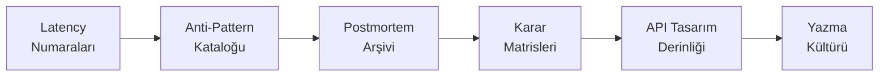

# 🛠️ Pratik — Staff+ Mühendis İçin Saha Kılavuzu

Bu klasör, kitap özetlerinin **bir adım ötesindeki** üretim odaklı dokümanları içerir. Her doküman gerçek olaylar, sayısal veriler, karar matrisleri, anti-pattern'ler ve sahada test edilmiş kalıplar üzerine kuruludur.

---

## 📑 Klasör İçeriği

| # | Doküman | Konu | Hedef Okuyucu |
|---|---|---|---|
| 1 | [Latency Numaraları & Kapasite Matematiği](latency-numbers-ve-kapasite-matematigi.md) | Jeff Dean tablosu, Little's Law, p99 tail-at-scale, kapasite sizing | Senior+ |
| 2 | [Postmortem Arşivi](postmortem-arsivi.md) | 20 ünlü kesinti (Knight Capital → CrowdStrike 2024) yapılandırılmış analizi | Tüm seviye |
| 3 | [Karar Çerçevesi Matrisleri](karar-cercevesi-matrisleri.md) | DB seçimi, sync/async, monolith/microservice, build/buy, cache, vb. 12 karar tablosu | Staff+ |
| 4 | [API Tasarım Derinliği](api-tasarim-derinligi.md) | Idempotency, pagination, RFC 9457, versioning, rate limiting, webhook | Senior+ |
| 5 | [Staff+ Yazma Kültürü](staff-yazma-kulturu.md) | Design Doc, ADR, RFC, 6-pager, PRFAQ, postmortem yazma sanatı | Staff+ |
| 6 | [Anti-Pattern Kataloğu](anti-pattern-katalogu.md) | 60+ anti-pattern (mimari, veri, API, distributed, ops, kod, test, güvenlik, kültür, perf) | Tüm seviye |

---

## 🎯 Okuma Sırası (Önerilen)

**Mantık:**
1. **Sayısal sezgi** olmadan tasarım yapılamaz → Latency önce.
2. **Hata kalıpları** bilinmeden tasarım naif olur → Anti-pattern'ler.
3. **Gerçek olaylar** sezgileri kalibre eder → Postmortem arşivi.
4. **Karar verme** disiplini → Matrisler.
5. **Spesifik alan** (API) → tasarım derinliği.
6. **Yazma** (etki çoğaltıcı) → en sonda, çünkü 1-5'i içselleştirilmiş okuyucu için.

---

## 🔗 İlgili Klasörler

- 📐 [`templates/`](../templates/README.md) — ADR, RFC, 6-pager, postmortem şablonları
- 📚 [`glossary/`](../glossary/terim-sozlugu.md) — TR-EN terim sözlüğü
- 🔬 [`kaynakca.md`](../kaynakca.md) — Birincil kaynaklar (paper'lar, kitaplar)

---

## 🧭 Felsefe

> *"Senior 'nasıl' yapacağını bilir. Staff 'neden' o şekilde olduğunu bilir. Principal 'ne zaman aksini yapacağını' bilir."*

Bu klasör **trade-off'ları**, **sayısal sezgileri**, ve **karşılaşılan tuzakları** öne çıkarır. Tek doğru cevap yok; **bağlama bağlı doğru cevap** vardır.

> [⬅️ Ana README](../README.md)
