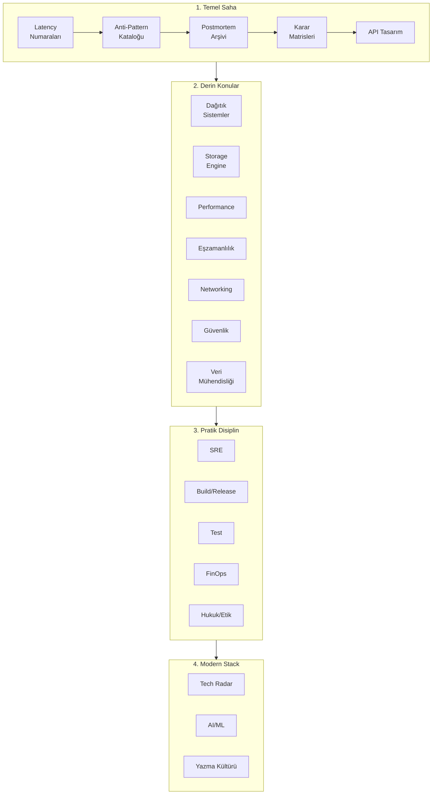

# 🛠️ Pratik — Staff+ Mühendis İçin Saha Kılavuzu

Bu klasör, kitap özetlerinin **bir adım ötesindeki** üretim odaklı dokümanları içerir. Her doküman gerçek olaylar, sayısal veriler, karar matrisleri, anti-pattern'ler ve sahada test edilmiş kalıplar üzerine kuruludur.

---

## 📑 Klasör İçeriği

### Temel Saha Kılavuzları

| # | Doküman | Konu | Hedef Okuyucu |
|---|---|---|---|
| 1 | [Latency Numaraları & Kapasite Matematiği](latency-numbers-ve-kapasite-matematigi.md) | Jeff Dean tablosu, Little's Law, p99 tail-at-scale, kapasite sizing | Senior+ |
| 2 | [Postmortem Arşivi](postmortem-arsivi.md) | 20 ünlü kesinti yapılandırılmış analizi | Tüm seviye |
| 3 | [Karar Çerçevesi Matrisleri](karar-cercevesi-matrisleri.md) | DB seçimi, sync/async, monolith/microservice, build/buy, cache | Staff+ |
| 4 | [API Tasarım Derinliği](api-tasarim-derinligi.md) | Idempotency, pagination, RFC 9457, versioning, rate limiting, webhook | Senior+ |
| 5 | [Staff+ Yazma Kültürü](staff-yazma-kulturu.md) | Design Doc, ADR, RFC, 6-pager, PRFAQ, postmortem | Staff+ |
| 6 | [Anti-Pattern Kataloğu](anti-pattern-katalogu.md) | 60+ anti-pattern (mimari, veri, API, distributed, ops, kod, test, güvenlik) | Tüm seviye |

### Derinlemesine Sistem Konuları

| # | Doküman | Konu | Hedef Okuyucu |
|---|---|---|---|
| 7 | [Dağıtık Sistemler Derinlemesine](dagitik-sistemler-derinlemesine.md) | 8 fallacy, FLP, CAP/PACELC, consensus, CRDT, idempotency/outbox, fencing | Staff+ |
| 8 | [Storage Engine İç Yapısı](storage-engine-ic-yapisi.md) | WAL, B-tree, LSM-tree, MVCC, snapshot/checkpoint, indexing | Staff+ |
| 9 | [Performance Engineering](performance-engineering.md) | USE/RED/Four Golden Signals, profiling, flame graph, mechanical sympathy | Senior+ |
| 10 | [Eşzamanlılık Primitifleri](eszamanlilik-primitifleri.md) | Threading, memory model, locks, lock-free, async/await, backpressure | Senior+ |
| 11 | [Networking Derinlemesine](networking-derinlemesine.md) | OSI, TCP, TLS, HTTP/1.1/2/3, DNS, LB, gRPC, WebSocket, CDN | Senior+ |
| 12 | [Güvenlik Derinlemesine](guvenlik-derinlemesine.md) | STRIDE, OWASP Top 10, AuthN/Z, crypto, secret mgmt, supply chain | Tüm seviye |
| 13 | [Veri Mühendisliği](veri-muhendisligi.md) | OLTP/OLAP, lakehouse, ETL/ELT, Lambda/Kappa, CDC, schema evolution | Senior+ |

### Pratik Disiplinler

| # | Doküman | Konu | Hedef Okuyucu |
|---|---|---|---|
| 14 | [SRE Pratiği](sre-pratigi.md) | SLI/SLO/SLA, error budget, toil, on-call, incident, chaos | Senior+ |
| 15 | [Build, Release & Supply Chain](build-release-supply-chain.md) | CI/CD, deterministic build, SLSA/SBOM/Sigstore, deployment strategies | Senior+ |
| 16 | [Test Stratejileri](test-stratejileri.md) | Test pyramid, contract test, property-based, mutation, fuzzing | Tüm seviye |
| 17 | [FinOps & Cloud Maliyet](finops-cloud-maliyet.md) | Inform/optimize/operate, unit economics, compute/storage optimization | Staff+ |
| 18 | [Hukuk, Uyumluluk, Etik](hukuk-uyumluluk-etik.md) | GDPR, KVKK, PCI-DSS, SOC 2, lisans hijyeni, AI etiği | Tüm seviye |

### Modern Stack

| # | Doküman | Konu | Hedef Okuyucu |
|---|---|---|---|
| 19 | [Modern Teknoloji Radarı](modern-teknoloji-radari.md) | Adopt/Trial/Assess/Hold: eBPF, WASM, Rust, edge, modern data, LLM stack | Staff+ |
| 20 | [AI/ML Mühendislik Pratiği](ai-ml-muhendisligi.md) | MLOps, feature store, drift, RAG, LLM eval, cost & latency | Senior+ |

### Eleştirel Bakış & Soft Skills

| # | Doküman | Konu | Hedef Okuyucu |
|---|---|---|---|
| 21 | [Mimari Eleştiri](mimari-elestiri.md) | Microservices/DDD/Clean/Event Sourcing eleştirisi, over-engineering tuzakları | Staff+ |
| 22 | [Domain Mimarileri](domain-mimarileri.md) | Exchange/LMAX, Ad-tech/RTB, Gaming, IoT, Multi-tenancy | Senior+ |
| 23 | [Operasyonel Derinlik](operasyonel-derinlik.md) | Connection storm, idempotency key API tasarımı, operasyonel kalıplar | Senior+ |
| 24 | [Staff+ Soft Skills](staff-soft-skills.md) | Glue work, promotion/impact, executive communication, teknik liderlik | Staff+ |

---

## 🎯 Okuma Sırası (Önerilen)

**Mantık:**
1. **Temel sezgi** (latency, anti-pattern, postmortem, karar matrisleri) → tasarımın substratı.
2. **Derin sistem konuları** → "neden öyle olmalı" cevabı.
3. **Pratik disiplinler** → işletme + sürdürebilirlik.
4. **Modern stack** → bugünkü ve gelecekteki manzara.

---

## 🔗 İlgili Klasörler

- 📐 [`templates/`](../templates/README.md) — ADR, RFC, 6-pager, postmortem şablonları
- 📚 [`glossary/`](../glossary/terim-sozlugu.md) — TR-EN terim sözlüğü
- 🔬 [`kaynakca.md`](../kaynakca.md) — Birincil kaynaklar (paper'lar, kitaplar)

---

## 🧭 Felsefe

> *"Senior 'nasıl' yapacağını bilir. Staff 'neden' o şekilde olduğunu bilir. Principal 'ne zaman aksini yapacağını' bilir."*

Bu klasör **trade-off'ları**, **sayısal sezgileri**, ve **karşılaşılan tuzakları** öne çıkarır. Tek doğru cevap yok; **bağlama bağlı doğru cevap** vardır.

> [⬅️ Ana README](../README.md)
