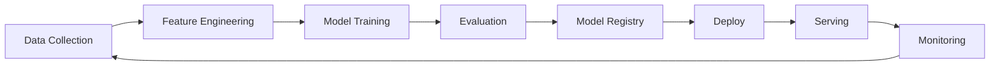
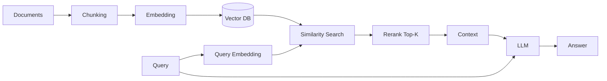

# 🤖 AI / ML Mühendislik Pratiği

> **"ML in production isn't a model. It's a system."** — Chip Huyen

Bu doküman ML modelini **deneyden üretime** taşımak için bilinmesi gerekeni özetler: MLOps, RAG sistemleri, LLM operasyonu, drift, evaluation.

---

## 📑 İçindekiler

1. [ML System ≠ ML Model](#1-ml-system--ml-model)
2. [MLOps — Model Lifecycle](#2-mlops--model-lifecycle)
3. [Feature Store](#3-feature-store)
4. [Data Drift, Model Drift](#4-data-drift-model-drift)
5. [Online vs Offline Inference](#5-online-vs-offline-inference)
6. [LLM Stack](#6-llm-stack)
7. [RAG — Retrieval Augmented Generation](#7-rag--retrieval-augmented-generation)
8. [LLM Evaluation](#8-llm-evaluation)
9. [LLM Cost & Latency](#9-llm-cost--latency)
10. [Anti-Pattern'ler](#10-anti-patternler)

---

## 1. ML System ≠ ML Model

### Sculley 2015 — *Hidden Technical Debt in ML Systems*

> Model **kodun küçük bir kısmı** (~%5). Etrafındaki sistem büyük çoğunluk:

```
Configuration • Data collection • Feature extraction • Data verification
Machine resource management • Analysis tools • Process management
Serving infrastructure • Monitoring
```

→ ML kodu küçük bir merkez kutusu, çevresinde **dev kutular**.

### "Production ML" tanımı

ML sisteminin gerçek değer üretmesi için:
- Veri pipeline (eğitim + inference).
- Feature pipeline.
- Model training + versiyonlama.
- Serving infrastructure.
- Monitoring (data drift, model drift, performance).
- Continuous training.
- A/B test framework.
- Rollback / fallback.
- Compliance (PII, audit, fairness).

---

## 2. MLOps — Model Lifecycle

### Aşamalar



### Tools

| Aşama | Tool |
|---|---|
| **Experiment tracking** | MLflow, Weights & Biases, Neptune |
| **Pipeline orchestration** | Kubeflow, Airflow, Dagster, Prefect |
| **Feature store** | Feast, Tecton, Hopsworks |
| **Model registry** | MLflow, BentoML, Vertex Model Registry |
| **Serving** | BentoML, KServe, Seldon, Triton, Ray Serve |
| **Monitoring** | Arize, Fiddler, WhyLabs, Evidently |
| **Vector DB (LLM)** | pgvector, Pinecone, Weaviate, Qdrant |

### Model versiyonlama

```
model_id = "fraud-classifier"
version = "v2.3.1"
artifact = s3://models/fraud/v2.3.1/model.pkl
metadata:
  trained_at: 2025-09-15
  training_data: data/v8 (sha256:...)
  metrics: { auc: 0.94, precision: 0.89, recall: 0.78 }
  framework: xgboost 2.0.3
```

### Reproducibility

- Random seed.
- Data version (DVC, lakeFS).
- Code version (git SHA).
- Environment (Docker image digest).
- Hyperparameter config.

> **Kural:** 6 ay sonra **bit-by-bit aynı** modeli yeniden üretebilmek.

---

## 3. Feature Store

### Niye?

> **Train-serve skew**: Eğitimde feature'ı X şekilde compute ettin, serving'de Y şekilde → silent bug.

### Feature store ne yapar?

- Feature definition single source of truth.
- Online (low-latency, Redis) + offline (batch, BigQuery) consistent.
- Time-travel: "X anında bu user'ın feature'ı neydi?"
- Sharing across teams.

### Online vs offline serving

| | Online | Offline |
|---|---|---|
| Latency | < 100ms | Saatler |
| Storage | Redis, DynamoDB | Parquet, BigQuery |
| Use case | Real-time inference | Batch scoring, training |
| Freshness | Saniye-dakika | Saatlik-günlük |

### Feast örneği

```python
from feast import FeatureStore

store = FeatureStore(repo_path=".")

# Offline (training)
training_df = store.get_historical_features(
    entity_df=user_df,
    features=["user_features:lifetime_value", "user_features:last_purchase_days"]
).to_df()

# Online (serving)
features = store.get_online_features(
    entity_rows=[{"user_id": 123}],
    features=["user_features:lifetime_value"]
).to_dict()
```

---

## 4. Data Drift, Model Drift

### 3 drift tipi

| Tip | Tanım |
|---|---|
| **Data drift** | Input distribution değişti |
| **Concept drift** | Input → output ilişkisi değişti |
| **Label drift** | Ground truth dağılımı değişti |

### Tespit yöntemleri

- **PSI** (Population Stability Index) — distribution shift.
- **KL divergence**.
- **KS test** (Kolmogorov-Smirnov).
- **Wasserstein distance**.
- **Chi-squared** (categorical).

### Operasyonel monitoring

```
Daily:
- Model output dağılımı (mean, std, percentile).
- Input feature dağılımı vs training baseline.
- Prediction confidence dağılımı.
- Latency p50, p99.
- Throughput.

Weekly/Monthly:
- Ground-truth ile karşılaştırma (delayed label).
- Business metric (conversion, fraud rate).
- Cohort analysis (yeni user vs eski).
```

### Re-training trigger

- Schedule (haftalık).
- Performance degradation (auc < threshold).
- Data drift score > threshold.
- Manual (yeni feature, business shift).

> **A/B test** zorunlu — yeni model otomatik %100'e gitmesin.

---

## 5. Online vs Offline Inference

### Offline (batch)

```
Cron: nightly inference job
   - Input: tüm aktif user
   - Output: scored predictions table
   - Use: campaign, recommendation cache
```

✅ Compute optimization (large batch).
✅ Latency-tolerant.
❌ Stale (24h+).

### Online (real-time)

```
HTTP API: predict(user_id)
   - p99 < 100ms
   - Auto-scale
   - Feature lookup online store
```

✅ Fresh.
✅ Personalized real-time.
❌ Pahalı, latency budget.

### Streaming

> Kafka → real-time scoring → output topic.
> Flink ML, Spark Structured Streaming.

### Edge inference

- Mobile (CoreML, TFLite, ONNX).
- Browser (transformers.js, ONNX Runtime Web).
- IoT (TensorFlow Lite Micro).

### Inference optimization

- **Quantization**: FP32 → INT8, 4x küçük + 2x hızlı, accuracy ~%1 düşüş.
- **Distillation**: Büyük teacher → küçük student model.
- **Pruning**: Önemsiz weight'leri sıfırla.
- **Compilation**: TensorRT, ONNX Runtime, MLC.
- **Batching**: Multiple request birleştir (Triton, vLLM).

---

## 6. LLM Stack

### Provider seçimi

| Provider | Güçlü taraf | Kullanım |
|---|---|---|
| **OpenAI** | GPT-4o, JSON mode, vision | General |
| **Anthropic** | Claude 3.5/Opus 4, long context, alignment | Reasoning, agents |
| **Google** | Gemini 1.5/2 (1M context), multimodal | Long doc, video |
| **Meta** | Llama 3.1/3.3 open weights | Self-host, fine-tune |
| **Mistral** | Open + API, hızlı | Multi-lingual EU |
| **DeepSeek, Qwen** | Open weights, güçlü | Self-host |

### Self-host vs API

| | API | Self-host |
|---|---|---|
| Cost (low volume) | Düşük | Yüksek (GPU \$\$) |
| Cost (high volume) | Lineer artar | Sabit + GPU |
| Latency | Network + model | Network minimal |
| Privacy | Vendor (OK most) | Tam kontrol |
| Customization | Fine-tune sınırlı | Tam |
| Operations | None | GPU mgmt, autoscale |

> Crossover ~10M-100M token/gün civarı (workload + GPU spot fiyatına göre).

### Self-host runtime

- **vLLM** — high-throughput batching (Anyscale).
- **llama.cpp** — CPU + GPU, GGUF format.
- **TGI** (HuggingFace Text Generation Inference).
- **Ollama** — local dev.
- **LMDeploy, TensorRT-LLM** — NVIDIA optimized.

### Prompt management

- Version control (`prompts/` git'te).
- Template engine (Jinja, Mustache).
- A/B test framework.
- Eval suite per prompt.

### Function calling / Tool use

```python
tools = [
  {"name": "get_weather",
   "parameters": {"location": "string"}}
]

response = openai.chat.completions.create(
  model="gpt-4o",
  messages=[...],
  tools=tools,
  tool_choice="auto"
)

# Model returns: tool_calls=[{name: "get_weather", arguments: {location: "Istanbul"}}]
```

---

## 7. RAG — Retrieval Augmented Generation

### Niye RAG?

- 🎯 LLM training cutoff sonrası bilgi.
- 🎯 Internal company knowledge.
- 🎯 Citation / source tracking.
- 🎯 Hallucination azaltma.
- 🎯 Düşük cost (fine-tune'a göre).

### Mimari



### Chunking stratejileri

| Strateji | Use case |
|---|---|
| **Fixed-size** | Basic, default 512-1024 token |
| **Recursive** (paragraph → sentence) | Doc structure korur |
| **Semantic** | Embedding-based break |
| **Hierarchical** (parent + child) | Long doc, summary + detail |
| **Sliding window** | Overlap (10-20%) — context loss önler |

### Embedding modelleri

| Model | Boyut | Dim |
|---|---|---|
| OpenAI text-embedding-3-small | 8K token | 1536 |
| OpenAI text-embedding-3-large | 8K | 3072 |
| Cohere embed-english-v3.0 | 512 | 1024 |
| BGE / E5 (open) | 512 | 768-1024 |
| Voyage AI | 16K | 1024 |

### Vector DB

| DB | Özellik |
|---|---|
| **pgvector** (Postgres) | Familiar, single source, simple |
| **Pinecone** | Managed, hızlı, pahalı |
| **Weaviate** | Open-source, hibrit search |
| **Qdrant** | Rust, fast, filtering |
| **Milvus** | Cloud-native, scale |
| **Chroma** | Dev-friendly |
| **Elasticsearch** | Existing infra ise |

### Hibrit search

> **Sadece** vector arama yetmez. Keyword (BM25) + vector kombinasyonu çoğu durumda **daha iyi**.

```python
results = bm25.search(query) + vector.search(query_embedding)
results = rerank(results, query, top_k=5)
```

### Rerank

> İlk retrieval (top-50) → daha pahalı reranker (cross-encoder) → top-5.

Tools: Cohere Rerank, BGE-reranker, Voyage-rerank.

### RAG quality knobs

- Chunk size + overlap.
- Embedding model.
- Top-K retrieval.
- Reranker.
- Query rewriting (HyDE, multi-query).
- Filter (metadata pre-filter).
- Citation prompt engineering.

---

## 8. LLM Evaluation

### Niye zor?

- Ground truth çok seçenekli (open-ended).
- Hallucination silent.
- Cost: human eval pahalı + yavaş.

### Eval kategorileri

| | Yaklaşım |
|---|---|
| **Reference-based** | Ground truth ile compare (BLEU, ROUGE, exact match) |
| **Reference-free** | Heuristic, embedding similarity, LLM-as-judge |
| **Behavior** | Specific behavior test (bias, refusal, toxicity) |
| **Performance** | Latency, throughput, cost |

### LLM-as-judge

```python
prompt = f"""
Question: {q}
Answer: {a}
Reference: {ref}

Score the answer 1-10 on:
- Correctness
- Completeness
- Helpfulness
"""
score = judge_llm(prompt)
```

⚠️ Bias riski (pozisyon bias, length bias).
⚠️ Self-preference (GPT GPT'i over-rate).
✅ Pairwise comparison daha sağlam.

### Eval frameworks

- **Ragas** — RAG-specific (faithfulness, relevance, recall).
- **LangSmith / Langfuse** — production trace + eval.
- **Promptfoo** — declarative prompt eval.
- **OpenAI Evals** — model evaluation suite.
- **DeepEval** — pytest-style LLM tests.

### Production'da continuous eval

```
1. Sampled production traffic logged.
2. Periodic eval (LLM-judge + human spot-check).
3. Regression alert on metric drop.
4. Slack notification + dashboard.
```

### Anti-pattern: spotcheck only

> "Birkaç örneğe baktım, çalışıyor."
> Subjektif, tekrarlanmaz, regression bilinmez.

**Çözüm:** Reproducible eval set + automated metric.

---

## 9. LLM Cost & Latency

### Cost driver'ları

```
Cost ≈ tokens_input × price_input + tokens_output × price_output
```

GPT-4o (örnek): \$2.50/M input + \$10/M output (2025 fiyat).

### Optimization

| Teknik | Tasarruf |
|---|---|
| **Smaller model** (4o-mini, Haiku) | 10-30x ucuz |
| **Caching** (semantic cache, GPTCache) | %30-70 hit |
| **Batching** | Throughput |
| **Streaming** | Perceived latency |
| **Output length limit** | max_tokens |
| **Compression** (LLMLingua) | %20-50 input |
| **Self-host** (high volume) | Fixed cost |
| **Fine-tune small model** | Specialist task |

### Latency

```
TTFT (Time to First Token) — RAG ek latency
TPS (Tokens Per Second) — generation speed
Total latency = TTFT + (output_tokens / TPS)
```

Tipik:
- GPT-4o: TTFT ~500ms, TPS ~100.
- Llama 3.1 70B (vLLM, A100): TTFT ~200ms, TPS ~30-50.
- Local 8B: TTFT ~50ms, TPS ~50-100.

### Streaming

User'a token-by-token gönder → perceived latency düşük.

```python
for chunk in openai.chat.completions.create(stream=True, ...):
    yield chunk.choices[0].delta.content
```

### Semantic caching

```
1. Query embedding → search cache.
2. Similarity > 0.95 → return cached answer.
3. Else → LLM call → cache.
```

---

## 10. Anti-Pattern'ler

### 1. "Model is the product"

> Mühendis: "Model trained, %95 accuracy, deploy edelim."
> Reality: Drift, edge case, integration, monitoring eksik → 1 ay sonra %60.

**Çözüm:** Sistem perspektifi (Sculley).

### 2. Train-serve skew

Eğitim Python, serving Java → feature engineering farklı.

**Çözüm:** Feature store, identical preprocessing, integration test.

### 3. No baseline

> "%95 accuracy harika." Ama random baseline %93 ise model **hiç** öğrenmedi.

**Çözüm:** Baseline (random, frequency, simple rule) compare.

### 4. Look-ahead leak

Eğitim verisinde **gelecekteki** bilgi kullanıldı.

**Çözüm:** Time-aware split. Feature time-travel (feature store).

### 5. Imbalanced data ignored

Fraud %1 — model "always normal" tahmin → %99 accuracy ama useless.

**Çözüm:** Precision/recall, F1, AUC, PR curve. Class weighting / SMOTE / focal loss.

### 6. Static evaluation

Model deploy edildi, eval suite donmuş. Production data değişti, eval anlamsız.

**Çözüm:** Continuous eval, drift monitoring.

### 7. Hallucination tolerance

LLM "uydurabilir" but acceptable for X. Sonra X user-facing.

**Çözüm:** RAG + grounding + citation + content filter.

### 8. Prompt = code yok

Prompt versiyonu yok, A/B test yok, eval yok.

**Çözüm:** Prompt registry, eval-driven prompt engineering.

### 9. Single LLM provider lock

OpenAI down → tüm sistem down.

**Çözüm:** LiteLLM, OpenRouter — multi-provider abstraction + fallback.

### 10. PII to public API

Customer message + sensitive data → OpenAI.

**Çözüm:** PII redaction, on-prem model, vendor BAA agreement.

---

## 🎯 Staff+ ML/AI Kontrol Listesi

### Production launch

- [ ] Baseline metric defined?
- [ ] Reproducible training (seed + data version + code SHA)?
- [ ] Feature store (online/offline parity)?
- [ ] Model registry + versioning?
- [ ] A/B test framework?
- [ ] Drift monitoring (data + model)?
- [ ] Latency SLO (p50, p99)?
- [ ] Cost tracking per inference?
- [ ] Rollback strategy?
- [ ] Fallback when model fails (rule-based)?
- [ ] Compliance (PII, fairness, audit)?
- [ ] Model card + datasheet?

### LLM-specific

- [ ] Eval suite + continuous eval?
- [ ] Hallucination mitigation (RAG + citation)?
- [ ] Output filtering (toxic, PII)?
- [ ] Cost optimization (cache, smaller model)?
- [ ] Multi-provider fallback?
- [ ] Prompt versioning + A/B?
- [ ] Red-teaming?
- [ ] Human review for high-risk?

---

## 📚 İleri Okuma

### Kitaplar

- *Designing Machine Learning Systems* — Chip Huyen (2022)
- *Machine Learning Engineering* — Andriy Burkov
- *Reliable Machine Learning* — Chen et al. (Google, 2022)
- *Building Machine Learning Powered Applications* — Emmanuel Ameisen
- *Hands-On Large Language Models* — Jay Alammar & Maarten Grootendorst (2024)

### Papers

- Sculley et al. 2015 — *Hidden Technical Debt in ML Systems*
- Lewis et al. 2020 — *Retrieval-Augmented Generation* (RAG)
- Brown et al. 2020 — GPT-3 paper
- Hoffmann et al. 2022 — *Chinchilla* scaling laws
- Mitchell et al. 2019 — *Model Cards*

### Bloglar

- Chip Huyen blog
- Eugene Yan blog
- Lilian Weng — OpenAI alignment
- Hamel Husain — RAG, eval
- Anthropic, OpenAI engineering blogs

> [⬅️ Pratik klasörü](README.md) · [📚 Sözlük](../glossary/terim-sozlugu.md) · [🔬 Kaynakça](../kaynakca.md)
