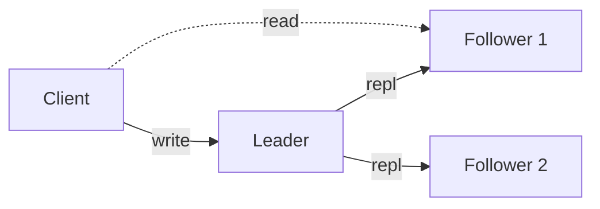
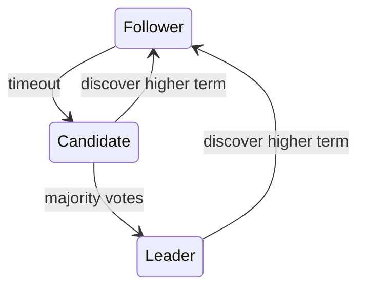
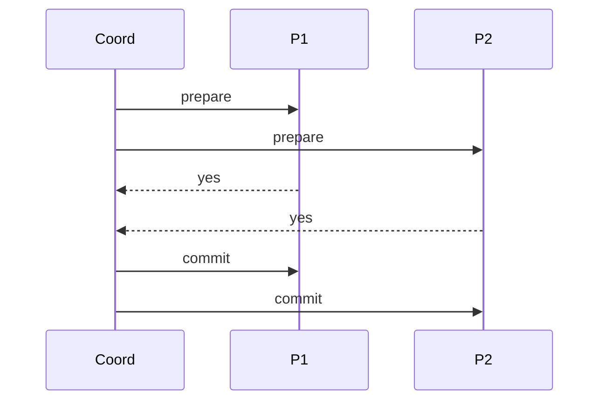
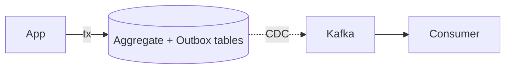

# 🌐 Dağıtık Sistemler Derinlemesine

> **"Dağıtık bir sistem, var olduğunu bilmediğin bir bilgisayarın çökmesi yüzünden senin makinendeki işin yapamaz hale gelmesidir."** — Leslie Lamport

Bu doküman dağıtık sistemlerin **çekirdek teorik temellerini** ve **üretim pratiğini** birleştirir. Hedef okuyucu: Senior+ ve Staff seviye.

---

## 📑 İçindekiler

1. [8 Yanlış Varsayım (Fallacies)](#1-8-yanlış-varsayım-fallacies)
2. [Zaman, Saat ve Sıralama](#2-zaman-saat-ve-sıralama)
3. [FLP Imkânsızlığı ve Consensus](#3-flp-imkânsızlığı-ve-consensus)
4. [CAP, PACELC ve Tutarlılık Modelleri](#4-cap-pacelc-ve-tutarlılık-modelleri)
5. [Replication Stratejileri](#5-replication-stratejileri)
6. [Consensus Algoritmaları](#6-consensus-algoritmaları)
7. [Distributed Transactions](#7-distributed-transactions)
8. [CRDT — Conflict-Free Replicated Data Types](#8-crdt--conflict-free-replicated-data-types)
9. [Failure Detection ve Membership](#9-failure-detection-ve-membership)
10. [Idempotency, Exactly-Once ve Outbox](#10-idempotency-exactly-once-ve-outbox)
11. [Distributed Locking ve Fencing](#11-distributed-locking-ve-fencing)
12. [Üretim Tuzakları](#12-üretim-tuzakları)

---

## 1. 8 Yanlış Varsayım (Fallacies)

Peter Deutsch & James Gosling'in 1990'larda derlediği, **dağıtık sisteme yeni başlayan herkesin sessizce inandığı** yanlış varsayımlar:

| # | Yanlış varsayım | Gerçek |
|---|---|---|
| 1 | Network güvenilirdir | Paket kaybı, partition normal. Cloudflare 2019 BGP, Facebook 2021 DNS. |
| 2 | Latency sıfırdır | DC içi 0.5ms, cross-region 70-90ms ([latency](latency-numbers-ve-kapasite-matematigi.md)). |
| 3 | Bandwidth sonsuzdur | 10 Gbps NIC bile 1.25 GB/s. CDN ücretleri katlamalı. |
| 4 | Network güvenlidir | mTLS olmadan internal trafik clear-text. SolarWinds 2020. |
| 5 | Topology değişmez | K8s pod IP'si dakikada değişir. Service discovery zorunlu. |
| 6 | Tek bir admin var | Multi-cloud, multi-team, hybrid. |
| 7 | Transport maliyeti sıfır | Cross-AZ ücreti AWS'de \$0.01/GB. PB'larca veri = 7 haneli fatura. |
| 8 | Network homojendir | Mobile 4G, WiFi, fiber, satellite. Aynı kod aynı RTT göstermez. |

> **Staff IC sezgisi:** Tasarımda her birini **açıkça** sınamadıysan, biri seni vuracak.

---

## 2. Zaman, Saat ve Sıralama

### Wall-clock time'ın yalanları

```c
// ❌ TEHLİKELİ
if (event_a.timestamp < event_b.timestamp) {
  // a, b'den önce oldu (sanılır)
}
```

**Sorunlar:**
- 🕰️ **NTP drift** — saat geri gidebilir.
- 🕰️ **Leap second** — 1 saniye atlama.
- 🕰️ **Clock skew** — iki makinede 100ms+ fark normaldir.
- 🕰️ **VM saat donması** — hypervisor pause sonrası.

### Lamport Clock (1978)

> Leslie Lamport, *Time, Clocks, and the Ordering of Events in a Distributed System* (CACM 1978)

```
Her process bir counter L tutar.
- Local event:          L = L + 1
- Mesaj gönderirken:    L = L + 1, mesajla L'i de yolla
- Mesaj alırken:        L = max(L, L_mesaj) + 1
```

**Garanti:** Eğer A → B (causal precedence), o zaman `L(A) < L(B)`.
**Garanti vermez:** `L(A) < L(B)` olması A'nın B'den önce olduğunu garanti **etmez**.

### Vector Clock

Her process N elemanlı vector tutar (N = process sayısı):
```
[3, 5, 2]  ← P1=3, P2=5, P3=2
```

İki olay karşılaştırma:
- **A → B** (causal): A'nın vector'ü her elemanda B'den ≤, en az birinde <.
- **Concurrent**: ne A → B ne B → A.

Dynamo (2007), Riak, Voldemort kullandı. **Sorun:** Vector boyutu N ile büyür.

### Hybrid Logical Clock (HLC)

Physical + logical kombinasyonu. CockroachDB, MongoDB causally consistent reads.

### TrueTime (Spanner, 2012)

> Google, atomik saat + GPS ile **`TT.now()` → [earliest, latest]** aralığı döndürür. Tipik aralık: 7ms.

```
Yazma için commit timestamp = TT.now().latest
Okuma: TT.now().earliest geçene kadar bekle
→ Externally consistent (linearizable) global timestamp
```

**Maliyeti:** Her DC'de atomik saat + GPS antenler. Sadece Google ölçeğinde rasyonel.

> **AWS Time Sync 2024**: TrueTime benzeri ClockBound API (μs hassasiyet).

### Pratik öneri

| Durum | Çözüm |
|---|---|
| Tek node ordering | Monotonic clock (`CLOCK_MONOTONIC`) |
| Causal ordering | Lamport / Vector clock |
| Cross-DC ordering | HLC veya TrueTime tarzı |
| ID generation (zamana göre sortable) | UUIDv7 / Snowflake |
| Kesin "X saniye geçti" | Monotonic, asla wall-clock |

---

## 3. FLP Imkânsızlığı ve Consensus

### FLP Teoremi (Fischer, Lynch, Paterson 1985)

> *"Asenkron bir sistemde, **tek bir** process'in çökmesi durumunda bile **deterministic** consensus algoritması imkansızdır."*

**Anlamı:**
- Asenkron = mesaj gecikmesinde üst sınır yok.
- Deterministic = randomization yok.
- Çökme = crash failure (Byzantine değil).

**Çıkış yolları:**
1. **Partial synchrony** ekle (timeout var) → Paxos, Raft.
2. **Randomization** ekle → Ben-Or, Bitcoin (Nakamoto consensus).
3. **Failure detector** ekle (suspicion oracle).

### Consensus problemi

N process arasında, herkesin tek bir değer üzerinde anlaşması:
- **Agreement**: Tüm correct process'ler aynı değeri seçer.
- **Validity**: Seçilen değer önerilen değerlerden biri.
- **Termination**: Tüm correct process'ler eninde sonunda karar verir.

### Eşdeğer problemler

> Atomic Broadcast ≡ Total Order Broadcast ≡ State Machine Replication ≡ Consensus

→ Birini çözen tümünü çözer.

---

## 4. CAP, PACELC ve Tutarlılık Modelleri

### CAP Theorem (Brewer 2000, Gilbert & Lynch 2002)

> Network partition (P) durumunda, **C** (linearizable consistency) ve **A** (availability) ikisinden **birini** seçmelisin.

**Sık yanlış anlama:** "CP / AP veritabanı" — CAP **anlık** bir trade-off, sürekli bir özellik değil. Partition **yok**ken sistem her ikisini de sunabilir.

### PACELC (Abadi 2012)

```
IF Partition (P):    Availability (A) vs Consistency (C)
ELSE (E, normal):    Latency (L) vs Consistency (C)
```

| Sistem | P | E |
|---|---|---|
| Spanner | C | C (yüksek L kabul) |
| CockroachDB | C | C |
| DynamoDB (default) | A | L |
| DynamoDB (strong read) | C | C |
| Cassandra | A | L |
| MongoDB (majority) | C | C |

### Tutarlılık spektrumu (zayıftan güçlüye)

```
Eventual → Read-your-writes → Monotonic Reads → Causal → Sequential → Linearizable → Strict Serializable
```

| Model | Garanti | Maliyet |
|---|---|---|
| **Eventual** | Yeterli zaman geçince yakınsar | En ucuz, async replication |
| **Read-your-writes** | Kendi yazdığını okuyabilirsin | Session sticky veya read-from-leader |
| **Monotonic reads** | Geriye gitmiyor | Versiyon tracking |
| **Causal** | "If A causes B, herkes A'yı B'den önce görür" | Vector clock / HLC |
| **Sequential** | Tüm process'ler aynı sırayı görür | Total order broadcast |
| **Linearizable** | Tek bir kopya hissi (real-time order) | Consensus / quorum |
| **Strict Serializable** | Linearizable + Serializable transactions | Spanner, FaunaDB |

### Isolation seviyeleri (transaksiyonel)

```
Read Uncommitted → Read Committed → Repeatable Read → Snapshot Isolation → Serializable
```

> **Critical fark:** Snapshot Isolation **Serializable değil** (write skew anomaly). Postgres `SERIALIZABLE` aslında SSI (Serializable Snapshot Isolation).

**Adya hierarchy** ve **Jepsen testleri** isolation iddialarını saha denetler. Hemen her DB sattığı seviyeden zayıf çıkmıştır.

---

## 5. Replication Stratejileri

### Single-Leader (Master-Slave)



**Senkron vs Asenkron:**
- **Senkron**: Yazma N kopyaya gidene kadar bekler. Durability ↑, latency ↑, availability ↓.
- **Asenkron**: Leader yazar, replica'lar yetişir. Latency ↓, ama leader düşerse veri kaybı.
- **Semi-synchronous (chain)**: En az 1 follower onaylasın. MySQL, Postgres standart.

**Failover:** Leader öldü → yeni leader seç. Tehlikeler:
- 🚨 **Split-brain**: 2 leader (GitHub 2018, postmortem-arsivi #4).
- 🚨 **Veri kaybı**: Async replication'da unflushed write'lar.
- 🚨 **Promotion timing**: Çok hızlı = false positive, çok yavaş = uzun outage.

### Multi-Leader

İki+ DC her ikisi de yazma alabilir. **Conflict resolution** zorunlu:
- LWW (Last-Write-Wins) — basit, **tehlikeli** (clock skew → veri kaybı).
- CRDT (sonraki bölüm).
- Application-level merge.

### Leaderless (Dynamo-style)

```
N = replica sayısı, W = write quorum, R = read quorum
W + R > N  →  okuma en az 1 fresh kopyaya dokunur
```

**Cassandra örneği:** N=3, W=2, R=2 → bir node düşse de quorum sağlanır.

**Hinted handoff**: Geçici düşmüş node için yazma başka bir node'da tutulur, dönünce iletilir.

**Read repair / Anti-entropy**: Okumalar tutarsızlık tespit ederse onarır. Background Merkle tree comparison.

### Quorum bozulduğunda

> **Sloppy quorum + hinted handoff** availability arttırır ama linearizability kaybeder. Riak default.

---

## 6. Consensus Algoritmaları

### Paxos (Lamport 1998 — *The Part-Time Parliament*)

İki rol: **Proposer**, **Acceptor**. (Çoğu pratik uygulamada üçüncüsü Learner.)

İki faz:
1. **Prepare** (n) → quorum acceptor'dan promise.
2. **Accept** (n, v) → quorum acceptor'dan kabul.

**Sorun:** Anlaşılması zor. *"Paxos Made Simple"* (2001) bile zor. Üretim için Multi-Paxos varyantı gerekir, döküm zor.

#### Multi-Paxos Derinleştirmesi

Temel (Single-Decree) Paxos tek bir değer üzerinde consensus sağlar; her yeni karar için tam Prepare-Accept turları gerekir. Multi-Paxos bu maliyeti amorti eder:

- **Stable leader**: Prepare fazı yalnızca leader değişiminde çalışır. Leader stabil kaldığı sürece yeni kararlar **sadece Accept fazıyla** (1 RTT) kesinleşir. Bu, Raft'ın "leader append" modeliyle neredeyse eşdeğerdir.
- **Slot-based log**: Her consensus instance'ı bir "slot" numarasına bağlanır. Leader her slot için paralel Accept gönderebilir → **pipelining**. Raft bunu `nextIndex` ile benzer şekilde yapar.

**Pratikte Paxos vs Raft:** Google Chubby ve Spanner Multi-Paxos kullanır. Raft'ın farkı minimal — Raft, leader'ın log'undaki "holes" (boşlukları) yasaklar, Paxos'ta boşluklar olabilir (out-of-order commit). Bu kısıtlama Raft'ı anlamayı kolaylaştırır ama esnekliği azaltır. Performans farkı akademik düzeyde; üretim farkını implementasyon kalitesi belirler.

### Raft (Ongaro & Ousterhout 2014)

> *"In Search of an Understandable Consensus Algorithm"*

Roller: **Leader**, **Follower**, **Candidate**.



**Üç parça:**
1. **Leader Election** — randomized timeout (150-300ms tipik).
2. **Log Replication** — leader log entry'sini quorum'a yazar.
3. **Safety** — committed entry asla overwrite edilmez.

**Üretim:** etcd (K8s), Consul, TiKV, CockroachDB, MongoDB (var. Raft).

#### Log Compaction

Raft log'u sınırsız büyür; compaction olmadan disk tükenir ve yeni node'ların catch-up süresi uzar. İki yaklaşım:

1. **Snapshotting** (etcd, Consul): Belirli aralıklarla tüm state machine durumu diske yazılır, o noktaya kadarki log entry'leri silinir. Yeni katılan node snapshot'ı alır, ardından kalan log'u replay eder.
2. **Log cleaning** (Kafka-tarzı): Log segmentlere bölünür, eski segmentler key bazlı deduplicate edilerek sıkıştırılır. Daha granüler ama implementasyon karmaşıklığı yüksek.

**Trade-off:** Snapshot sırasında I/O spike olur; büyük state'lerde (GB+) snapshot süresi SLO'yu etkileyebilir. Incremental snapshot (TiKV) veya concurrent snapshot (etcd v3.5+) bu sorunu hafifletir.

#### Leader Lease

Raft'ın standart read path'i leader'a quorum read gerektirir (linearizability için). Leader lease bu maliyeti düşürür:

- Leader, heartbeat başarılı olduktan sonra `election_timeout` süresince "ben hâlâ leader'ım" garantisi verir.
- Bu süre içinde **follower'lara danışmadan local read** yapabilir → read latency'si 1 RTT → 0 RTT'ye düşer.
- **Risk:** Clock skew. Leader lease süresi < minimum election timeout olmalıdır; aksi halde iki leader aynı anda read serve edebilir (stale read).
- CockroachDB ve TiKV bu mekanizmayı production'da kullanır. etcd ise `--experimental-enable-lease-checkpoint` ile destekler.

### Multi-Raft / Sharded Consensus

> Tek raft group throughput'u sınırlı (~10K ops/s). **Range/Region** başına ayrı Raft group. CockroachDB, TiKV, YugabyteDB.

### Byzantine Fault Tolerance (BFT)

Sadece çökme değil, **kötü niyetli** node varsayar.
- **PBFT** (Castro & Liskov 1999) — N ≥ 3f+1 (f Byzantine için).
- **Tendermint, HotStuff** — modern blockchain consensus.
- Çoğu enterprise sistem CFT (crash fault tolerant) yeterlidir.

### Consensus performansı

| Algoritma | Mesaj kompleksitesi | Latency |
|---|---|---|
| Paxos / Raft | O(N) | 1 RTT |
| Fast Paxos | O(N) | 1 RTT (uncontended) |
| EPaxos | O(N) | 1 RTT (commutative) |
| PBFT | O(N²) | 2-3 RTT |

---

## 7. Distributed Transactions

### 2PC (Two-Phase Commit)



**Sorun:**
- 🚨 **Blocking**: Coordinator commit fazında çökerse participant'lar **kilitli kalır**.
- 🚨 **Latency**: 2 RTT.
- 🚨 **Availability**: Coordinator SPOF.

**Üretimde:** Çoğu yerde **kötü fikir**. XA transactions enterprise legacy.

### 3PC

Non-blocking iddia ediyor (PreCommit fazı eklenir) ama network partition'da hala fail eder. Pratikte ender.

### Saga Pattern (Garcia-Molina & Salem 1987)

Uzun süreli iş akışını **lokal transaction zinciri + compensation** olarak modeller.

```
T1 → T2 → T3 → T4
Hata T3'te → C2 → C1 (compensating actions)
```

**İki implementasyon:**
- **Choreography**: Her servis event'leri dinler, kendi adımını atar. Decentralized, ama akış görmek zor.
- **Orchestration**: Merkezi orchestrator (Temporal, AWS Step Functions, Camunda) zinciri yönetir. Görünür ama orkestrar SPOF.

#### TCC (Try-Confirm-Cancel)

Saga'nın alternatifi: her katılımcı üç API sunar — **Try** (kaynağı rezerve et), **Confirm** (kesinleştir), **Cancel** (bırak). Try aşamasında iş henüz commit edilmez, sadece "tutulur." Tüm katılımcılar Try'ı başarıyla geçerse Confirm çağrılır; biri başarısızsa herkese Cancel gönderilir.

| Özellik | Saga (Orchestration) | TCC |
|---|---|---|
| İzolasyon | Yok (intermediate state görünür) | Try fazında reservation ile kısmi izolasyon |
| Compensating logic | Her adım için ayrı undo | Cancel = reservation serbest bırakma |
| Kullanım alanı | Uzun-süreli iş akışları, event-driven | Finansal işlemler, stok rezervasyonu, kısa-süreli |
| Karmaşıklık | Orta (compensation zinciri) | Yüksek (3 API per participant, timeout yönetimi) |
| Tutarlılık garantisi | Eventual | Eventual ama daha güçlü (intermediate state gizli) |

**Tercih kuralı:** İşlem süresi kısa ve izolasyon kritikse TCC; uzun süreli, çok adımlı ve eventual kabul edilebilirse Saga.

### Calvin / Deterministic Transactions

Ön-belirlenen sıra → tüm replica'lar aynı sonucu deterministic üretir. FaunaDB.

### Modern hibrit: Spanner-tarzı

- TrueTime ile globally consistent timestamp.
- 2PC + Paxos (her shard içinde Paxos, paxos group'lar arası 2PC).
- Read-only transaction'lar lock-free (snapshot read).

---

## 8. CRDT — Conflict-Free Replicated Data Types

> Şahin & Pregibon, Shapiro et al. (2011). **Matematiksel olarak çakışmasız** replication.

### CmRDT (operation-based) vs CvRDT (state-based)

- **CvRDT**: State'ler join (semi-lattice). Replica'lar state değişimini yayar; merge associative + commutative + idempotent.
- **CmRDT**: Operation'lar yayılır; her replica aynı op'u en az bir kez (causally) uygular.

### Yaygın CRDT'ler

| Tip | Yapı | Kullanım |
|---|---|---|
| **G-Counter** | Grow-only counter, vector | View counter |
| **PN-Counter** | İki G-Counter (positive/negative) | Likes |
| **G-Set** | Add-only set | Append-only log |
| **2P-Set** | Set + Tombstone Set | Bir kez silinmiş set |
| **OR-Set** (Observed-Remove) | Add tag + remove tag | Generic set |
| **LWW-Element-Set** | Timestamp tabanlı | Basit ama LWW riski |
| **RGA / Logoot / Yjs** | Sequence | Collaborative text editing |

### Üretim örnekleri

- **Riak** — OR-Set, counter, register.
- **Redis** (CRDT enterprise) — Active-Active.
- **Automerge / Yjs** — collaborative editing (Figma, Linear).
- **Soundcloud Roshi** — LWW set timeline.

### CRDT'nin sınırları

- ❌ **Constraints zorlu**: "Bakiye 0'ın altına düşmesin" CRDT ile garanti edilemez (bakiye eventually consistent).
- ❌ **Memory growth**: OR-Set tag'ları büyür; periyodik garbage collection gerekir.
- ❌ **Sıralama anlamsız**: G-Counter "kim önce bastı" söylemez.

---

## 9. Failure Detection ve Membership

### Phi-Accrual Failure Detector (Hayashibara et al. 2004)

Boolean (alive/dead) yerine **şüphe seviyesi** φ döndürür:

```
φ = -log10(P(saatlerce hayatta kalma | son N heartbeat))
φ > 8 → büyük olasılıkla öldü
```

Cassandra, Akka kullanır. Adaptive — gecikmenin tarihçesinden öğrenir.

### Gossip Protocols

Her node periyodik olarak rastgele K node ile state değişir:

```
T = O(log N) round → tüm cluster bilir
```

**SWIM** (Das, Gupta, Motivala 2002): Failure detection + membership gossip + indirect ping. Hashicorp Serf, Memberlist, Consul.

### Quorum-based Membership

Etcd / Consul Raft cluster member listesi. Üye eklemek/çıkarmak **commit** gerektirir. Daha güvenli, ama N büyüdükçe yavaş.

---

## 10. Idempotency, Exactly-Once ve Outbox

### "Exactly-once delivery" diye bir şey **yok**

> Two Generals Problem: ACK kayıpsa retry zorunlu → at-least-once kaçınılmaz.

**Doğru ifade:** *Effectively-once processing = at-least-once delivery + idempotent consumer.*

### Idempotency tasarımı

```javascript
async function processOrder(orderId, idempotencyKey) {
  const existing = await db.findByKey(idempotencyKey);
  if (existing) return existing.result;

  const result = await transaction(async (tx) => {
    await tx.insertOrder(orderId);
    await tx.insertIdempotency(idempotencyKey, result);
    return result;
  });
  return result;
}
```

**Stripe modeli:** Client `Idempotency-Key` header'ı gönderir, sunucu 24 saat hatırlar (api-tasarim-derinligi.md #1).

### Transactional Outbox



**Adım:**
1. Aggregate ve outbox row'unu **aynı** DB transaction'ında yaz.
2. CDC (Debezium) veya polling outbox'tan okur, Kafka'ya yazar.
3. Successfully published → outbox row delete (veya `published_at`).

**Faydası:** Dual-write tutarsızlığı yok (anti-pattern-katalogu #7).

### Idempotency'nin scope'u

| Scope | Saklama |
|---|---|
| User-level (form submit) | Client + 5dk server cache |
| Payment | 24h-30d, audit zorunlu |
| Webhook | Receiver kendi keyi tutar (event id) |
| Background job | Job id + status table |

---

## 11. Distributed Locking ve Fencing

### Naif Redis lock (DİKKAT)

```
SET lockKey value NX PX 30000
```

**Sorun:** Process pause edip lock expire olursa, başkası lock alır. **Eski process** uyandığında shared resource'u **iki taraf** birden tutuyor sanır.

### Fencing Token

Lock kazanan **monotonic artan** token alır. Resource server **gördüğü en yüksek token'dan küçük** istekleri reddeder.

```
Lock al → token=42 al → resource'a "yaz, token=42" gönder
   |
   pause 60s
   |
Lock 35'te expire, başkası lock aldı → token=43
Sen uyandın, "yaz, token=42" gönderdin → resource REDDEDER (43 > 42)
```

> Martin Kleppmann'ın *How to do distributed locking* (2016) yazısı, Redlock'ın bu konuda yetersiz olduğunu açıklar.

### Doğru distributed lock

- **Zookeeper / Etcd**: Ephemeral sequential nodes + watch.
- **DynamoDB conditional write** ile lease.
- **Postgres advisory lock** + session fencing.

---

## 12. Üretim Tuzakları

### Dağıtık sistemde **kaçınılmaz** bug kaynakları

1. **Clock skew** — kullanmadığın kodda bile.
2. **Network reorder/duplicate** — TCP içinde değil, TCP **arasında**.
3. **GC pause / VM pause** — 30s+ pause normaldir.
4. **Disk fsync yalancılığı** — bazı SSD `fsync` döner ama buffer'da. Power loss → veri kaybı.
5. **Kernel TCP keepalive ≠ application liveness**.
6. **DNS** — TTL sıfır olsa bile resolver cache'leyebilir (Facebook 2021).
7. **Connection pool tükenmesi** — retry storm sırasında ilk patlayan.
8. **Serialization version mismatch** — schema evolve etmeyen sistemler.

### Verifikasyon araçları

| Araç | Ne yapar? |
|---|---|
| **Jepsen** (Kyle Kingsbury) | DB consistency'i nemesys ile test |
| **TLA⁺** (Lamport) | Spec doğrulama (model checking) |
| **P language** (Microsoft) | Distributed protocol modeling |
| **FoundationDB simulator** | Deterministic simülasyon, milyonlarca saat |
| **Antithesis** | Continuous deterministic fuzzing |
| **Chaos Mesh / Litmus** | K8s'de chaos engineering |

### Staff+ kontrol listesi

Her dağıtık tasarımda yanıtlanmalı:

- [ ] Tutarlılık modeli **adı** ile söylendi mi (linearizable, causal, vb.)?
- [ ] Partition senaryosunda davranış belirlendi mi?
- [ ] Clock'a güvenmiyor muyuz?
- [ ] Idempotency-key pattern'i her yazma için var mı?
- [ ] Failure detection eşiği ölçüldü mü (FD timeout vs request timeout vs SLA)?
- [ ] Split-brain önleme (fencing, quorum) var mı?
- [ ] Tutarsızlık tespiti (Merkle, anti-entropy) var mı?
- [ ] Dual-write yerine outbox kullanıldı mı?
- [ ] "Exactly-once" iddiası varsa yalan mı söylüyoruz?
- [ ] Test stratejisinde Jepsen / chaos planlandı mı?

---

## 📚 İleri Okuma

### Birincil kaynaklar (kaynakca.md'de geniş listesi)

- Lamport 1978 — *Time, Clocks, and the Ordering of Events*
- Fischer, Lynch, Paterson 1985 — *Impossibility of Distributed Consensus with One Faulty Process*
- Brewer 2000 (CAP) + Gilbert & Lynch 2002 (CAP proof)
- DeCandia et al. 2007 — *Dynamo: Amazon's Highly Available Key-Value Store*
- Corbett et al. 2012 — *Spanner: Google's Globally-Distributed Database*
- Ongaro & Ousterhout 2014 — *In Search of an Understandable Consensus Algorithm (Raft)*
- Shapiro et al. 2011 — *A comprehensive study of CRDTs*

### Kitaplar

- Martin Kleppmann — *Designing Data-Intensive Applications* (DDIA)
- Christopher Meiklejohn — distributed systems papers reading list
- Roberto Vitillo — *Understanding Distributed Systems*

### Bloglar

- Aphyr (Kyle Kingsbury) — Jepsen analizleri
- Marc Brooker — AWS principal blog (concurrency, queue theory)
- Murat Demirbas — bilgisayar bilimi profesörü
- Henrik Karlsson — *Strange Loop* sunumları

> [⬅️ Pratik klasörü](README.md) · [📚 Sözlük](../glossary/terim-sozlugu.md) · [🔬 Kaynakça](../kaynakca.md)
