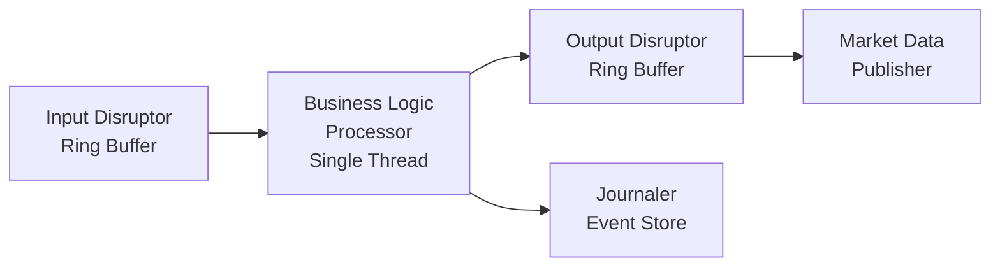
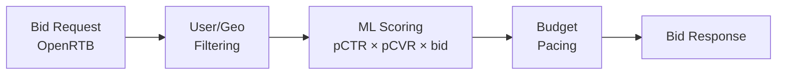
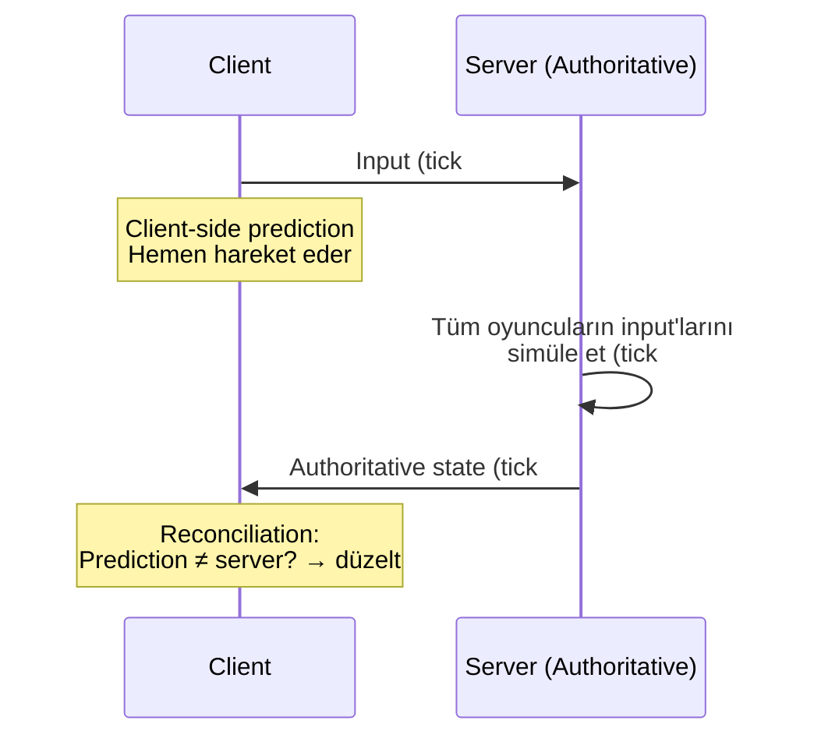
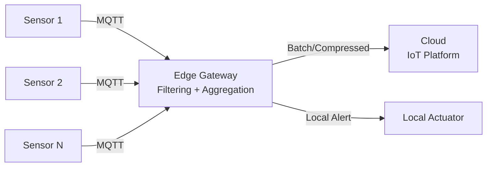
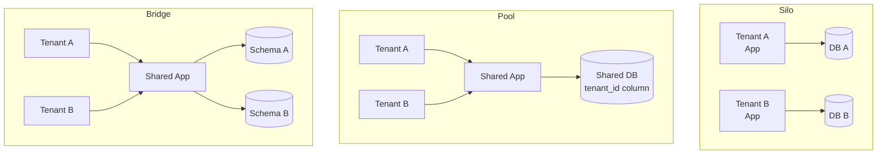

# 🏗️ Domain Mimarileri — Sektörel Derinlik

> *"Every system is perfectly designed to get the results it gets."* — W. Edwards Deming

> Genel mimari kalıplar (microservices, CQRS, event sourcing) her sektörde farklı biçimde tezahür eder. Bu doküman **beş farklı domain'in** kendine özgü mimari kısıtlarını, çözüm kalıplarını ve operasyonel tuzaklarını inceler.

---

## 📑 İçindekiler

1. [Exchange / LMAX — Ultra-Low Latency](#1-exchange--lmax--ultra-low-latency)
2. [Ad-tech / RTB — Sub-100ms Pipeline](#2-ad-tech--rtb--sub-100ms-pipeline)
3. [Gaming Backends](#3-gaming-backends)
4. [IoT at Scale](#4-iot-at-scale)
5. [Multi-Tenancy](#5-multi-tenancy)
6. [Anti-Pattern'ler](#6-anti-patternler)
7. [Staff+ Kontrol Listesi](#-staff-domain-mimarisi-kontrol-listesi)
8. [İleri Okuma](#-ileri-okuma)

---

## 1. Exchange / LMAX — Ultra-Low Latency

> Hedef: **Mikrosaniye seviyesinde deterministik** işlem eşleştirme.

### LMAX Disruptor Mimarisi

Geleneksel borsa sistemlerinde kuyruk + iş parçacığı havuzu modeli kullanılır. LMAX bunu kökten değiştirdi:



**Temel ilkeler:**

| İlke | Açıklama | Neden |
|---|---|---|
| **Single-Writer Principle** | Tüm iş mantığı **tek bir thread** üzerinde çalışır | Lock yok → context switch yok → öngörülebilir latency |
| **Ring Buffer** | Pre-allocated, fixed-size circular array | GC yok (Java'da), cache-line friendly |
| **Mechanical Sympathy** | CPU cache hierarchy'ye uygun veri yapıları | L1 cache miss = 1ns → main memory = 100ns (100× fark) |
| **Deterministic Core** | Aynı event stream → aynı sonuç | Replay ile debugging, warm standby |
| **Event Sourcing for Audit** | Her order/trade immutable event olarak kaydedilir | Regülatör uyumluluk (MiFID II, SEC) |

### Performans Rakamları

- LMAX: **~6M ops/sec**, p99 < 1µs (single thread, Java).
- Aeron (messaging): 40ns median latency.
- Kernel bypass (DPDK, Solarflare OpenOnload): NIC'ten userspace'e sıfır kopya.

### Trade-off'lar

- Tek thread = **vertical scaling sınırı**; yatay ölçekleme farklı instrument group'ları ayrı core'lara partition ederek yapılır.
- Deterministic replay = **side effect yasak**; network call, clock, random iş mantığında kullanılamaz.
- Java'da: `final` fields, primitive arrays, object pooling → **"Java gibi görünmeyen Java"** kodu.

---

## 2. Ad-tech / RTB — Sub-100ms Pipeline

> Hedef: Bir web sayfası yüklenirken (< 100ms) reklam açık artırması tamamlansın.

### Bid Request Budget Breakdown

```
Kullanıcı sayfa açar
  └─ Publisher → SSP → Ad Exchange ──── 100ms toplam bütçe
       │
       ├─ Network (exchange → DSP): ~10ms
       ├─ DSP bidding logic:        ~20ms
       ├─ ML model inference:       ~15ms
       ├─ Budget/pacing check:      ~5ms
       ├─ Response serialization:   ~5ms
       ├─ Network (DSP → exchange): ~10ms
       └─ Exchange auction:         ~10ms
       ─────────────────────────────
       Toplam:                      ~75ms (25ms headroom)
```

### Bidding Pipeline



**Mimari kısıtlar:**
- **Stateless compute**: Her bid request bağımsız. State (user profil, kampanya bütçesi) **ön-yüklenmiş** cache'te tutulur.
- **Pre-computed models**: ML model inference < 15ms → model serving (ONNX, TensorRT) veya decision tree/lookup table.
- **Approximate counters**: Bütçe takibi **eventual consistent** (Redis + local counter). Kesin accuracy = latency bütçesi aşılır.
- **No disk I/O**: Tüm veri memory'de veya NVMe üzerinde memory-mapped.

### Real-Time Aggregation

Impression/click/conversion event'leri saniyede milyonlarca:
- **Stream processing**: Kafka/Kinesis → Flink/ksqlDB → OLAP (ClickHouse, Apache Druid).
- **Lambda vs Kappa**: Çoğu ad-tech Kappa (stream-only) tercih eder; batch correction periodic reconciliation ile yapılır.
- **Click fraud detection**: Sliding window + anomaly detection → real-time.

---

## 3. Gaming Backends

> Hedef: **Düşük latency + adil + tutarlı** multiplayer deneyim.

### Authoritative Server

Client-side prediction + server reconciliation modeli:



**Neden client authoritative olamaz?** Hile. Client "teleport" veya "wall-hack" gönderebilir. Server **tek doğruluk kaynağı** olmalı.

### Lag Compensation

- **Client-Side Prediction**: Oyuncu kendi hareketini anında görür; sunucu onaylamadan.
- **Server Rewind**: Sunucu, hit detection için **istemcinin gördüğü duruma** geri sarar. FPS oyunlarında zorunlu.
- **Interpolation**: Client, sunucudan gelen state'leri 2 frame gecikmeli gösterir → akıcı hareket.
- **Extrapolation**: Paket kaybında son bilinen hıza göre tahmin → "rubber-banding" riski.

### Lockstep vs Rollback Netcode

| Özellik | Lockstep | Rollback |
|---|---|---|
| Nasıl çalışır | Tüm oyuncuların input'u gelene kadar bekle | Input predict et, yanlışsa geri al |
| Latency etkisi | En yavaş oyuncuya bağlı | Her oyuncu kendi latency'sini hisseder |
| Kullanım | RTS (StarCraft), fighting (eski) | Fighting (modern — GGPO), FPS |
| Bandwidth | Düşük (sadece input) | Orta (state snapshot gerekebilir) |
| Determinizm | Zorunlu (bit-exact) | Zorunlu değil ama tercih edilir |

### Tick Rate

- **Tick rate**: Sunucunun saniyede kaç kez state hesapladığı.
- 128 tick → 7.8ms per tick (CS2, Valorant).
- 64 tick → 15.6ms per tick (eski CS:GO).
- 20-30 tick → MMO, battle royale (Fortnite).
- Yüksek tick = daha doğru ama **CPU/bandwidth maliyeti artar**.

---

## 4. IoT at Scale

> Hedef: **Milyonlarca cihazdan** veri toplama, komut gönderme, edge processing.

### MQTT Broker Seçimi

MQTT (Message Queuing Telemetry Transport): Düşük bant genişliği, yüksek device sayısı.

| Broker | Öne Çıkan | Ölçek |
|---|---|---|
| **EMQX** | Erlang/OTP, cluster, rule engine | 100M+ connection |
| **HiveMQ** | Java, enterprise, AWS/Azure entegrasyonu | 10M+ connection |
| **VerneMQ** | Erlang, open-source, pluggable auth | 1M+ connection |
| **Mosquitto** | C, hafif, single-node | 100K connection |
| **AWS IoT Core** | Managed, serverless | Pay-per-message |

### Device Shadow (Digital Twin)

- Her fiziksel cihazın bulutta bir **shadow** (desired + reported state) tutulur.
- Cihaz çevrimdışıyken `desired` güncellenir → cihaz bağlandığında delta senkronize olur.
- AWS IoT Shadow, Azure Device Twin, Google Cloud IoT Device State.

### Time-Series Ingestion

| Veritabanı | Mimari | Güçlü Yön | Zayıf Yön |
|---|---|---|---|
| **TimescaleDB** | Postgres extension, hypertable | SQL uyumlu, JOINs | Horizontal scale sınırlı |
| **QuestDB** | Column-oriented, zero-GC Java | Çok hızlı ingestion (1.4M rows/s) | Ecosystem küçük |
| **InfluxDB** | TSM engine, Flux query | Geniş ekosistem | Clustering (OSS) yok |
| **Apache IoTDB** | Tree-model, edge + cloud | Düşük resource edge | Community küçük |

### Edge Gateway Mimarisi



**Edge'de neden işlem?**
- Bandwidth tasarrufu: Her saniye veri göndermek yerine 5-dakikalık aggregate.
- Latency: Acil alarm (sıcaklık eşiği) cloud'a gitmeden lokal tetiklenir.
- Connectivity: Offline durumda buffer + store-and-forward.

---

## 5. Multi-Tenancy

> Hedef: Tek platform, **binlerce müşteri**, izolasyon + verimlilik dengesi.

### İzolasyon Modelleri



| Model | İzolasyon | Maliyet | Operasyonel Karmaşıklık | Kullanım |
|---|---|---|---|---|
| **Silo** (tenant-per-infra) | En yüksek | En yüksek | N× altyapı yönetimi | Büyük enterprise, regülasyon (sağlık, finans) |
| **Pool** (shared everything) | En düşük | En düşük | Tek deployment, ama noisy neighbor riski | SaaS startup, B2C |
| **Bridge** (shared app, separate schema/DB) | Orta | Orta | Schema migration N kez | B2B SaaS, mid-market |

### Noisy Neighbor Problemi

Bir tenant'ın aşırı kullanımı diğerlerini etkiler (shared resource'larda):

**Çözümler:**
- **Per-tenant rate limiting**: API gateway'de tenant bazlı quota.
- **Per-tenant connection pool**: DB bağlantılarını tenant bazlı sınırla.
- **Resource tagging + priority queue**: Kritik tenant'lara öncelik.
- **Tenant-aware auto-scaling**: Hotspot tenant'ı ayrı instance'a taşı ("silo promotion").

### Per-Tenant Rate Limit Tasarımı

```
Rate Limit Hierarchy:
├── Global (platform koruması): 100K req/s
├── Plan-based (tier): Free=10 req/s, Pro=100, Enterprise=1000
├── Tenant-specific override: Tenant X = 5000 req/s (özel anlaşma)
└── Endpoint-specific: POST /import = 5 req/min (heavy operation)
```

### Data Residency

GDPR, KVKK gibi regülasyonlar verinin **fiziksel lokasyonunu** kısıtlar.

- **Routing layer**: Tenant → region mapping; istekler coğrafi olarak yönlendirilir.
- **Cell-based architecture**: Her bölge bağımsız "cell"; cross-cell veri akışı yok.
- **Metadata vs data**: Tenant metadata (isim, plan) global olabilir; PII/transaction verisi regional.
- Stripe, Shopify modeli: tenant onboarding'de region seçimi → geri dönülemez.

---

## 6. Anti-Pattern'ler

| Anti-Pattern | Domain | Neden Tehlikeli | Doğru Yaklaşım |
|---|---|---|---|
| **GC-dependent latency path** | Exchange | Java GC pause = 10-200ms → siparişler kaybolur | Object pooling, off-heap, Zing/ZGC veya C++/Rust |
| **Sync ML inference in bid path** | Ad-tech | Model inference > 50ms → timeout, gelir kaybı | Pre-computed lookup, ONNX batch, feature cache |
| **Client-authoritative game state** | Gaming | Hile: teleport, wall-hack, speed-hack | Server-authoritative + client prediction |
| **MQTT QoS 2 everywhere** | IoT | QoS 2 = 4 mesaj handshake → throughput 4× düşer | QoS 0 (telemetry) + QoS 1 (commands) + QoS 2 (sadece kritik) |
| **Shared DB pool tenancy** | Multi-tenant | Bir tenant 1000 slow query → tüm platform yavaşlar | Per-tenant pool, query timeout, noisy neighbor detection |
| **"Every device online" varsayımı** | IoT | Cihazlar çevrimdışı olur; last-will, shadow/twin olmadan state kaybolur | Device shadow + offline buffering + idempotent commands |
| **Single-region multi-tenant** | Multi-tenant | GDPR data residency ihlali; tek region = tek failure domain | Cell-based architecture, tenant-region pinning |
| **Tick rate yarışı** | Gaming | 128→256 tick ≠ daha iyi; bandwidth + CPU maliyeti geometrik artar | Tick rate'i latency ve oyun tipiyle orantılı seç |

---

## 🎯 Staff+ Domain Mimarisi Kontrol Listesi

### Yeni domain'e girerken

- [ ] Domain'in **birincil kısıtı** ne? (Latency, throughput, consistency, compliance, bandwidth)
- [ ] Sektördeki **dominant mimari pattern** nedir ve neden? (Ör: exchange = single-writer, gaming = authoritative server)
- [ ] **Regulatory requirement** var mı? (MiFID II, GDPR data residency, HIPAA)
- [ ] Domain'e özgü **benchmark/SLA** standartları nedir? (Ör: RTB < 100ms, game tick rate)
- [ ] Bu domain'de **build vs buy** dengesi nerede? (Ör: MQTT broker = buy, game netcode = build)

### Mimari review

- [ ] Hot path'te **GC, lock, disk I/O** var mı? (Ultra-low latency domain'lerde yasak)
- [ ] Multi-tenancy modeli dokümante mi? Noisy neighbor mitigasyonu tanımlı mı?
- [ ] IoT cihazları için **offline scenario** planlanmış mı?
- [ ] Data residency requirement'ları routing layer'da enforce ediliyor mu?
- [ ] Domain-specific anti-pattern'ler ekip tarafından biliniyor mu?

---

## 📚 İleri Okuma

### Exchange / LMAX
- Martin Thompson — *Mechanical Sympathy* blog + LMAX Disruptor talks
- *Trading and Exchanges* — Larry Harris (market microstructure)
- Aeron — github.com/real-logic/aeron (ultra-low latency messaging)

### Ad-tech / RTB
- OpenRTB specification — IAB Tech Lab
- *Computational Advertising* — Jun Wang et al.
- Meta Engineering — *Real-time bidding with machine learning*

### Gaming
- *Networked Graphics* — Steed & Oliveira
- Glenn Fiedler — *Gaffer On Games* (gafferongames.com) — netcode rehberi
- Valorant Engineering — *Netcode & 128-tick servers*
- GGPO — github.com/pond3r/ggpo (rollback netcode)

### IoT
- *Designing Connected Products* — Rowland et al. (O'Reilly)
- EMQX docs — emqx.io
- AWS IoT Greengrass — edge computing reference architecture

### Multi-tenancy
- *SaaS Tenant Isolation Strategies* — AWS Whitepaper (2023)
- *Building Multi-Tenant SaaS Architectures* — Tod Golding (AWS)
- Stripe Engineering Blog — multi-tenant database design

> [⬅️ Pratik klasörü](README.md) · [📚 Sözlük](../glossary/terim-sozlugu.md) · [🔬 Kaynakça](../kaynakca.md)
