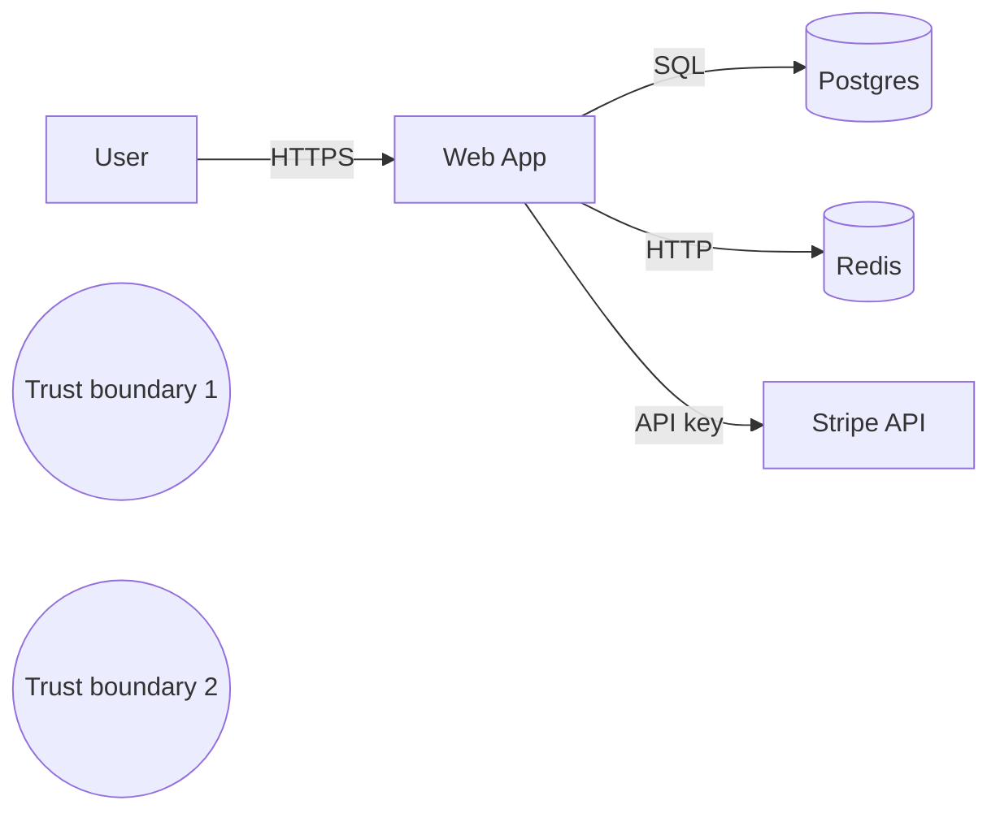

# 🛡️ Güvenlik Derinlemesine

> **"Security is a process, not a product."** — Bruce Schneier

Bu doküman uygulama mühendisinin **bilmek zorunda olduğu** güvenlik bilgisini özetler. OWASP Top 10, threat modeling, kimlik & yetki, secret management, supply chain.

---

## 📑 İçindekiler

1. [Güvenlik Felsefesi & Tehdit Modeli](#1-güvenlik-felsefesi--tehdit-modeli)
2. [STRIDE Tehdit Modelleme](#2-stride-tehdit-modelleme)
3. [OWASP Top 10 (2021)](#3-owasp-top-10-2021)
4. [Authentication](#4-authentication)
5. [Authorization](#5-authorization)
6. [Cryptography Doğru Kullanımı](#6-cryptography-doğru-kullanımı)
7. [Secret Management](#7-secret-management)
8. [Supply Chain Güvenliği](#8-supply-chain-güvenliği)
9. [Logging, Audit ve Forensics](#9-logging-audit-ve-forensics)
10. [Compliance Çerçeveleri](#10-compliance-çerçeveleri)
11. [Incident Response](#11-incident-response)

---

## 1. Güvenlik Felsefesi & Tehdit Modeli

### Temel ilkeler

| İlke | Anlamı |
|---|---|
| **Defense in depth** | Tek savunma yetmez, katmanlı |
| **Least privilege** | Sadece gereken yetki |
| **Zero trust** | "İçeride/dışarıda" varsayım yok |
| **Fail securely** | Hata durumunda güvenli tarafta kal |
| **Secure by default** | Güvenli olmayan yapılandırma çaba gerektirir |
| **Don't roll your own crypto** | Battle-tested kütüphane |
| **Audit trail** | Her değişiklik izlenebilir |

### CIA triad

- **Confidentiality** — sadece yetkili görür.
- **Integrity** — yetkisiz değişiklik tespit edilir.
- **Availability** — meşru kullanıcı erişebilir.

### Threat actor sınıfları

| | Motivation | Sophistication |
|---|---|---|
| Script kiddie | Eğlence, küçük çıkar | Düşük |
| Cyber criminal | Para (ransomware, fraud) | Orta |
| Hacktivist | Ideoloji | Orta |
| Insider | Para, intikam | Yüksek (erişim) |
| Nation-state | Strateji, espionage | Çok yüksek |

---

## 2. STRIDE Tehdit Modelleme

> Microsoft'un mnemonic'i. Her sistem için 6 tehdit kategorisi sor.

| Tehdit | Tanım | Karşı kontrol |
|---|---|---|
| **S**poofing | Kimlik taklidi | Authentication, mTLS |
| **T**ampering | Veri değiştirme | Integrity (HMAC, signed cert) |
| **R**epudiation | İnkar | Audit log, signed action |
| **I**nformation disclosure | Sızıntı | Encryption, access control |
| **D**enial of service | Erişim engelleme | Rate limit, scaling, redundancy |
| **E**levation of privilege | Yetki yükseltme | Least privilege, sandboxing |

### Threat modeling süreci

1. **Decompose**: Sistemi DFD (data flow diagram) olarak çiz.
2. **Identify**: Her komponent + flow için STRIDE sor.
3. **Mitigate**: Her tehdit için kontrol tasarla.
4. **Validate**: Test et, attack tree güncelle.

### PASTA Metodolojisi (Process for Attack Simulation and Threat Analysis)

STRIDE bileşen bazlı sorgularken, **PASTA** 7 aşamalı, risk-merkezli bir metodoloji sunar. Farkı: iş hedeflerinden başlar, saldırgan perspektifiyle biter.

1. **Define Objectives** — İş hedefleri ve güvenlik gereksinimleri.
2. **Define Technical Scope** — Teknik yüzey (API, infra, 3rd-party).
3. **App Decomposition** — DFD, trust boundary, data flow.
4. **Threat Analysis** — Tehdit istihbaratı (CVE, TTPs, sektör verileri).
5. **Vulnerability Analysis** — Mevcut zafiyetlerin tespiti (SAST, DAST, pentest sonuçları).
6. **Attack Modeling** — Saldırı ağaçları (attack tree), saldırgan profili ile simülasyon.
7. **Risk & Impact** — İş etkisi × olasılık = risk skoru; mitigasyon önceliklendirmesi.

**STRIDE vs PASTA:** STRIDE hızlı brainstorm için idealdir (1-2 saat workshop). PASTA daha kapsamlıdır; regülasyona tabi sistemlerde (finans, sağlık) veya M&A due diligence'da tercih edilir. İkisi birlikte kullanılabilir: PASTA'nın 6. adımında STRIDE kategorileri saldırı ağacını yapılandırır.

### DFD örneği



> **Trust boundary** geçişleri tehlike noktalarıdır. Her birinde validation + auth zorunlu.

---

## 3. OWASP Top 10 (2021)

### A01 — Broken Access Control

> En sık görülen.

- **IDOR**: `/api/orders/123` URL'i değiştir → başkasının siparişi.
- **Vertical privilege escalation**: User → admin.
- **Force browsing**: Yetkisiz endpoint'e doğrudan istek.

**Önlem:**
- Server-side authz **her** endpoint.
- Resource ownership check.
- Default deny.

### A02 — Cryptographic Failures

- Cleartext password storage (bcrypt/argon2 kullan).
- Weak hash (MD5, SHA1).
- TLS olmayan içsel servis.

### A03 — Injection (SQL, NoSQL, OS, LDAP)

```javascript
// ❌
db.query(`SELECT * FROM users WHERE id = ${userId}`);

// ✅ Prepared statement
db.query('SELECT * FROM users WHERE id = $1', [userId]);
```

OS command injection:
```python
# ❌
os.system(f"ping {user_input}")

# ✅
subprocess.run(["ping", user_input], shell=False, check=True)
```

### A04 — Insecure Design

> Kod düzeyi değil, **mimari düzeyi** açık. Threat modeling eksikliği.

### A05 — Security Misconfiguration

- Default password.
- Verbose error → stack trace user'a.
- Debug endpoint açık prod'da.
- Cloud bucket public.

### A06 — Vulnerable & Outdated Components

> log4shell (CVE-2021-44228) — log4j 2.x RCE.

- Dependency scanning (Dependabot, Snyk, Renovate).
- SBOM (Software Bill of Materials).
- Otomatik patch policy.

### A07 — Identification and Authentication Failures

- Weak password policy.
- No MFA.
- Session fixation.
- Predictable token.

### A08 — Software and Data Integrity Failures

- Unsigned update.
- Pipeline injection (CI/CD compromise).
- Untrusted deserialization (Java `ObjectInputStream`).

### A09 — Security Logging and Monitoring Failures

- Login failure log yok.
- Audit log yok.
- Alert gecikmesi 6+ ay (industry avg).

### A10 — Server-Side Request Forgery (SSRF)

```
GET /fetch?url=http://localhost:8080/admin
GET /fetch?url=http://169.254.169.254/latest/meta-data
```

EC2 metadata endpoint çalınması (Capital One 2019 — postmortem-arsivi).

**Önlem:**
- Allowlist for outbound URL.
- Block private IP ranges (RFC 1918, link-local).
- IMDSv2 (token-required).

---

## 4. Authentication

### Password storage

```
✅ argon2id (modern best, Password Hashing Competition winner)
✅ bcrypt (workfactor 12+, 100ms target)
✅ scrypt (memory-hard)
❌ PBKDF2 (legacy, OWASP minimum 600K iter)
❌ SHA-256, MD5 (NEVER for password)
```

### Multi-Factor Authentication

| Faktör | Örnek | Güç |
|---|---|---|
| Something you know | Password | Zayıf |
| Something you have | TOTP, hardware key | Orta-Yüksek |
| Something you are | Fingerprint, FaceID | Orta |
| Phishing-resistant | FIDO2/WebAuthn | En güçlü |

> **SMS OTP** zayıf (SIM swap attack). Authenticator app veya FIDO2 yeğle.

### OAuth 2.0 + OIDC

- **OAuth 2.0**: Authorization (yetki delegasyonu).
- **OIDC**: OAuth üstüne identity layer.
- **Authorization Code + PKCE**: Modern best practice.

```
1. User → /authorize?client_id=...&code_challenge=...
2. User authenticates at IdP
3. IdP → redirect with code
4. Client exchanges code + code_verifier → access_token + id_token
```

### JWT — Pitfalls

- 🚫 `alg: none` saldırısı → reject explicitly.
- 🚫 RS256 yerine HS256 confusion (key as algorithm).
- 🚫 No expiration → token sonsuz geçerli.
- 🚫 Sensitive data in payload (base64 ≠ encryption).
- 🚫 No revocation → kısa TTL + refresh token rotation.

### DPoP (Demonstration of Proof-of-Possession)

Bearer token'ın en büyük zayıflığı: çalınırsa herkes kullanabilir (token theft → replay). **DPoP** (RFC 9449) bunu çözer: client her istekte token'a bağlı bir **proof JWT** üretir. Bu proof, client'ın private key'i ile imzalanır ve `ath` (access token hash) + `htm` (HTTP method) + `htu` (URL) içerir. Sunucu, access token + DPoP proof eşleşmesini doğrular; çalınmış token **farklı bir client'ta kullanılamaz**. OAuth 2.0 Security Best Current Practice (BCP) DPoP'u "sender-constrained token" olarak önerir. Fintech, PSD2 ve yüksek-güvenlik API'larda hızla yaygınlaşıyor.

### Session vs JWT

| | Session (server-side) | JWT |
|---|---|---|
| Storage | Server (Redis) | Client |
| Revocation | Anlık | Token expire'a kadar |
| Scaling | Sticky veya shared store | Stateless |
| Size | Cookie ID | 500-2000 byte |

> Çoğu monolith için **session > JWT**. JWT distributed/microservice context'inde değer kazanır.

### Cookie güvenliği

```
Set-Cookie: session=...;
  HttpOnly;     # JS erişemez (XSS)
  Secure;       # HTTPS only
  SameSite=Strict;  # CSRF mitigation
  Path=/;
  Domain=example.com;
  Max-Age=3600;
```

---

## 5. Authorization

### Modeller

| Model | Açıklama | Örnek |
|---|---|---|
| **RBAC** | Role-based | "admin", "editor", "viewer" |
| **ABAC** | Attribute-based | `if (user.dept == resource.dept)` |
| **ReBAC** | Relationship-based | Google Zanzibar, OpenFGA |
| **PBAC** | Policy-based | OPA Rego |
| **DAC** | Discretionary (owner-based) | Unix file perms |
| **MAC** | Mandatory (system) | SELinux, classification labels |

### RBAC örneği

```sql
CREATE TABLE roles (id, name);
CREATE TABLE permissions (id, action, resource);
CREATE TABLE role_permissions (role_id, permission_id);
CREATE TABLE user_roles (user_id, role_id);
```

```python
def has_permission(user, action, resource):
    return db.exists(
        SELECT 1 FROM user_roles ur
        JOIN role_permissions rp ON ur.role_id = rp.role_id
        JOIN permissions p ON rp.permission_id = p.id
        WHERE ur.user_id = $1 AND p.action = $2 AND p.resource = $3
    )
```

### ReBAC (Zanzibar-style)

> "Dropbox folder X'i Alice'in arkadaşları görebilir."
> Çok sayıda fine-grained ilişki.

OpenFGA, SpiceDB, Authzed, Permify.

### Policy-as-code (OPA)

```rego
package authz

default allow = false

allow {
  input.user.role == "admin"
}

allow {
  input.user.id == input.resource.owner
  input.action == "read"
}
```

### Pratik kuralı

- 🟢 Authentication: kim?
- 🟢 Authorization: ne yapabilir?
- 🚨 İkisi **karıştırılmaz**.
- 🚨 Authz check **server-side**, **her endpoint**, **default deny**.

---

## 6. Cryptography Doğru Kullanımı

### Don't roll your own crypto

> Geçerli olan tek savunma: **review edilmiş kütüphane**.

| Dil | Kullan |
|---|---|
| Python | `cryptography` (PyCA), `nacl` |
| Node | `crypto` built-in |
| Java | JCE + Bouncy Castle |
| Go | `crypto/...` standart |
| Rust | `ring`, `RustCrypto` |
| C/C++ | `libsodium`, `OpenSSL` (dikkatli) |

### Symmetric encryption

| Algoritma | Kullanım |
|---|---|
| AES-GCM | Default (auth + encryption) |
| ChaCha20-Poly1305 | Mobile (no AES-NI) |
| AES-CBC | ❌ Padding oracle, manual MAC |
| AES-ECB | ❌❌❌ Asla |

**Nonce reuse = catastrophic.** GCM'de aynı nonce + key → plaintext recovery. Random 96-bit OR counter + restart-safe.

### Asymmetric

| Use case | Algoritma |
|---|---|
| Sign | Ed25519, ECDSA P-256, RSA-PSS |
| Encrypt (KEM) | RSA-OAEP, ECIES |
| Key exchange | X25519, ECDH |

### Hashing

| | Algoritma |
|---|---|
| **General hash** | SHA-256, SHA-3, BLAKE3 |
| **Password** | argon2id, bcrypt, scrypt |
| **MAC** | HMAC-SHA256 |
| **❌ NEVER for password** | MD5, SHA-1, plain SHA-256 |

### Random

```
crypto/rand (Go), secrets (Python), crypto.randomBytes (Node)
NEVER: Math.random, rand() (predictable)
```

### Constant-time comparison

```python
# ❌ Timing attack riski
if user_input == correct_token: ...

# ✅
import hmac
if hmac.compare_digest(user_input, correct_token): ...
```

### Post-quantum hazırlık

- 2024 NIST: ML-KEM (Kyber), ML-DSA (Dilithium) standartlaştı.
- "Harvest now, decrypt later" tehdidi → uzun ömürlü secret için PQC migrasyon.
- TLS 1.3 + X25519+Kyber768 hybrid (Cloudflare, Chrome 2023+).

---

## 7. Secret Management

### Hierarchy

| Yöntem | Risk |
|---|---|
| Code repo | 🔴🔴🔴 (gitleaks, trufflehog) |
| .env file (committed) | 🔴🔴🔴 |
| .env file (not committed) | 🟡 (developer machine'de) |
| Env var (deploy time) | 🟡 (process listing leak) |
| Secret manager | 🟢 (Vault, AWS SM, GCP SM) |
| KMS-backed envelope | 🟢🟢 (encrypted at rest) |

### Vault örneği

```bash
vault kv put secret/app/db password=...
vault kv get -field=password secret/app/db
```

App'e injection:
- Sidecar (vault-agent injector).
- Init container.
- CSI driver (K8s mount as file).

### Secret rotation

- ✅ **Otomatik**: Vault leases, AWS RDS auto-rotate.
- ✅ **Düzenli**: 90 günde bir.
- ✅ **Compromise sonrası**: Anında.
- 🚨 **Hard-coded secret** = güvenlik açığı.

### Pre-commit hooks

```yaml
# .pre-commit-config.yaml
repos:
  - repo: https://github.com/gitleaks/gitleaks
    rev: v8.18.0
    hooks:
      - id: gitleaks
```

### "Compromise sonrası ne yaparım?" oyun planı

1. **Rotate immediately** — eski sırrı iptal et.
2. **Audit log review** — sızıntıdan beri kullanım.
3. **Blast radius** — başka servisler etkilendi mi?
4. **Postmortem** — nasıl sızdı?
5. **Tooling update** — gelecekte engelle.

---

## 8. Supply Chain Güvenliği

### Tehditler

- **Typosquatting**: `react-domm` (Facebook react-dom değil).
- **Dependency confusion**: Public registry'de aynı isimli paket.
- **Compromised maintainer**: Account takeover (event-stream 2018, ua-parser-js 2021).
- **Build pipeline injection**: SolarWinds 2020.
- **Repojacking**: Username + repo name silinince başkası alır.

### SLSA (Supply-chain Levels for Software Artifacts)

| Seviye | Garanti |
|---|---|
| L1 | Build script var |
| L2 | Build hosted, provenance |
| L3 | Hardened build, signed provenance |
| L4 | Two-party review, hermetic build |

### SBOM

> Software Bill of Materials — bağımlılıklar listesi.

Formatlar: SPDX, CycloneDX. Generate: `syft`, `cdxgen`.

### Sigstore / cosign

```bash
cosign sign --key cosign.key myimage:v1
cosign verify --key cosign.pub myimage:v1
```

Keyless: OIDC identity → ephemeral cert (Fulcio) → transparency log (Rekor).

### Container image hardening

- ✅ Minimal base (distroless, alpine-static, scratch).
- ✅ Non-root user.
- ✅ Read-only filesystem.
- ✅ Drop all capabilities, add only needed.
- ✅ Image scanning (Trivy, Grype) CI'da.
- ✅ Sign + verify (cosign).

---

## 9. Logging, Audit ve Forensics

### Log seviyeleri (security için)

| Seviye | İçerik |
|---|---|
| **Auth events** | Login (success/fail), logout, MFA, password change |
| **Authz events** | Permission grant/revoke, privileged action |
| **Data access** | PII access (read), bulk export |
| **Admin events** | Config change, user management |
| **System events** | Service start/stop, deploy |

### Log içeriği

- ✅ Timestamp (UTC, ISO 8601).
- ✅ Actor (user id, session id, IP).
- ✅ Action.
- ✅ Resource.
- ✅ Result (success/fail).
- ✅ Trace id (request correlation).
- ❌ Password, token, full PII (mask).

### Log security

- **Tamper-evident**: Append-only, signed (Rekor-style transparency log).
- **Retention**: SOC2 12 ay min, GDPR balance.
- **Access**: Read-only for engineers, write-only from app.
- **Centralization**: SIEM (Splunk, Elastic, Datadog).

### Audit trail

- Database: trigger / CDC / WAL audit.
- Application: explicit `audit_log.write(...)`.
- Infrastructure: CloudTrail (AWS), Activity Log (Azure), Audit Logs (GCP).

### Forensics readiness

- Time sync (NTP) tüm sistem.
- Log retention sufficient (30+ gün hot, 1+ yıl cold).
- Snapshot/image policy (on-demand).
- Tabletop exercise yıllık.

---

## 10. Compliance Çerçeveleri

### GDPR (EU) / KVKK (TR) — Data Protection

- **Lawful basis**: consent, contract, legitimate interest.
- **Data minimization**: gereken kadar.
- **Right to access / erasure / portability**.
- **DPO** (Data Protection Officer).
- **Breach notification**: 72 saat (GDPR), 72 saat (KVKK önemli vakalarda).

**Mühendislikte:**
- Soft delete + scheduled hard delete.
- Right to erasure: tüm replica + backup'ta?
- Cross-border transfer: AB dışı veri?
- DSAR (Data Subject Access Request): export endpoint.

### PCI-DSS (Payment)

- Card data isolation (CDE).
- Tokenization (Stripe, Adyen).
- Log retention 12+ ay.
- Quarterly vulnerability scan.
- Annual pentest.

### SOC 2

- **Trust principles**: Security, Availability, Processing Integrity, Confidentiality, Privacy.
- **Type 1**: Point-in-time control design.
- **Type 2**: 6-12 month observed effectiveness.
- Audit yıllık.

### HIPAA (US Healthcare)

- PHI protection.
- BAA (Business Associate Agreement).
- Encryption at rest + in transit.
- Audit log + access tracking.

### ISO 27001

- ISMS (Information Security Management System).
- Annex A: 93 control (2022 ed.).
- 3-yıl certification cycle.

### Compliance ≠ Security

> **Compliant olmak güvenli olmak demek değildir.** Equifax 2017 PCI-DSS uyumluyken sızıntı oldu.

Compliance = **minimum bar**. Güvenlik onun üstünde.

---

## 11. Incident Response

### NIST 4-faz model

```
Preparation → Detection & Analysis → Containment, Eradication, Recovery → Post-Incident
```

### Roller (security incident'te)

- **Incident Commander** — koordinasyon.
- **Investigator** — forensics.
- **Communications** — internal + external (regulator).
- **Legal** — disclosure obligations.
- **PR** — public statement.

### Containment stratejileri

- **Isolate**: compromised host'u network'ten çıkar.
- **Disable account**: kompromis edilmiş kimliği reddet.
- **Rotate credentials**: tüm secret.
- **Revoke tokens**: session/JWT denylist.

### Disclosure obligations

- GDPR: 72 saat regulator (EU).
- US state laws: değişken.
- HIPAA: 60 gün (large breach).
- PCI: card brand'a anında.
- Public: depends on jurisdiction + SEC (publicly traded companies).

### Tabletop exercise

> Yıllık (en az). Senaryo: "AWS access key sızdı, ne yapacağız?" 2-saat masa başı egzersiz.

---

## 🎯 Staff+ Güvenlik Kontrol Listesi

### Yeni servis için

- [ ] Threat model (STRIDE) yazıldı mı?
- [ ] Authentication: standart sağlayıcı (OAuth/OIDC), MFA?
- [ ] Authorization: her endpoint, default deny?
- [ ] Input validation, output encoding (XSS).
- [ ] Prepared statement / parametrized query.
- [ ] Secret manager kullanımı, no hardcode.
- [ ] TLS 1.2+ , HSTS, modern cipher.
- [ ] Audit log + log retention.
- [ ] Rate limit (auth endpoint'lerde özel).
- [ ] Dependency scan CI'da.
- [ ] Container hardening (non-root, distroless).
- [ ] Compliance: hangi data tipleri (PII, PCI, PHI)?
- [ ] DSAR / right-to-erasure flow.
- [ ] Incident runbook + on-call.

---

## ⚠️ Güvenlik Anti-Pattern'leri

| Anti-Pattern | Neden Tehlikeli | Doğru Yaklaşım |
|---|---|---|
| **Security by obscurity** | Gizli algoritma/port/URL keşfedilir; saldırgan reverse-engineer eder | Kerckhoffs ilkesi — sistem açık olsa bile güvenli olmalı |
| **Hardcoded secrets** | Repo'ya push → credential leak, rotate edemezsin | Secret manager (Vault, AWS SM) + rotate policy |
| **Trust-all-origins CORS (`*`)** | CSRF/data exfiltration kapısı açılır | Whitelist origin, `Access-Control-Allow-Credentials` ile `*` yasak |
| **JWT'de sensitive data** | JWT payload Base64 — imzalı ama **şifreli değil**, herkes okur | JWT'ye sadece subject/role/exp koy; PII → backend lookup |
| **Shared admin password** | Audit trail yok, rotate edilmez, ayrılan çalışan riski | Bireysel hesap + MFA + least-privilege RBAC |
| **Checkbox compliance** | SOC 2 badge alınır ama gerçek kontrol uygulanmaz | Continuous compliance: policy-as-code, automated evidence |
| **"İç ağda güvendeyiz" varsayımı** | Lateral movement (SolarWinds); VPN ≠ güvenlik | Zero-trust: her hop authenticate + authorize |
| **Dependency pinlememe** | Supply chain attack (event-stream, ua-parser-js) | Lock file + hash verify + Dependabot/Renovate + SBOM |

---

## 📚 İleri Okuma

- *The Tangled Web* — Michal Zalewski (browser security klasiği)
- *Cryptography Engineering* — Ferguson, Schneier, Kohno
- *Web Application Hacker's Handbook* — Stuttard & Pinto
- *Building Secure & Reliable Systems* — Adkins et al. (Google SRE/security)
- OWASP Top 10, ASVS, Cheat Sheet Series
- Krebs on Security blog
- Troy Hunt — *Have I Been Pwned* + blog
- Phrack, USENIX Security papers

> [⬅️ Pratik klasörü](README.md) · [📚 Sözlük](../glossary/terim-sozlugu.md) · [🔬 Kaynakça](../kaynakca.md)
