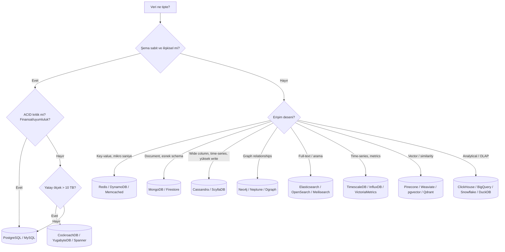
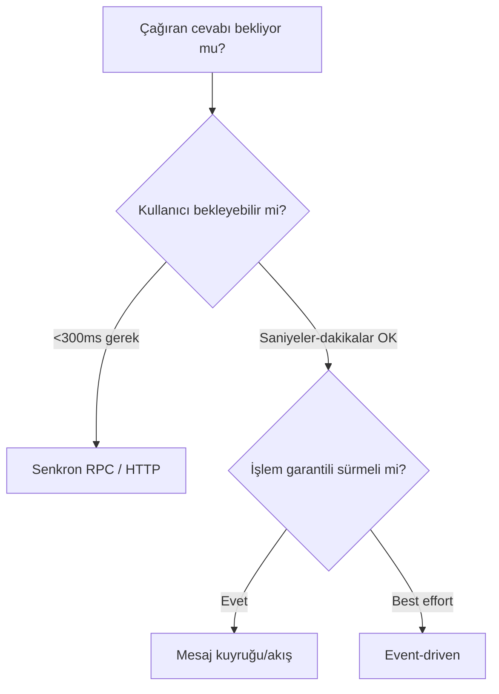
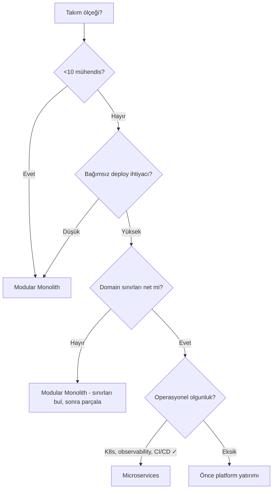
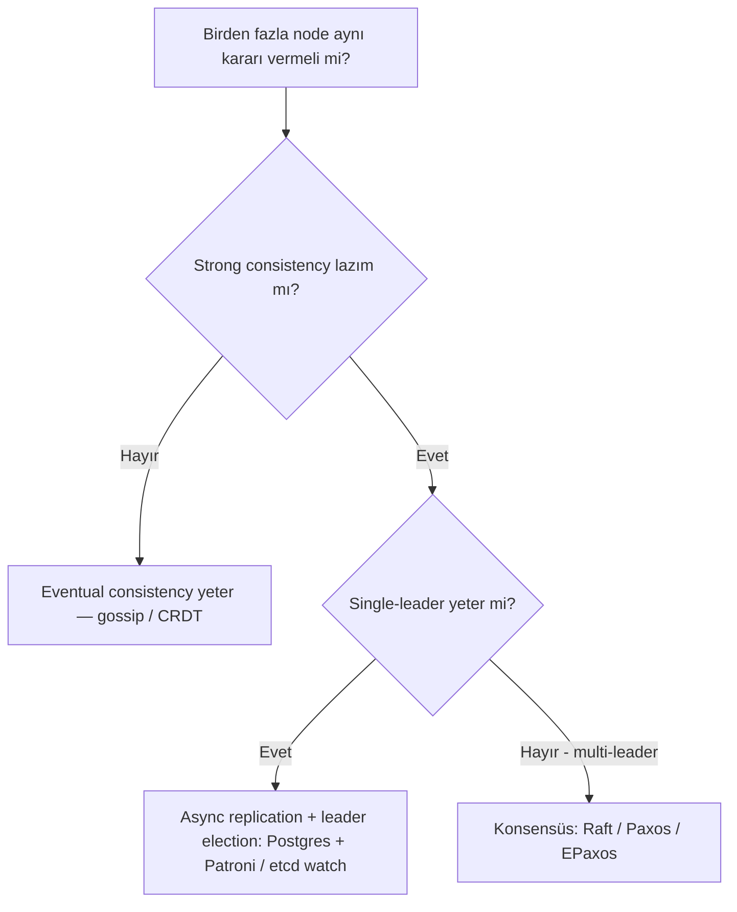
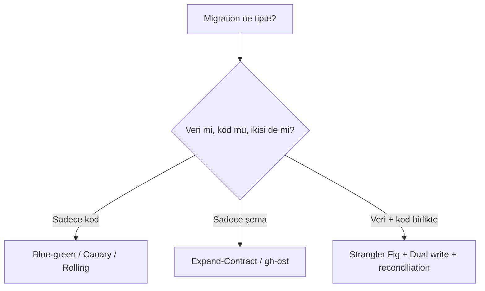

# 🧭 Karar Çerçevesi Matrisleri

> **"Senior mühendis 'cevap'ı bilir; staff mühendis 'soru'yu bilir."**

Bu doküman, üretim ortamında yıllarca tekrar eden **mimari kararlar** için karar ağaçları, trade-off matrisleri ve "ne zaman ne" tabloları sunar. Her bölüm, ADR yazımına geçişi kolaylaştırmak için **somut sinyaller** içerir.

---

## 📑 İçindekiler

1. [Veritabanı Seçimi](#1--veritabanı-seçimi)
2. [Sync vs Async İletişim](#2--sync-vs-async-iletişim)
3. [Monolith vs Microservices vs Modular Monolith](#3--monolith-vs-microservices-vs-modular-monolith)
4. [Build vs Buy](#4--build-vs-buy)
5. [Cache Stratejisi](#5--cache-stratejisi)
6. [Yetkilendirme Modeli](#6--yetkilendirme-modeli-rbac-vs-abac-vs-rebac)
7. [API Stili (REST / gRPC / GraphQL)](#7--api-stili-rest--grpc--graphql)
8. [Messaging: Kuyruk vs Log vs Pub/Sub](#8--messaging-kuyruk-vs-log-vs-pubsub)
9. [Storage: SQL / NoSQL / NewSQL / Search / TSDB](#9--storage-tipi-sql--nosql--newsql--search--tsdb)
10. [Compute: Container / VM / Serverless / Edge](#10--compute-tipi-container--vm--serverless--edge)
11. [Konsensüs / Lider Seçimi Gerekiyor mu?](#11--konsensüs--lider-seçimi-gerekiyor-mu)
12. [Migration Stratejisi](#12--migration-stratejisi)

---

## 1. 💾 Veritabanı Seçimi

### Karar ağacı



### Trade-off matrisi (üretim sinyalleri)

| Sinyal | Önerilen | Neden |
|---|---|---|
| Veriniz **ilişkisel** ve <10 TB | **PostgreSQL** | Boring, sağlam, ekosistem geniş |
| Yatay ölçeklenecek + güçlü tutarlılık | **CockroachDB / YugabyteDB / Spanner** | Distributed SQL |
| **Çok yüksek write** (>50K/s/node), güçlü tutarlılığa ihtiyaç yok | **Cassandra / Scylla** | LSM-friendly, AP system |
| **Mikro saniye latency**, tüm veri RAM'e sığar | **Redis** | İn-memory, single-thread sıkı |
| **Schema sürekli değişiyor**, embed edilebilir aggregate | **MongoDB** (dikkatli kullanılırsa) | Şema esnek; ama **transaction'a güvenme** |
| **Zaman serisi + binlerce metric** | **TimescaleDB / VictoriaMetrics** | Time-bucketing, downsampling native |
| **Tam-metin arama, fasetleme** | **OpenSearch / Meilisearch / Typesense** | Inverted index |
| **Graph traversal** (3+ hop) | **Neo4j / Memgraph** | Index-free adjacency |
| **OLAP raporlama** | **ClickHouse** (self-host) / **BigQuery** (managed) | Kolonlu store, vectorized exec |
| **Embedded analytical** (data app) | **DuckDB** | OLAP-in-process, embed |
| **Vector search** (RAG) | **pgvector** (basit) / **Qdrant** (ölçek) | HNSW index |

### "PostgreSQL ne zaman yetmez?" sinyalleri

- ✅ Tek-yazar throughput **>50K writes/sec** ve dikey ölçek tükendi.
- ✅ Tek tabloda **>10 TB** ve partition / sharding karmaşık geldi.
- ✅ **Cross-region active-active** yazma gerekiyor.
- ✅ **Time-series** workload'unda VACUUM / index bloat ezici.

→ Bunlar görülene kadar **PostgreSQL'de kal**. Çoğu girişim "büyük veri" sorununu **yaşamadan** çözmeye çalışır → premature complexity.

### Anti-pattern uyarıları

- ❌ **MongoDB ile transaction** ağırlıklı OLTP. (2.x'ten beri var; ama ergonomi/garanti zayıf.)
- ❌ **Postgres'i full-text engine** olarak ölçeklendirme. `tsvector` küçük-orta için OK; >100M doc ise OpenSearch.
- ❌ **Cassandra'yı OLTP** gibi sorgulama. Sorgu desenlerini önceden bilmen şart.
- ❌ **Redis'i durable store** olarak kullanma. AOF ≠ Postgres durability.
- ❌ **Elasticsearch primary store** olarak. _id reindex acılı, schema migration zayıf.

---

## 2. 🔁 Sync vs Async İletişim

### Karar ağacı



### Trade-off matrisi

| Boyut | Sync | Async |
|---|---|---|
| **Latency** | Düşük | Yüksek |
| **Coupling** | Sıkı (servis temas yüzeyi) | Gevşek |
| **Hata propagation** | Doğrudan; çağıran görür | Geri-basınç gerek |
| **Operasyonel karmaşıklık** | Az | Çok (broker, DLQ, replay) |
| **Debug** | Kolay (stack trace) | Zor (correlation ID + tracing) |
| **Backpressure** | Doğal (cevap gecikir) | Manuel |
| **Idempotency gereksinimi** | Düşük | **Yüksek** (retry kaçınılmaz) |
| **Exactly-once illüzyonu** | Yok (zaten 1 kez) | Var (Kafka transactions vb.) |

### Ne zaman async **mecbur**?

- 🐢 İşlem **>5 saniye** sürüyor (örn. video transcode, ML inference, e-mail toplu gönderim).
- 🌊 **Trafik dalgalı** ve geri-basınç gerekiyor (kuyruk şok absorban).
- 📡 **Fan-out** (1 olay → N consumer).
- 🔄 **Saga / koreografi** ile multi-service workflow.

### Ne zaman sync **mecbur**?

- 👤 Kullanıcı **anında cevap** bekliyor (login, search, payment authorize).
- 🔒 İşlemin sonucuna **bağlı sonraki adım**.

### Hibrit: "Accept-then-async"

> En yaygın pratik: HTTP 202 + Location header → async iş başlat → client polling/webhook ile sonucu al.

```
POST /jobs   → 202 Accepted, jobId: abc
GET /jobs/abc → 200 { status: "pending" } / { status: "done", result: ... }
```

---

## 3. 🏛️ Monolith vs Microservices vs Modular Monolith

### Karar ağacı



### "Microservices ne zaman seni öldürür?"

| Sinyal | Risk |
|---|---|
| <10 mühendis | Operasyonel yük tüm zamanı yer |
| Domain sınırları **bilinmiyor** | Yanlış yerlerde sınır → distributed monolith |
| **K8s/observability/CI/CD** olgun değil | Her micro-service ayrı baş ağrısı |
| Cross-service transaction yaygın | Distributed transaction zorluğu |
| **DB her servise ayrı değil**, paylaşılıyor | Database = coupling = distributed monolith |

### Vakalar (kaynakça'dan)

- **Shopify**: ~3000 mühendis, hâlâ **modular monolith** (Rails). Domain'ler `pack`'lerle izole.
- **Amazon Prime Video** 2023: Microservices → monolithic kararı. Maliyet %90 azalma. Mimari moda değil iş bağlamı.
- **Segment**: 100s microservice → 1 monolith → sonra "macroservices". Mikroservis efsanesini kıran blog.
- **Uber**: ~3000 microservice. Çalışıyor, ama operasyonel yatırım hyperscaler ölçeğinde.

### Modular monolith'in altın kuralı

> Sınırları **kod seviyesinde** zorla (linter ile), **process seviyesine almadan**. Ekip büyür, gerçekten ihtiyaç olduğunda extraction kolaydır. Tersi (microservice → monolith) **çok pahalıdır**.

---

## 4. 🛒 Build vs Buy

### Soru kümesi

1. **Bu sorun bize özgü mü, sektörde standart mı?**
2. **Çekirdek kompetansımız mı?**
3. **3 yıl sonra hâlâ özgün mü olacak?**
4. **Vendor lock-in maliyeti?**
5. **Toplam sahip olma maliyeti (TCO)?**

### Karar matrisi

| Sorun | Buy | Build |
|---|---|---|
| Authentication (OIDC/OAuth) | ✅ Auth0, Clerk, Cognito | ❌ KeyCloak self-host bile fazla iş |
| Email gönderme | ✅ Postmark, SES, SendGrid | ❌ |
| Payment | ✅ Stripe, Adyen, Braintree | ❌ Regülasyon ezer |
| Logs / metrics / traces | ✅ Datadog, New Relic / OSS Grafana stack | 🤔 Hyperscale'de cost bazlı |
| Feature flags | ✅ LaunchDarkly, Unleash | 🤔 |
| Search | 🤔 Algolia (kolay) / OSS OpenSearch (kontrol) | ❌ Lucene'i sıfırdan yazma |
| Vector DB | 🤔 Pinecone (kolay) / pgvector (basit) | ❌ |
| Domain workflow / business logic | ❌ Asla | ✅ Çekirdek |
| Recommendation engine | 🤔 (off-the-shelf zayıf) | ✅ Çekirdek diferansasyon |
| Internal tooling | ✅ Retool, Appsmith | 🤔 |

### "Buy" tuzakları

- 🎣 **Vendor lock-in**: Migration acılı (especially proprietary DB, custom DSL).
- 💰 **Egress / per-user fee** ölçekte patlar.
- 🔒 **Compliance**: SaaS hangi bölgede host? GDPR/KVKK uyumlu mu?
- 🪝 **Contract negotiation**: Yıllık $500K üstüne çıkarsa avukat eşliğinde.

### "Build" tuzakları

- ⏰ **6 ay sandığın iş 3 yıl sürer**.
- 👨‍💻 **Bus factor 1**: Kim yazdı, gitti.
- 🔁 **Boring problemler için reinvention** = mühendis kibirinin maliyeti.
- 📚 **Internal tool** ≠ ürün → dokümantasyon ve UX ihmal edilir.

### Hibrit (en yaygın)

- **Buy commodity, build differentiator.** Auth alın, ML model siz yazın.
- **Open core**: OSS bileşeni (Postgres, Kafka) + managed servisi (RDS, Confluent) → kontrol + operasyon kolaylığı.

---

## 5. 🚀 Cache Stratejisi

### Karar matrisi

| Strateji | Ne zaman? | Riskler |
|---|---|---|
| **Cache-aside** (look-aside) | Genel amaç, esnek | Stale data, cache stampede |
| **Read-through** | Cache opaque | Lib/proxy gerek (Redis Cluster, Varnish) |
| **Write-through** | Tutarlılık şart | Yazma latency artar |
| **Write-behind** | Yüksek write throughput | Veri kaybı riski |
| **Refresh-ahead** | Hot key, periodic | Karmaşık |

### Eviction politikası

| Politika | Ne zaman? |
|---|---|
| **LRU** | Default, çoğu durumda iyi |
| **LFU** | Sıklık skewed (Zipf) |
| **TTL only** | Tutarlılık zaman pencereli |
| **TinyLFU** (Caffeine) | Modern, en iyi hit rate |

### Cache invalidation 3 yöntem

1. **TTL** — "Eninde sonunda doğrulanır" (basit, eventual)
2. **Explicit invalidation** — "Veri değişti, cache sil" (event-driven, daha tutarlı)
3. **Versioning** — "Cache key'e versiyon koy" (immutable cache, en güvenli)

### Anti-pattern: Cache stampede

> 1M kullanıcı aynı anda expired key okur → 1M DB hit aynı anda → DB ölür.
> **Çözüm:** **Probabilistic early expiration** (XFetch algoritması), **request coalescing**, **stale-while-revalidate**.

---

## 6. 🛂 Yetkilendirme Modeli (RBAC vs ABAC vs ReBAC)

| Model | Temel | Ne zaman? |
|---|---|---|
| **ACL** | Per-resource user→permission | Çok küçük sistemler |
| **RBAC** | Roller (admin, editor, viewer) | Şirket içi, sabit roller |
| **ABAC** | Attribute (owner = user, region = TR) | Multi-tenant, dynamic |
| **ReBAC** (Zanzibar) | Relationship (user X is editor of doc Y) | Google Drive tarzı, paylaşım |

### Karar sinyalleri

- 🚪 Kullanıcı **kendi resource**'una "share" yapacaksa → **ReBAC** (Google Zanzibar paper, OpenFGA, SpiceDB).
- 🏢 **Sabit roller** + bölüm ayrımı → **RBAC** yeter.
- 🌍 **Coğrafya, zaman, IP** gibi context-aware → **ABAC** (OPA, Casbin).
- 📈 **Performans kritik** (mikro saniye yetki) → cache + offline materialization (Zanzibar).

### Anti-pattern

- ❌ **Kod içinde `if user.role == 'admin'`** dağılımı. Authz logic merkezi olmalı.
- ❌ Yetki yapısı **DB'de + code'da + middleware'de** üç yerde. Tek doğruluk kaynağı.

---

## 7. 🔌 API Stili (REST / gRPC / GraphQL)

| Boyut | REST | gRPC | GraphQL |
|---|---|---|---|
| **Schema** | OpenAPI (opsiyonel) | Protobuf (zorunlu) | SDL (zorunlu) |
| **Wire** | JSON, ~3-10× boyut | Protobuf binary | JSON |
| **Streaming** | SSE/WebSocket ekle | **Native** | Subscriptions (websocket) |
| **Browser** | ✅ | ❌ (gRPC-Web ile sınırlı) | ✅ |
| **Mobil** | ✅ | ✅✅ (binary, küçük) | ✅ (over-fetch yok) |
| **Discovery** | URL path | Service registry | Schema introspection |
| **Cache (HTTP)** | ✅ Kolay | ❌ | 🤔 (POST genelde) |
| **Versionleme** | URL veya header | Field ekleme + reserved | Schema evolution |
| **Tooling** | Çok geniş | İyi (her dilde stub) | Çok iyi (Apollo, Relay) |
| **Tail latency** | Connection pool | HTTP/2 multiplex | Tek istekte multi-resource |

### Karar tablosu

| Senaryo | Tercih |
|---|---|
| Public API, 3rd party developer | **REST + OpenAPI** |
| Internal microservice-to-microservice | **gRPC** |
| Mobile app, n+1 problem | **GraphQL** |
| Realtime push (chat, finance) | **gRPC streaming** veya **WebSocket** |
| BFF pattern, çok çeşitli client | **GraphQL** veya **REST BFF** |

### Anti-pattern

- ❌ **GraphQL'i public API yap** ve rate-limit'i yok say → her sorgu DB'ni patlatabilir (depth-limit + query cost).
- ❌ **gRPC'yi browser'dan kullan** (gRPC-Web tüm streaming feature'larını desteklemez).
- ❌ **REST + RPC karışımı** (`POST /users/123/changeEmail`) — REST kuralları silahını sallar.

---

## 8. 📨 Messaging: Kuyruk vs Log vs Pub/Sub

| Sistem | Model | Tutma | Tüketici sayısı | Replay |
|---|---|---|---|---|
| **RabbitMQ** | Queue (smart broker) | Mesaj alındığında silinir | 1 (her mesaj 1 consumer) | Hayır |
| **AWS SQS** | Queue | TTL'e kadar | 1 | Hayır (DLQ ile sınırlı) |
| **Kafka** | Log | Süresiz / time-based | N (ayrı consumer group) | **Evet** (offset reset) |
| **Pulsar** | Hibrit (Queue + Log) | Tiered storage | N | Evet |
| **Redis Streams** | Log (in-memory) | Memory limit | N | Evet (sınırlı) |
| **NATS / NATS JetStream** | Pub/Sub + persistent | Konfigüre | N | Evet (JetStream ile) |

### Karar sinyalleri

- 🎯 **Tek consumer iş kuyruğu** (background job, e-mail gönder) → **RabbitMQ / SQS**.
- 📜 **Olayları replay edebilmek**, çok consumer, event sourcing, stream processing → **Kafka / Pulsar**.
- ⚡ **Çok düşük latency, mikrosaniye** → **NATS** (persistence istiyorsan JetStream).
- 🌐 **Multi-region replication** → **Kafka MirrorMaker, Pulsar geo-replication**.

### Anti-pattern

- ❌ **Kafka'yı queue gibi kullanma** (1 partition + 1 consumer + manual offset). Kafka log'dur.
- ❌ **RabbitMQ'da event sourcing** yapma. Mesaj silinir; replay yok.
- ❌ **Mesaj büyüklüğünü > 1 MB** yapma; payload'ı S3'e koy, mesaja referans yaz.

---

## 9. 💽 Storage Tipi (SQL / NoSQL / NewSQL / Search / TSDB)

> Yukarıda (#1) özet yapıldı. Burada ölçek/teknoloji haritası:

```
Veri büyüklüğü
  ▲
  │ ┌───────────┐
  │ │BigQuery   │  ← Petabyte OLAP
  │ │Snowflake  │
  │ │ClickHouse │
  │ └───────────┘
  │ ┌───────────┐
  │ │Cassandra  │  ← TB+ OLTP, AP
  │ │Scylla     │
  │ └───────────┘
  │ ┌───────────┐
  │ │Spanner    │  ← TB+ OLTP, CP
  │ │CockroachDB│
  │ │YugabyteDB │
  │ └───────────┘
  │ ┌───────────┐
  │ │Postgres   │  ← <10 TB OLTP, %99 vakaları kapsar
  │ │MySQL      │
  │ └───────────┘
  │ ┌───────────┐
  │ │SQLite     │  ← Embedded, edge
  │ │DuckDB     │
  │ └───────────┘
  └────────────────► Karmaşıklık
```

> **Kural:** Sol-aşağıdan başla. Sağ-yukarıya **gerçek sinyal** olmadan kaçma.

---

## 10. ⚙️ Compute Tipi (Container / VM / Serverless / Edge)

| Boyut | Container (K8s) | VM | Serverless | Edge |
|---|---|---|---|---|
| **Cold start** | ~saniyeler (pull) | dakika | ms-saniye | ms |
| **Max execution** | Sınırsız | Sınırsız | 15 dk (Lambda) | <30 sn |
| **Scaling** | HPA, manuel | Auto Scaling Group | Otomatik | Otomatik |
| **Stateful** | StatefulSet, PV | EBS | Zor (Durable Objects, DynamoDB) | Çok zor |
| **Cost @ idle** | Pod ayakta | VM ayakta | **0** | 0 |
| **Cost @ peak** | Düşük | Düşük | **Yüksek** (per-invocation) | Orta |
| **Vendor lock** | Düşük (K8s portable) | Düşük | **Yüksek** | Çok yüksek |

### Karar matrisi

| Senaryo | Tercih |
|---|---|
| 7/24 sabit yük, kontrollü ölçek | **Container (K8s)** veya **VM** |
| Spiky / bursty trafik, idle çok | **Serverless** |
| Latency <50 ms global | **Edge** (Cloudflare Workers, Fastly) |
| Long-running batch | **Container/VM** veya managed batch (AWS Batch) |
| Event handler (S3 trigger, Cron) | **Serverless** |
| GPU ML inference | **Container** veya managed (SageMaker, Vertex) |

### Cost crossover

> Lambda için 1M invocation / 100 ms / 256 MB ≈ $0.40. Aynı işi 24/7 EC2 t3.small ≈ $15/ay. **Crossover ~37M invocation/ay.** Üstündeyse container daha ucuz; altındaysa Lambda.

---

## 11. 🤝 Konsensüs / Lider Seçimi Gerekiyor mu?



### Hazır konsensüs sistemleri (sıfırdan yazma!)

- **etcd** (Raft) — config, leader election, küçük KV.
- **Consul** (Raft) — service discovery + KV.
- **ZooKeeper** (ZAB) — eski ama sağlam.
- **CockroachDB / YugabyteDB / TiDB** — DB-level Raft.
- **Spanner** (Paxos) — Google managed.

### Anti-pattern

- ❌ **Kendi konsensüs algoritmanı yaz**. Bunu yapma. Kanıtlanmış sistem kullan.
- ❌ **Konsensüs'ü her şey için**. Yavaş + karmaşık. Yalnızca **gerçekten** lazım olduğunda (lider seçimi, distributed lock, schema metadata).
- ❌ **Konsensüs'le yüksek throughput**. Konsensüs ~10-100K op/s. Üstüne çıkmak için sharding.

---

## 12. 🔄 Migration Stratejisi

### Karar ağacı



### Strangler Fig pattern

```
[Old System]                [Old System]              [New System]
     ↑                            ↑                         ↑
[Router]   ────────────►  [Router %5→%50→%100]  ─────►  [Router %100]
     ↑                            ↑                         
Eski %100 trafik            Trafiği yavaşça yeni'ye         Eski kapanır
```

### Expand-Contract şema migration

1. **Expand:** Yeni kolon ekle, eski kalsın. Code çift yazsın.
2. **Migrate:** Eski veriyi yeni kolona kopyala (gh-ost / pt-osc / async backfill).
3. **Switch:** Code yeni kolondan okusun.
4. **Contract:** Eski kolon dropla.

→ Her adım **rollback edilebilir**.

### Online schema değişikliği araçları

- **gh-ost** (GitHub) — MySQL, replication-based, no triggers.
- **pt-online-schema-change** (Percona) — MySQL, trigger-based.
- **pgroll / spilo + Patroni** — Postgres expand-contract automation.
- **Liquibase / Flyway** — versioning + apply.

### Anti-pattern

- ❌ **`ALTER TABLE` + lock**: Production'da büyük tabloda dakikalarca lock = 503.
- ❌ **Big-bang migration**: "Cuma gece atalım" 2010'da kaldı. Strangler kullan.
- ❌ **Rollback prosedürü test edilmemiş**: Restore drill yıllık zorunlu.

---

## 🧠 Genel Karar Disiplini

### Her kararda sor

1. **Tersine çevrilebilir mi?** (One-way door / two-way door)
2. **Bu kararın yanlışlığını nasıl ölçeceğim?** (Sinyal + eşik)
3. **Reddettiğim alternatifler neden kötü?** (Steel-man'ları yaz)
4. **6 ay sonra geriye dönüp bu kararı okuduğumda ne göreceğim?** (ADR yaz)
5. **Bu kararı bizden önce kim verdi, sonuç ne oldu?** (Postmortem arşivi, vendor case study)

### "Ne zaman karar vermem?"

- 🚧 **Geri dönülemez kararı bilgi yetmezken alma.** Bilgi topla. Spike yap.
- ⏳ **Erteleyebileceğin kararı erteliye.** "Last responsible moment."
- 🛡️ **One-way door = paranoyak titizlik.** Two-way door = hızlı dene, geri al.

---

## 📚 İleri Okuma

- *Software Architecture: The Hard Parts* — Ford et al. (2021)
- *Building Evolutionary Architectures* — Ford, Parsons, Kua
- ThoughtWorks Technology Radar (radarsız)
- Google SRE Workbook bölüm 24 "What's the difference between..."
- Adrian Cockcroft talks (microservices'e dair en doğru pratisyen)

> [⬅️ Pratik klasörü](README.md) · [📐 ADR şablonu](../templates/adr-sablon.md) · [📄 RFC şablonu](../templates/rfc-design-doc-sablon.md)
