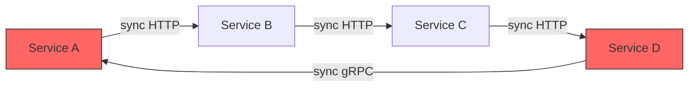
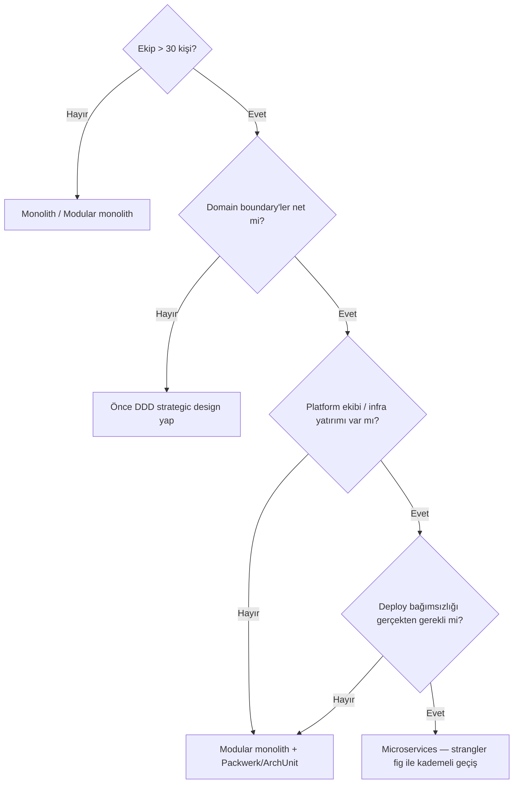
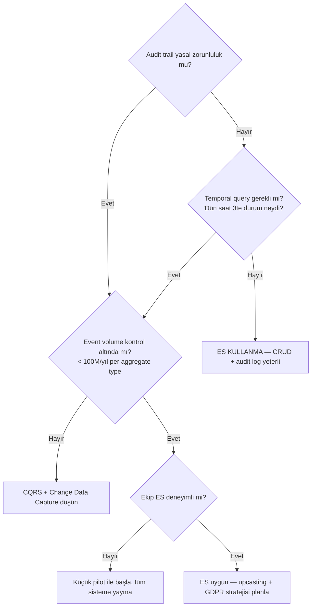

# 🔍 Mimari Eleştirel Mesafe

> *"There are no solutions, only trade-offs."* — Thomas Sowell

> Bu doküman popüler mimari yaklaşımların **karanlık tarafını** ele alır. Amaç bu kalıpları reddetmek değil, körü körüne benimsemenin maliyetini göstermektir. Staff+ mühendis her mimari kararın **ne zaman çöktüğünü** bilmek zorundadır.

---

## 📑 İçindekiler

1. [Microservices Ne Zaman Öldürür?](#1-microservices-ne-zaman-öldürür)
2. [DDD Başarısızlıkları](#2-ddd-başarısızlıkları)
3. [Clean / Hexagonal Over-Engineering](#3-clean--hexagonal-over-engineering)
4. [Event Sourcing Maliyetleri](#4-event-sourcing-maliyetleri)
5. [Anti-Pattern'ler](#5-anti-patternler)
6. [Staff+ Kontrol Listesi](#-staff-mimari-eleştiri-kontrol-listesi)
7. [İleri Okuma](#-i̇leri-okuma)

---

## 1. Microservices Ne Zaman Öldürür?

> *"Don't even consider microservices unless you have a system that's too complex to manage as a monolith."* — Martin Fowler

### Premature Decomposition

Microservices, **organizasyonel ölçek** problemidir, teknik bir sihir değildir. 5 kişilik bir ekibin Day 1'de 12 servis oluşturması = **distributed monolith** üretmesi.

**Sinyaller:**
- Servisler arasında senkron çağrı zinciri 3+ hop.
- Bir feature için 4+ repo'da değişiklik gerekiyor.
- "Shared library" sürüm cehennemi.
- Integration test'lerin local'de çalıştırılması 30+ dakika.

### Distributed Monolith

Monolith'in tüm bağımlılık sorunları + dağıtık sistemin tüm operasyonel maliyetleri = **en kötü iki dünyanın birleşimi.**



**Belirtileri:**
- Deploy sırası önemli (A önce, sonra B, sonra C).
- Bir servis düşünce cascade failure.
- "Microservices" deniyor ama tek database paylaşılıyor.
- Her servisin kendi ORM'i ama aynı `users` tablosuna yazıyor.

### Case Study: Shopify — Modular Monolith

Shopify, dünyanın en büyük Ruby on Rails uygulamasını **microservices'e bölmedi**. Bunun yerine:

1. **Packwerk** aracıyla monolith içinde modül sınırları tanımladı.
2. Her modül kendi bounded context'ine sahip; inter-module bağımlılıklar statik analizle kontrol ediliyor.
3. Veritabanı tablolarına **ownership** atandı; cross-boundary direct query yasaklandı.
4. Sonuç: Monolith'in deployment basitliği + modüler bağımsızlık.

**Ders:** Boundary'ler çizmek microservices'e geçiş gerektirmez. İç disiplin yeterli olabilir.

### Case Study: Amazon Prime Video (2023)

Amazon Prime Video ekibi, video kalite izleme (audio/video quality inspection) servisini **microservices + Step Functions** mimarisinden **tek bir monolith process'e** geri taşıdı.

- Step Functions çağrı maliyeti yüksekti (her video segmenti için invocation).
- Servisler arası veri aktarımı S3 üzerinden yapılıyordu → latency + maliyet.
- Monolith'e dönüşle **%90 maliyet düşüşü** elde edildi.

**Ders:** "Serverless + microservices" her workload'a uygun değildir. Data-intensive pipeline'lar co-located process'ten faydalanır.

### Netflix ve Uber: Karşı Örnekler

| Özellik | Netflix | Uber |
|---|---|---|
| Neden microservices? | 1000+ mühendis, bağımsız deploy zorunluluğu | Farklı şehirlerde farklı özellik setleri |
| Ekip boyutu | Domain başına 5-8 kişi | Domain başına 3-5 kişi |
| Altyapı yatırımı | Zuul, Eureka, Hystrix (yıllar sürdü) | Ringpop, TChannel, Cadence/Temporal |
| Bedel | Yüzlerce mühendis yılı platform geliştirme | Polyglot karmaşıklığı, platform team büyüklüğü |

**Ders:** Bu şirketler microservices'e "başladı" değil, **zorunluluktan geçti**. Altyapı yatırımı olmadan taklitleri felaket üretir.

### Karar Ağacı: Microservices'e Geçmeli miyim?



---

## 2. DDD Başarısızlıkları

> *"Most teams doing DDD are doing it wrong."* — Eric Evans (2019 DDD Europe)

### Anemic Domain Model Epidemic

Martin Fowler'ın 2003'te adlandırdığı anti-pattern hâlâ **en yaygın DDD hatası**: Entity'ler sadece getter/setter, tüm iş mantığı `*Service` sınıflarında.

```java
// ❌ Anemic — "DDD yapıyoruz" ama aslında Transaction Script
class Order {
    private List<OrderLine> lines;
    // getter, setter...
}

class OrderService {
    void addLine(Order order, Product p, int qty) {
        order.getLines().add(new OrderLine(p, qty));
        // iş kuralı burada, entity'de değil
    }
}

// ✅ Rich Domain Model
class Order {
    private List<OrderLine> lines;

    void addLine(Product p, int qty) {
        if (lines.size() >= MAX_LINES)
            throw new OrderLimitExceeded();
        lines.add(new OrderLine(p, qty));
        recalculateTotal();
    }
}
```

**Sonuç:** İş kuralları dağılır, test zorlaşır, domain bilgisi kaybedilir.

### Tactical Without Strategic

Ekipler hemen `Aggregate`, `Value Object`, `Repository` pattern'lerine atlar. Ama **strategic design** yapılmaz:

| Strategic (önce yapılmalı) | Tactical (sonra yapılmalı) |
|---|---|
| Bounded Context keşfi | Aggregate tasarımı |
| Context Mapping | Entity, Value Object |
| Ubiquitous Language | Repository, Factory |
| Core / Supporting / Generic ayrımı | Domain Event |

**Sonuç:** Tactical pattern'ler yanlış yerde kullanılır → over-engineering. Generic subdomain'e (email gönderme) DDD tactical uygulamak zaman israfı.

### Bounded Context'i Bulamama

En kritik ve en zor DDD aktivitesi: **doğru boundary'yi bulmak.**

**Yaygın hatalar:**
- Teknik katmana göre bölmek (`UserService`, `PaymentService`) — domain'e göre değil.
- Çok büyük context: Tüm domain tek context → monolith.
- Çok küçük context: Her entity bir context → nano-service cehennem.
- **Event Storming yapmamak**: Masabaşı tasarım → gerçek domain'i yakalayamama.

**Pragmatik kural:** Bir bounded context, **tek bir ekibin** (5-8 kişi) sahip olabileceği büyüklükte olmalı. Daha büyükse böl, daha küçükse birleştir.

### Shared Kernel Tuzağı

İki bounded context arasında "ortak" model: `SharedKernel`. Kağıt üzerinde zararsız, pratikte **coupling kaynağı**.

- Shared kernel değişikliği her iki ekibi etkiler → deployment bağımlılığı.
- Versiyonlama zorlaşır; "breaking change" riski çarpanla artar.
- Zamanla shared kernel büyür → fiilen tek bir monolith context haline gelir.

**Alternatif:** Anti-Corruption Layer (ACL) ile her context kendi modelini korur, dönüşümü sınırda yapar.

---

## 3. Clean / Hexagonal Over-Engineering

> *"Architecture is about the important stuff. Whatever that is."* — Ralph Johnson

### Port/Adapter/Use-Case Çoğaltması

Clean Architecture'ın katman kuralı (Entities → Use Cases → Interface Adapters → Frameworks) 3 kişilik startup'ta şöyle görünür:

```
src/
├── domain/
│   └── entities/
│       └── User.ts              # 1 class
├── application/
│   ├── ports/
│   │   ├── in/
│   │   │   └── CreateUserUseCase.ts  # interface
│   │   └── out/
│   │       └── UserRepository.ts     # interface
│   └── services/
│       └── CreateUserService.ts      # implements use case
├── adapters/
│   ├── in/
│   │   └── web/
│   │       └── UserController.ts     # HTTP adapter
│   └── out/
│       └── persistence/
│           ├── UserPersistenceAdapter.ts  # implements repo
│           └── UserMapper.ts             # entity ↔ ORM
└── config/
    └── DependencyInjection.ts
```

**8 dosya, 1 CRUD operasyonu.** Basit bir Express route + Prisma query ile 15 satırda yapılabilecek iş.

### YAGNI İhlali

| Argüman | Gerçek |
|---|---|
| "Yarın database değiştirmemiz gerekebilir" | Şirketlerin %95'i hiç DB değiştirmiyor |
| "Framework'ten bağımsız olmalıyız" | Express → Fastify geçişi 1 sprint, mimariden bağımsız |
| "Testable olsun" | Repository interface olmadan da mock/stub yapılır |
| "Katmanlar değişimi kolay kılar" | 8 dosya değiştirmek 1 dosyadan daha "kolay" değil |

### Ne Zaman Clean Architecture Haklıdır?

- Ekip > 10 kişi ve domain karmaşık.
- Core domain'de (para, sağlık, güvenlik) iş kuralları yoğun.
- Birden fazla delivery mechanism (REST + gRPC + CLI + event consumer).
- Gerçekten DB değiştireceksiniz (multi-cloud, vendor agnostic zorunluluğu).

### Pragmatik Alternatif: Vertical Slice Architecture

Her feature kendi klasöründe, katman ayrımı feature **içinde** kalır:

```
src/
├── features/
│   ├── create-user/
│   │   ├── handler.ts     # business logic
│   │   ├── route.ts       # HTTP binding
│   │   └── repository.ts  # data access
│   ├── update-order/
│   │   ├── handler.ts
│   │   ├── route.ts
│   │   └── repository.ts
```

Feature silindiğinde klasör silinir. Cross-cutting concern'ler (auth, logging) middleware/decorator ile çözülür.

---

## 4. Event Sourcing Maliyetleri

> *"Event sourcing is a great idea that most teams should not implement."* — Greg Young (ironik olarak ES'nin mucidi)

### Schema Migration — Upcasting

Geleneksel DB'de `ALTER TABLE` ile schema migrate edilir. Event store'da **geçmiş event'ler değiştirilemez** (immutable). Yeni event versiyonu çıktığında eski event'leri okumak için **upcaster** yazılır.

```
OrderPlacedV1 { items: [...], total: 100 }
  ↓ upcaster
OrderPlacedV2 { items: [...], total: 100, currency: "USD" }
  ↓ upcaster
OrderPlacedV3 { lineItems: [...], amount: { value: 100, currency: "USD" } }
```

**Her event sürümü sonsuza dek desteklenmeli** veya tüm event store bir "migration" event ile yeniden yazılmalı — ki bu saatler/günler sürebilir.

### Snapshot Strateji

Aggregate state'i replay'le hesaplanır. 10.000 event'lik bir Aggregate'i her seferinde replay etmek performans felaket.

| Strateji | Avantaj | Dezavantaj |
|---|---|---|
| **Her N event'te snapshot** | Basit, öngörülebilir | N seçimi zor; bazı aggregate'ler hızlı, bazıları yavaş büyür |
| **Time-based snapshot** | Zamanla tutarlı | Event burst'ünde gecikme |
| **On-demand snapshot** | İhtiyaç halinde | Snapshot yoksa ilk okuma yavaş |
| **Lazy + cache** | Memory'den okuma | Cache invalidation karmaşıklığı |

### Projection Rebuild Süresi

Event'lerden okunan model (read model / projection) bozulduğunda tüm event store yeniden işlenir.

- 100M event, 5K events/sec → **~5.5 saat rebuild süresi**.
- Bu süre boyunca read model **stale veya offline**.
- Paralel projection build (partitioned replay) implementasyonu zor.

### GDPR Right-to-Erasure Çelişkisi

Event sourcing: **"hiçbir şey silme, her şey immutable."**
GDPR Article 17: **"kişisel veriyi sil."**

| Yöntem | Nasıl | Trade-off |
|---|---|---|
| **Crypto shredding** | PII event'lere şifreli yaz, silme = anahtarı yok et | Karmaşık key management; projection'lar da şifreli olmalı |
| **Tombstone event** | `UserDataErased` event'i yaz, projection'da sil | Event store'da PII hâlâ duruyor |
| **Event rewriting** | Eski event'leri redakte et (immutability ihlali!) | Audit trail bozulur, hash chain kırılır |
| **Separation** | PII ayrı veri deposunda, event'te sadece referans ID | Ek join maliyeti, tutarlılık riski |

**Pragmatik seçim:** Crypto shredding + PII separation kombinasyonu. Saf ES puristliği GDPR ile uyumsuz.

### Debugging Zorluğu

- Bug nerede? Event handler'da mı, projection'da mı, upcaster'da mı?
- Geleneksel "current state'e bak" yerine "event stream'i replay et" gerekir.
- Tooling ekosistemi zayıf; çoğu ekip custom debug araçları yazar.
- **Temporal coupling**: Event sırası değişirse business logic bozulur.

### Ne Zaman Event Sourcing Haklıdır?



---

## 5. Anti-Pattern'ler

| Anti-Pattern | Neden Tehlikeli | Doğru Yaklaşım |
|---|---|---|
| **Conference-Driven Architecture** | "Netflix yapıyor" = biz de yapalım; context farkı 1000× | Kendi ölçeğini, ekip büyüklüğünü, domain'ini değerlendir |
| **Premature microservices** | Day 1'de 15 servis = distributed monolith | Monolith-first; boundary'ler olgunlaşınca ayır |
| **Tactical DDD without strategic** | Aggregate/Repository var ama bounded context yok | Önce Event Storming + Context Mapping yap |
| **Port/Adapter her yerde** | CRUD API'ye hexagonal = 8 dosya, 1 iş | Core domain'e hexagonal, generic subdomain'e basit CRUD |
| **Event sourcing by default** | "Her şeyi event olarak saklayalım" → upcasting, GDPR, rebuild maliyeti | ES sadece audit + temporal query zorunluluğunda |
| **Shared kernel sevgisi** | İki context'in "ortak" modeli coupling kaynağı | ACL ile her context kendi modelini korusun |
| **"Database-per-service" dogma** | Her servise ayrı DB ama veri tutarlılığı çözülmemiş | Data ownership net olana kadar shared DB kabul edilebilir |
| **Abstraction without variation** | Tek implementasyonlu interface = gereksiz indirection | Interface, 2+ implementasyon veya test seam olduğunda yarat |

---

## 🎯 Staff+ Mimari Eleştiri Kontrol Listesi

### Yeni mimari karar öncesi

- [ ] Bu karar **geri dönülebilir mi?** (One-way door → ekstra dikkat)
- [ ] Microservices motivasyonu **teknik mi, organizasyonel mi?** (Organizasyonel değilse neden?)
- [ ] Ekip büyüklüğü mimari karmaşıklığı karşılayabilir mi? (Platform team var mı?)
- [ ] Domain boundary'ler **Event Storming** ile keşfedilmiş mi, yoksa masabaşı tahmin mi?
- [ ] "Bu mimariyi 3 kişilik ekiple operate edebilir miyiz?" sorusu soruldu mu?

### Mevcut mimari review

- [ ] Distributed monolith belirtileri var mı? (Senkron çağrı zinciri, shared DB, deploy sırası)
- [ ] Anemic domain model mi yoksa rich domain model mi? (İş mantığı nerede?)
- [ ] Event sourcing varsa: upcasting stratejisi, GDPR planı, projection rebuild süresi belgelenmiş mi?
- [ ] Clean Architecture katmanları **gerçekten kullanılıyor mu?** (Tek implementasyonlu interface = YAGNI)
- [ ] Mimari kararlar **ADR ile dokümante** edilmiş mi?

### Kültürel

- [ ] "X şirketi yapıyor" argümanı kararları yönlendiriyor mu? (Red flag)
- [ ] Ekipte **mimari karar dissent'i** güvenli mi? (Karşı çıkmak cezalandırılıyor mu?)
- [ ] "Over-engineering" kelimesi code review'da kullanılabiliyor mu?

---

## 📚 İleri Okuma

- *Monolith to Microservices* — Sam Newman (2019), strangler fig ve decomposition stratejileri
- *Domain-Driven Design* — Eric Evans (2003), özellikle Part IV Strategic Design
- *Learning Domain-Driven Design* — Vlad Khononov (2021), modern DDD pratiği
- *Get Your Hands Dirty on Clean Architecture* — Tom Hombergs (2019)
- Martin Fowler — *MonolithFirst* (2015), blog post
- Amazon Prime Video — *Scaling up the Prime Video audio/video monitoring service* (2023)
- Shopify Engineering — *Deconstructing the Monolith* (2019, Packwerk)
- Tanya Reilly — *Being Glue* (2019) — mimari kararların görünmez maliyeti
- Greg Young — *Event Sourcing* (CQRS.nu), özellikle "When NOT to use ES"
- *Implementing Domain-Driven Design* — Vaughn Vernon (2013)
- *Vertical Slice Architecture* — Jimmy Bogard, blog series
- *A Philosophy of Software Design* — John Ousterhout (2018), complexity perspektifi

> [⬅️ Pratik klasörü](README.md) · [📚 Sözlük](../glossary/terim-sozlugu.md) · [🔬 Kaynakça](../kaynakca.md)
