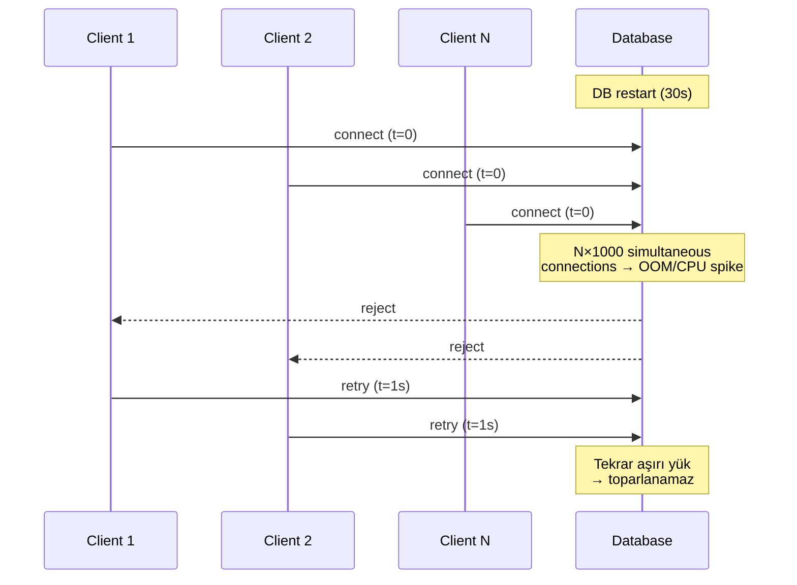
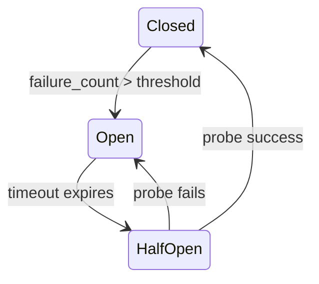
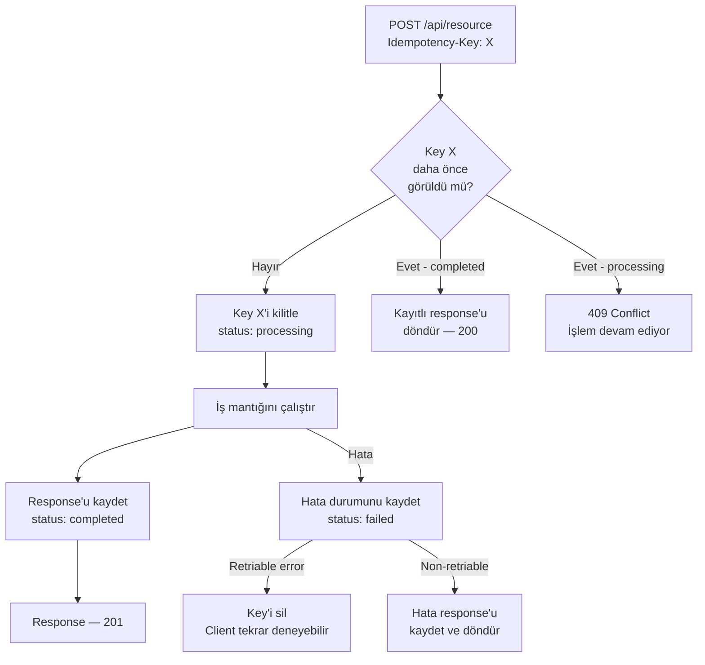

# ⚡ Operasyonel Derinlik — Connection Storm & Idempotency

> *"Everything fails, all the time."* — Werner Vogels

> Bu doküman iki kritik operasyonel konuyu derinlemesine ele alır: **bağlantı fırtınaları** (connection storm) ve **idempotency key tasarımı**. Her ikisi de üretim kesintilerinin en yaygın nedenleri arasındadır ve doğru tasarlanmadığında cascade failure üretir.

---

## 📑 İçindekiler

1. [Connection Storm Handling](#1-connection-storm-handling)
2. [Idempotency Keys — API Tasarımı](#2-idempotency-keys--api-tasarımı)
3. [Anti-Pattern'ler](#3-anti-patternler)
4. [Staff+ Kontrol Listesi](#-staff-operasyonel-derinlik-kontrol-listesi)
5. [İleri Okuma](#-ileri-okuma)

---

## 1. Connection Storm Handling

### Thundering Herd Problemi

Bir kaynak (DB, cache, downstream servis) kısa süre kullanılamaz hale gelir. Tüm client'lar **aynı anda** yeniden bağlanmaya çalışır → kaynak toparlanamaz → cascade failure.



### Failover Sırasında Reconnect

Primary DB düşer → standby promote olur. Bu geçişte:

1. **Tüm bağlantılar kopar** (TCP RST veya timeout).
2. Connection pool'daki tüm bağlantılar invalid → pool **sıfırdan dolmaya** çalışır.
3. Yeni primary, aynı anda N × pool_size bağlantı isteği alır.
4. Connection limit aşılır → `too many connections` → servisler cascade fail.

**Gerçek vaka:** Slack 2021 Ocak kesintisi. MySQL failover → tüm servisler aynı anda reconnect → yeni primary ezildi → 5+ saat outage.

### Exponential Backoff + Jitter

Naif retry: `1s, 1s, 1s, ...` → tüm client'lar aynı anda vurur.
Exponential: `1s, 2s, 4s, 8s` → hepsi aynı backoff → hâlâ sync.
**Full jitter**: `random(0, min(cap, base × 2^attempt))` → dağılım.

```python
import random

def retry_delay(attempt: int, base: float = 1.0, cap: float = 30.0) -> float:
    """Full jitter exponential backoff (AWS önerisi)"""
    exp = min(cap, base * (2 ** attempt))
    return random.uniform(0, exp)

# attempt 0: [0, 1.0)
# attempt 1: [0, 2.0)
# attempt 2: [0, 4.0)
# attempt 5: [0, 30.0)  ← cap
```

**Decorrelated jitter** (daha iyi dağılım):
```python
def decorrelated_jitter(prev_delay: float, base: float = 1.0, cap: float = 30.0) -> float:
    return min(cap, random.uniform(base, prev_delay * 3))
```

### Circuit Breaker

Retry tek başına yetmez. Downstream hâlâ ölüyse retry sadece yükü artırır.



| State | Davranış |
|---|---|
| **Closed** | Normal çalışma; hataları sayar |
| **Open** | Tüm istekleri **anında reject** (fail-fast); downstream'e yük gitmez |
| **Half-Open** | Sınırlı probe trafiği gönder; başarılıysa kapat |

**Konfigürasyon parametreleri:**
- `failure_threshold`: Kaç hata sonra aç (ör: 5/10s).
- `reset_timeout`: Open'dan Half-Open'a geçiş süresi (ör: 30s).
- `success_threshold`: Half-Open'da kaç başarı sonra kapat (ör: 3).

### Connection Pool Warm-Up

Cold start sonrası pool boş; tüm istekler yeni bağlantı açmayı bekler → ilk N istek yavaş.

**Çözümler:**
- **Min idle connections**: Pool başlangıçta minimum bağlantı sayısını ön-açar (HikariCP `minimumIdle`).
- **Readiness probe gecikmesi**: K8s'de `initialDelaySeconds` ile pool dolana kadar traffic almamak.
- **Gradual traffic shift**: Load balancer'da yeni instance'a trafiği kademeli yönlendir (1% → 5% → 25% → 100%).
- **Connection pre-warming script**: Deploy öncesi health endpoint'e N paralel istek gönder.

### PgBouncer Pause

PostgreSQL failover sırasında PgBouncer'ın `PAUSE` komutu kritik:

1. `PAUSE` → PgBouncer yeni sorgu kabul etmez, mevcut sorgular bitmesini bekler.
2. Primary failover tamamlanır.
3. PgBouncer yeni primary'ye yeniden bağlanır.
4. `RESUME` → Sorgular akışı yeniden başlar.

**Avantaj:** Uygulama katmanı bağlantı kopması görmez; PgBouncer tampon olur.

**Dikkat:** `PAUSE` süresi servis timeout'undan kısa olmalı; aksi halde uygulama timeout alır ve kendi retry'ını başlatır.

---

## 2. Idempotency Keys — API Tasarımı

### Problem: Duplicate İşlem

Network timeout, client retry, load balancer retry → **aynı istek 2+ kez işlenir**.

```
Client → POST /payments (amount=100) → timeout
Client → POST /payments (amount=100) → retry
Sonuç: 2× $100 çekildi 💀
```

### Stripe Idempotency Key Modeli

Stripe'ın endüstri standardı haline gelen yaklaşımı:

```http
POST /v1/charges HTTP/1.1
Idempotency-Key: key_abc123def456
Content-Type: application/json

{"amount": 2000, "currency": "usd", "source": "tok_visa"}
```

**Kurallar:**
1. Client **benzersiz key üretir** (UUIDv4 veya deterministic hash).
2. Server ilk işlemde: işle + key + response'u kaydet.
3. Aynı key ile tekrar gelirse: **kayıtlı response'u döndür** (yeniden işleme yok).
4. Key TTL: Genellikle **24 saat** (Stripe: 24h).

### Sunucu Tarafı Akış



### Deduplication Window

Key'in ne kadar süre saklanacağı:

| Süre | Avantaj | Dezavantaj |
|---|---|---|
| **1 saat** | Düşük storage | Geç retry'lar yakalanmaz |
| **24 saat** (Stripe) | Çoğu retry senaryosunu kapsar | Makul storage |
| **7 gün** | Güvenli | Storage büyür |
| **Sonsuz** | Tam güvence | Storage yönetimi gerekir |

### Key Storage: Redis vs DB

| Özellik | Redis | Relational DB |
|---|---|---|
| Hız | ~0.1ms | ~1-5ms |
| Durabilite | `appendfsync always` ile | WAL ile |
| TTL | Native `EXPIRE` | Cron job / partition |
| Consistency | Async replication risk | ACID transaction |
| İşlem + key atomik mi? | Hayır (ayrı store) | **Evet** (aynı transaction) |

**Best practice:** Idempotency key'i **iş verisiyle aynı DB transaction'ında** kaydet. Redis'te key, DB'de veri = split-brain riski.

```sql
BEGIN;
  INSERT INTO idempotency_keys (key, status, response, created_at)
    VALUES ('key_abc123', 'completed', '{"id": 42}', NOW())
    ON CONFLICT (key) DO NOTHING;

  -- Eğer insert başarılıysa (affected_rows = 1):
  INSERT INTO payments (amount, currency) VALUES (2000, 'usd');
COMMIT;
```

### Request Fingerprint

Aynı key ile **farklı body** gelirse ne olur?

- **Stripe yaklaşımı**: Body hash'i key ile birlikte sakla. Farklı body → `422 Unprocessable Entity`.
- **Naif yaklaşım**: Key'e bakıp önceki response'u döndür → **yanlış veri** riski.

```python
fingerprint = sha256(json.dumps(request.body, sort_keys=True)).hexdigest()
stored = get_idempotency_record(key)
if stored and stored.fingerprint != fingerprint:
    return 422, {"error": "Idempotency key reuse with different request body"}
```

### Response Replay

İlk isteğin response'u birebir döndürülür:
- **Status code** dahil (201 ilk sefer → 201 replay).
- **Headers** dahil (Location, ETag).
- Client açısından retry ile ilk istek **ayırt edilemez**.

### Distributed Idempotency

Çoklu instance'da aynı key için race condition:

```
Instance A: key=X → check DB → yok → işle
Instance B: key=X → check DB → yok → işle
Sonuç: Çift işlem 💀
```

**Çözüm:** Veritabanı `UNIQUE` constraint veya distributed lock:

```sql
-- PostgreSQL advisory lock
SELECT pg_advisory_xact_lock(hashtext('key_abc123'));
-- Şimdi güvenle kontrol et ve işle
```

**Redis-based (Redlock gerekli değil, tek instance yeterliyse):**
```
SET idempotency:key_abc123 "processing" NX EX 60
-- NX: sadece yoksa set et
-- EX 60: 60s sonra expire (stuck process koruması)
```

---

## 3. Anti-Pattern'ler

| Anti-Pattern | Neden Tehlikeli | Doğru Yaklaşım |
|---|---|---|
| **Retry without backoff** | Tüm client'lar aynı anda vurur → thundering herd | Exponential backoff + **full jitter** |
| **Retry without circuit breaker** | Dead downstream'e yük göndermeye devam | Circuit breaker: fail-fast, downstream'i koru |
| **Immediate retry on failover** | Yeni primary henüz hazır değil → ezilir | Backoff + readiness probe + gradual traffic shift |
| **Client-generated sequential key** | Tahmin edilebilir → replay attack | UUIDv4 veya cryptographic random |
| **Key in Redis, data in DB** | Farklı store'larda atomiklik yok → split-brain | **Aynı DB transaction'ında** key + data |
| **Infinite idempotency window** | Storage sınırsız büyür | TTL + partition/archival stratejisi |
| **Idempotency sadece happy path** | Hata durumunda key'i temizlememek → retry imkânsız | Retriable error → key sil; non-retriable → response kaydet |
| **Connection pool max = unlimited** | DB bağlantı limiti aşılır → OOM / `too many connections` | `max_pool_size` = CPU core × 2 + disk spindle; kesinlikle sınırlı |

---

## 🎯 Staff+ Operasyonel Derinlik Kontrol Listesi

### Connection Resilience

- [ ] Tüm client'larda **exponential backoff + jitter** var mı?
- [ ] Circuit breaker konfigürasyonu (threshold, timeout, probe) dokümante mi?
- [ ] DB failover senaryosu **test edilmiş** mi? (Chaos testing: kill primary)
- [ ] Connection pool **min idle + max size** ayarları SLO ile uyumlu mu?
- [ ] PgBouncer / ProxySQL gibi connection pooler var mı? `PAUSE` mekanizması hazır mı?
- [ ] K8s readiness probe, pool warm-up'ı bekliyor mu?
- [ ] Load balancer'da yeni instance'a **gradual traffic shift** var mı?

### Idempotency

- [ ] Tüm **mutating** (POST, PUT, DELETE) endpoint'lerde idempotency key destekleniyor mu?
- [ ] Key + iş verisi **aynı DB transaction'ında** mı? (Split-brain riski yok mu?)
- [ ] Request fingerprint kontrolü var mı? (Aynı key + farklı body → 422)
- [ ] Deduplication window (TTL) tanımlı ve dokümante mi?
- [ ] Hata durumunda key davranışı belirlenmiş mi? (Retriable → sil, non-retriable → kaydet)
- [ ] Distributed race condition koruması var mı? (DB unique constraint, advisory lock)
- [ ] API dokümantasyonunda idempotency key kullanımı anlatılmış mı?

---

## 📚 İleri Okuma

### Connection Storm
- Marc Brooker — *Exponential Backoff and Jitter* (AWS Architecture Blog, 2015)
- *Release It!* — Michael Nygard, 2nd ed. (Stability Patterns bölümü)
- Slack Engineering — *A]Terrible, Horrible, No Good, Very Bad Day* (2021 Ocak postmortem)
- PgBouncer docs — pgbouncer.org (pause/resume)
- HikariCP — github.com/brettwooldridge/HikariCP (connection pool best practices)

### Idempotency
- Stripe Engineering — *Designing robust and predictable APIs with idempotency* (2017)
- Brandur Leach — *Implementing Stripe-like Idempotency Keys in Postgres* (brandur.org)
- *Designing Data-Intensive Applications* — Kleppmann, bölüm 11 (exactly-once)
- Airbnb Engineering — *Avoiding Double Payments in a Distributed Payments System*
- *Building Microservices* — Sam Newman, 2nd ed. (Resiliency bölümü)

> [⬅️ Pratik klasörü](README.md) · [📚 Sözlük](../glossary/terim-sozlugu.md) · [🔬 Kaynakça](../kaynakca.md)
