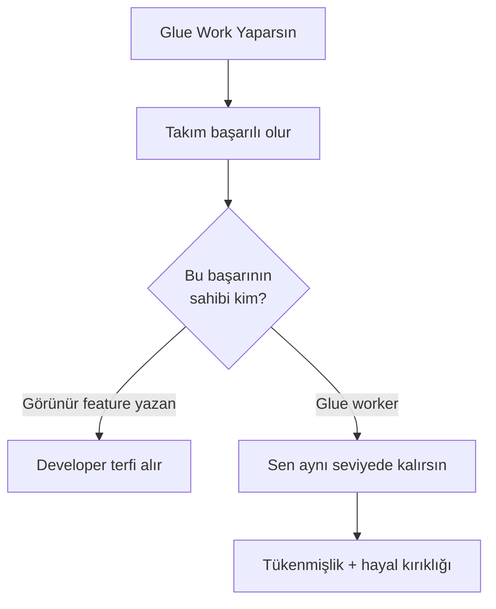

# 🤝 Staff+ Soft Skills — Görünmez İş, Etki ve İletişim

> *"Staff engineers are the people who set technical direction, not by authority, but by influence."* — Will Larson

> Teknik yetkinlik Staff+ seviyesine ulaşmak için **gerekli ama yeterli değildir**. Bu doküman Staff+ mühendislerin en çok zorlandığı üç soft skill alanını ele alır: **glue work** (görünmez iş), **impact kanıtlama** ve **executive communication**.

---

## 📑 İçindekiler

1. [Glue Work — Görünmez İş](#1-glue-work--görünmez-iş)
2. [Promotion & Staff Impact](#2-promotion--staff-impact)
3. [Executive Communication](#3-executive-communication)
4. [Anti-Pattern'ler](#4-anti-patternler)
5. [Staff+ Kontrol Listesi](#-staff-soft-skills-kontrol-listesi)
6. [İleri Okuma](#-ileri-okuma)

---

## 1. Glue Work — Görünmez İş

> Tanya Reilly, *Being Glue* (2019): "Glue work is the difference between a project that succeeds and one that fails."

### Glue Work Nedir?

Teknik olarak "kod yazmak" kategorisine girmeyen ama projenin başarısı için **kritik** olan işler:

| Glue Work Türü | Örnekler |
|---|---|
| **Koordinasyon** | Cross-team toplantı düzenleme, bağımlılık takibi, blocker çözme |
| **Onboarding** | Yeni mühendisleri codebase'e alıştırma, pair programming |
| **Dokümantasyon** | Design doc yazma, ADR oluşturma, runbook güncelleme |
| **Code review** | Kapsamlı, eğitici review'lar; standart yükseltme |
| **Teknik borç** | Kimsenin sahiplenmediği refactoring, dependency upgrade |
| **İletişim köprüsü** | Product ↔ Engineering ↔ Infra arasında çeviri yapma |
| **Proje kurtarma** | Raydan çıkmış projeyi sessizce düzeltme |

### Görünmezlik Tuzağı

Glue work **ölçülmez, takdir edilmez, terfi getiremez** — doğru yönetilmezse:



**Tanya Reilly'nin temel tespiti:** Glue work yapan kişi genellikle kadın veya azınlık mühendislerdir. Performans değerlendirmelerinde "teknik derinliği yok" denir.

### Tanınma Stratejisi

1. **Görünür kıl:** Yaptığın glue work'ü haftalık status update'e yaz. "Onboarding doc yazdım" değil, "Onboarding süresini 2 hafta → 3 gün'e düşüren doc yazdım."
2. **Impact'e bağla:** "20 code review yaptım" → "Code review'larla 3 kritik bug'ı production'dan önce yakaladım."
3. **Dönüşümlü yap:** Tüm glue work'ü **bir kişi** yapmasın. Rotation ile dağıt.
4. **Manager ile hizala:** Glue work'ün terfi kriterlerinde nasıl sayılacağını **önceden** konuş.
5. **Hayır de:** Her glue work'ü kabul etmek zorunda değilsin. Stratejik seç.

### Influence Without Authority

Staff+ mühendis **yönetici değildir** ama mimari kararları yönlendirir:

| Yanlış | Doğru |
|---|---|
| "Bunu böyle yapın" (emir) | "Şu alternatifi değerlendirdiniz mi?" (soru) |
| Toplantıda herkesi ikna etmeye çalışmak | 1:1'de anahtar kişilerle önceden konuşmak |
| RFC'yi onaylattırıp uygulamak | RFC'yi birlikte yazmak (co-author) |
| "Ben haklıyım" pozisyonu | "Veriyle konuşayım" pozisyonu |
| Tüm kararları kendin almak | Kararları ekip alır, sen frame'lersin |

---

## 2. Promotion & Staff Impact

### Staff Promo Packet Yapısı

Çoğu büyük şirkette (FAANG, Stripe, Datadog) Staff+ terfi için **yazılı paket** gerekir:

```
1. SUMMARY (2-3 cümle)
   "Son 18 ayda X alanında Y impact yarattım."

2. SCOPE & COMPLEXITY
   - Kaç ekip etkilendi?
   - Teknik zorluk neydi?
   - Ambiguity seviyesi (iyi tanımlanmış → open-ended)

3. KEY PROJECTS (2-3 proje, detaylı)
   Her proje için:
   - Problem: Ne bozuktu / eksikti?
   - Approach: Alternatifler, neden bu seçildi?
   - My Role: Liderlik mi, IC mi, mentorship mı?
   - Impact: Ölçülebilir sonuç.
   - Artifacts: Design doc, ADR, RFC, post-mortem link.

4. TECHNICAL LEADERSHIP
   - Mentorship (kaç kişi, sonuç)
   - Code review kültürüne katkı
   - Org-wide standart belirleme

5. COLLABORATION & INFLUENCE
   - Cross-team projeler
   - Conflict resolution örnekleri
   - "Bu kişi olmasa ne olurdu?" testi

6. PEER FEEDBACK (3-5 kişi)
   - Farklı ekiplerden, farklı seviyelerden
```

### Impact Kanıtlama Yöntemleri

| Yöntem | Açıklama | Örnek |
|---|---|---|
| **Scope** | Ne kadar geniş bir alanı etkiledi? | "3 ekip, 15 servis, 2 bölge" |
| **Leverage** | 1× çaba ile N× etki | "Yazdığım SDK ile 8 ekip aynı pattern'i kullanıyor" |
| **Multiplier** | Başkalarını daha verimli kıldın | "Onboarding doc ile ramp-up süresi %60 düştü" |
| **Risk reduction** | Olası felaketi engelleme | "Circuit breaker ekledim, 3 cascade failure önlendi" |
| **Revenue / cost** | Doğrudan iş etkisi | "Cache stratejisi ile AWS faturası ayda $120K azaldı" |

### FAANG vs Startup Farkı

| Boyut | FAANG | Startup |
|---|---|---|
| Terfi süreci | Formal paket, committee, rubric | Manager + founder kararı |
| Impact kanıtlama | Metrikler, peer review, promo doc | "Herkes biliyor" (ama bilmiyor) |
| Scope beklentisi | Org-wide, cross-functional | "Her şeyi yapan kişi" |
| Leveling | Detaylı (L3-L8+) | Belirsiz (senior → ???) |
| Staff+ kariyer patikası | İyi tanımlı (IC track) | Genellikle yok → yöneticiliğe kayma |

### "Quiet Impact" Tuzağı

> "İyi iş kendi kendini gösterir" — **YANLIŞ.**

- **Gerçek:** İyi iş, **anlatılırsa** görünür.
- Staff+ mühendislerin %80'i "self-promotion" konusunda rahatsız.
- Sonuç: Daha az yetenekli ama daha görünür mühendisler terfi alır.

**Çözüm: Brag Document**

Julia Evans'ın önerisi: Her hafta yaptığın işleri kısa notlar halinde kaydet.

```markdown
## 2026-Q1 Brag Document

### Ocak
- Payment servisinde circuit breaker implementasyonu → 3 cascade failure önlendi
- Junior 2 kişiyle pair programming: ilk PR'larını 1 hafta içinde merge ettiler
- RFC: Event-driven architecture migration (12 ekip review etti, kabul edildi)

### Şubat
- Cross-team dependency audit → 4 circular dependency kırıldı
- Production incident postmortem liderliği → 5 action item, 3 hafta içinde tamamlandı
```

---

## 3. Executive Communication

### 6-Pager

Amazon'un toplantı formatı: 6 sayfalık narratif doküman, toplantı başında **sessiz okunur**.

**Yapı:**
1. **Introduction & Context** — Problem nedir, neden şimdi?
2. **Current State** — Bugün ne yapıyoruz, ne ölçüyoruz?
3. **Proposal** — Ne yapılmalı?
4. **Alternatives Considered** — Neden bu alternatif seçildi?
5. **Risks & Mitigations** — Ne yanlış gidebilir?
6. **Appendix** — Detaylı data, mimari diyagram.

**Kurallar:**
- PowerPoint yasak. Prose (narratif metin) zorunlu.
- Bullet point'ler paragraf yerine geçmez.
- Her iddia **veriyle** desteklenmeli.

### PRFAQ (Press Release / FAQ)

Amazon'un "working backwards" metodolojisi: Ürün/proje henüz başlamadan **basın bülteni** yaz.

```markdown
## Basın Bülteni (1 sayfa)

**Başlık:** [Müşterinin anlayacağı dilde, jargonsuz]
**Alt başlık:** [Tek cümle fayda]
**Problem:** [Müşterinin yaşadığı acı]
**Çözüm:** [Ne yapıyoruz]
**Müşteri quote:** [Hayali ama gerçekçi]
**Call to action:** [Nasıl başlanır]

## FAQ (2-5 sayfa)

### External FAQ (müşteri soruları)
- Bu benim için ne değiştirir?
- Fiyatlandırma nasıl?
- Migration süreci nedir?

### Internal FAQ (iç sorular)
- Bu ne kadara mal olur?
- Hangi ekipler etkilenir?
- Timeline nedir?
- En büyük risk nedir?
```

### Yönetim Brief'i — BLUF (Bottom Line Up Front)

Yöneticiler **ilk 2 cümlede** sonucu görmek ister:

```markdown
# ❌ Yanlış
"Geçen ay performans problemleri yaşadık. Önce A denedik, sonra B
denedik. A işe yaramadı çünkü... B kısmen çalıştı ama..."
(Sonuç: 3. paragrafta)

# ✅ Doğru (BLUF)
"Ödeme servisinin p99 latency'si 2s → 200ms'e düştü. Cache katmanı +
connection pool tuning ile çözdük. Detaylar aşağıda."
```

### Status Update Yapısı

```markdown
## Haftalık Status — [Proje Adı]

**TL;DR:** [1 cümle: yeşil/sarı/kırmızı + neden]

### 🟢 Bu hafta tamamlanan
- [Feature/milestone] — [ölçülebilir sonuç]

### 🟡 Devam eden
- [İş] — [%ilerleme, beklenen tarih]

### 🔴 Blocker / Risk
- [Sorun] — [impact + önerilen çözüm + gereken karar]

### 📅 Gelecek hafta planı
- [2-3 madde]
```

### "So What?" Testi

Her bilgi parçası için sor: **"Ee, ne olmuş?"**

| Söylenen | "So What?" | Düzeltilmiş |
|---|---|---|
| "Kafka'ya geçtik" | Müşteriyi neden ilgilendirir? | "Event processing 5× hızlandı → bildirimler anında" |
| "Test coverage %85" | Kalite ile korelasyonu ne? | "Kritik path %95 coverage → son 6 ayda 0 production bug" |
| "10K satır refactoring yaptım" | İş etkisi ne? | "Deploy süresi 20dk → 5dk; haftada 3× daha sık deploy" |
| "3 mikroservis oluşturduk" | Neden umursayalım? | "Ödeme ve sipariş ekipleri artık bağımsız deploy edebiliyor" |

---

## 4. Anti-Pattern'ler

| Anti-Pattern | Neden Tehlikeli | Doğru Yaklaşım |
|---|---|---|
| **"İyi iş kendi kendini gösterir"** | Görünmez iş terfi getirmez; frustration + churn | Brag document + haftalık görünürlük |
| **Glue work monopolü** | Tek kişi tüm glue work'ü yapar → tükenmişlik | Rotation; glue work sprint planına dahil edilmeli |
| **PowerPoint engineering** | Slide'larla teknik karar; detay kaybolur | Narratif doküman (6-pager, RFC, ADR) |
| **Status update = activity log** | "Şunu yaptım, bunu yaptım" — impact yok | BLUF + "so what?" testi |
| **"Her şeyi ben yaparım" Staff+** | Multiplier etkisi sıfır; tek kişi scale etmez | Delegate + mentor + pattern yayılımı |
| **Promotion-driven development** | Terfi için proje seçmek ≠ impact üretmek | Şirketin en önemli problemiyle hizalan |
| **Teknik jargon yöneticiye** | CTO dışında kimse "p99 latency" umursamaz | Business impact diline çevir |
| **Sadece büyük projeler saymak** | Küçük ama sürekli improvement'lar görünmez | Brag doc'ta küçük wins de kaydet |

---

## 🎯 Staff+ Soft Skills Kontrol Listesi

### Görünürlük

- [ ] **Brag document** güncel mi? (Haftalık güncelleme)
- [ ] Glue work **sprint planına** dahil mi, yoksa "boş zamanda" mı yapılıyor?
- [ ] Yaptığın teknik kararlar **ADR/RFC** ile dokümante mi?
- [ ] Haftalık status update **BLUF** formatında mı?
- [ ] Cross-team katkılar **peer feedback** ile destekleniyor mu?

### İletişim

- [ ] Yönetim sunumlarında **"so what?" testi** uygulanıyor mu?
- [ ] Teknik karar dokümanları **narratif** mi (6-pager) yoksa slide mı?
- [ ] Farklı audience'lara (IC, manager, VP, exec) **farklı detay seviyesi** kullanılıyor mu?
- [ ] **1:1'ler** karar öncesi alignment için kullanılıyor mu?

### Impact

- [ ] Son 6 ayda **scope, leverage, multiplier** açısından en büyük 3 katkın ne?
- [ ] Promo packet yazılabilir durumda mı? (Yarın gerekse hazır mı?)
- [ ] **Mentorship** sonuçları ölçülebilir mi? (Mentorluk yaptığın kişi ne başardı?)
- [ ] Ekip/org genelinde yaydığın **pattern/standart** var mı?

---

## 📚 İleri Okuma

### Glue Work & Influence
- Tanya Reilly — *Being Glue* (2019 talk + blog post) — noidea.dog/glue
- *Staff Engineer: Leadership beyond the management track* — Will Larson (2021)
- *The Staff Engineer's Path* — Tanya Reilly (2022)
- *Influence Without Authority* — Cohen & Bradford (klasik)

### Promotion & Impact
- Julia Evans — *Brag documents* (jvns.ca/blog/brag-documents)
- *An Elegant Puzzle* — Will Larson (2019)
- Gergely Orosz — *The Pragmatic Engineer* newsletter (promo guides)
- StaffEng.com — Staff+ engineer hikâyeleri

### Executive Communication
- Amazon — *Working Backwards* — Colin Bryar & Bill Carr (2021)
- *The Pyramid Principle* — Barbara Minto (McKinsey communication framework)
- *Thinking in Bets* — Annie Duke (karar iletişimi)
- Lara Hogan — *Resilient Management* (2019) — manager-IC iletişimi

> [⬅️ Pratik klasörü](README.md) · [📚 Sözlük](../glossary/terim-sozlugu.md) · [🔬 Kaynakça](../kaynakca.md)
