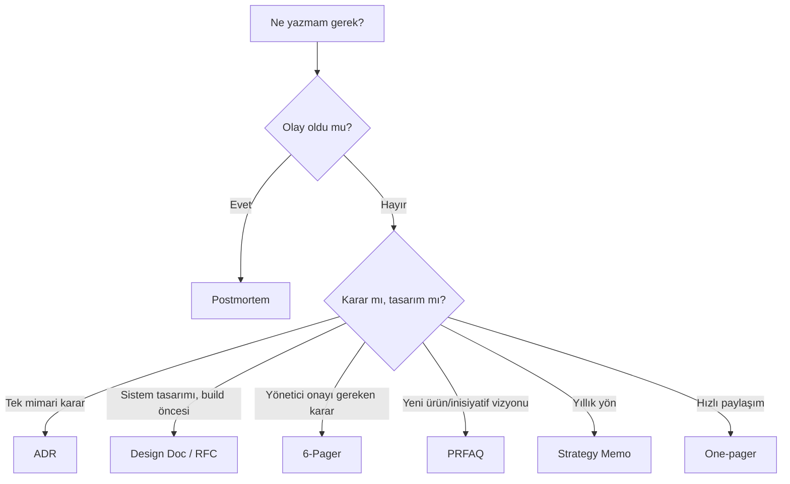

# ✍️ Staff+ Yazma Kültürü

> **"Senior IC'nin yazdığı kod / Staff+ IC'nin yazdığı doküman."**
> Staff seviyenin asıl çıktısı **etki**'dir. Etki ölçeklenmek için **iyi yazılmış** bir doküman zinciriyle yayılır.

Bu doküman staff/principal mühendisin yazma araç kutusunu kapsar: design doc, ADR, RFC, 6-pager, PRFAQ, işyerinde "writing as thinking" kültürü.

---

## 📑 İçindekiler

1. [Yazma Niçin Staff+ İşinin %50'sidir?](#1--yazma-niçin-staff-işinin-50sidir)
2. [Doküman Tipleri ve Kullanım Yeri](#2--doküman-tipleri-ve-kullanım-yeri)
3. [Design Doc / RFC](#3--design-doc--rfc)
4. [ADR — Architecture Decision Record](#4--adr--architecture-decision-record)
5. [Amazon 6-Pager](#5--amazon-6-pager)
6. [PRFAQ — Working Backwards](#6--prfaq--working-backwards)
7. [Postmortem](#7--postmortem)
8. [Tech Spec, Project Brief, One-Pager](#8--tech-spec-project-brief-one-pager)
9. [Slack/Email Mesaj Kalitesi](#9--slackemail-mesaj-kalitesi)
10. [Influence Without Authority](#10--influence-without-authority)
11. [Pattern: Asynchronous Decision-Making](#11--pattern-asynchronous-decision-making)
12. [Yazma Kalitesi Kontrol Listesi](#12--yazma-kalitesi-kontrol-listesi)

---

## 1. 🧠 Yazma Niçin Staff+ İşinin %50'sidir?

### Kod yazmaktan yazıya geçiş eğrisi

```
Junior   ──▶ %95 kod, %5 yazı
Mid      ──▶ %85 kod, %15 yazı
Senior   ──▶ %70 kod, %30 yazı
Staff    ──▶ %40 kod, %60 yazı / iletişim
Principal ─▶ %20 kod, %80 yazı / iletişim
Distinguished ▶ ~%5 kod, %95 yazı / strateji
```

> Bu **eksik** olduğun bir tarafa kayma değil; **etki ölçeğinin** değişmesi.

### Yazılı sözün avantajları

| Sözlü | Yazılı |
|---|---|
| Anlık | Kalıcı |
| Tek kişi-tek kişi | Bir-çok (asenkron yayılma) |
| Bant genişliği yok | Sınırsız okuyucu |
| Ezberlenir / unutulur | Aranabilir |
| Hatırlama yanlı (recency bias) | Tarihsel kayıt |
| Hızlı eskimişiyim | Versiyonlanır |

### Bezos'un sözü

> *"Memos force clear thinking. PowerPoint hides bad thinking."* — Jeff Bezos
> Madde işareti, fikri fikirden ayırır. Düz yazı, fikir akışını **sınamak zorundadır**.

### Yazma "düşünmenin uçtaki" hali

> Bir konuyu yazana kadar **gerçekten** anlamamışsın demektir. Yazma, **neyi bilmediğini** sana gösterir.

---

## 2. 📚 Doküman Tipleri ve Kullanım Yeri

| Tip | Amaç | Uzunluk | Kim okur? | Şablon |
|---|---|---|---|---|
| **One-pager** | Hızlı paylaşım, "fikir taslağı" | 1 sayfa | Yakın takım | — |
| **ADR** | Mimari karar kaydı | 1-2 sayfa | Mühendisler, gelecek | [adr-sablon.md](../templates/adr-sablon.md) |
| **Design Doc / RFC** | Sistem/özellik tasarımı | 4-8 sayfa | Mühendisler + reviewers | [rfc-design-doc-sablon.md](../templates/rfc-design-doc-sablon.md) |
| **Tech Spec** | İmplementasyon spec | 2-5 sayfa | Implement edecekler | (Design Doc'un alt kümesi) |
| **6-Pager** | Yönetici karar memo'su | 6 sayfa | C-level, VP | [6-pager-sablon.md](../templates/6-pager-sablon.md) |
| **PRFAQ** | Yeni ürün vizyonu | 1-3 sayfa + FAQ | Product + leadership | (aşağıda) |
| **Postmortem** | Olay sonrası analiz | 2-4 sayfa | Tüm org | [postmortem-sablon.md](../templates/postmortem-sablon.md) |
| **Project Brief** | Ekip kickoff | 2-3 sayfa | Proje takımı | — |
| **Strategy Memo** | Yıllık / yarı-yıllık yön | 5-15 sayfa | Tüm org | — |
| **Vision Doc** | 3-5 yıllık ufuk | 5-20 sayfa | Leadership | — |

### "Hangisini yazayım?" akış şeması



---

## 3. 📄 Design Doc / RFC

> **Asıl şablon:** [rfc-design-doc-sablon.md](../templates/rfc-design-doc-sablon.md)

### En sık ihmal edilen 5 bölüm

1. **Hedef değil (Non-goals)** — En az hedefler kadar uzun olmalı.
2. **Reddedilen alternatifler** — Steel-man yazılmalı, straw-man değil.
3. **Reversibility analizi** — Bu kararı 6 ay sonra geri almak ne kadar sürer?
4. **Threat model** — Yeni saldırı yüzeyi.
5. **"Why this is a bad idea"** — Karşı görüşü kendin yaz.

### Review süreci

```
Day 0    : Yazar taslağı paylaşır (Slack thread + doküman)
Day 0-2  : Inline yorumlar, sorular
Day 3-4  : Yazar bölüm bölüm yanıt yazar (yeni revizyon)
Day 5    : (Gerekirse) 30 dk sync toplantı — sadece tıkanan konular
Day 5+   : Status: Approved / Revisions Needed / Rejected
```

### Reviewer disiplini

- ✅ **Sorunu yorumda göster, çözümü dayatma** (Socratic method).
- ✅ **Spec'in dışındaki yan yorumları farklı thread'e** koy.
- ✅ **Strong opinion, weakly held**: Görüşünü söyle ama yazarın kararına saygı göster.
- ❌ **Bikeshedding**: Renk/isim tartışmasında saatler harcama.
- ❌ **Drive-by review**: 5 dk yüzeysel okuyup "LGTM".

### "How to RFC" — pratik tüyolar

- 🪞 **2-3 günlük ara** ver, kendi yazını okuyarak gözden geçir.
- 👫 **Buddy review**: 1 yakın çalışana ön gözden geçirme yaptır.
- 📊 **Sayı ver**: "yavaş" değil "p99 = 850 ms".
- 🎯 **TL;DR'i en sona yaz**: Doküman bittiğinde özet kendi başına çıkar.
- 💀 **Pre-mortem**: "Bu karar 1 yıl sonra felaketle sonuçlandı, neden?" Cevabı RFC'ye işle.

---

## 4. 📐 ADR — Architecture Decision Record

> **Asıl şablon:** [adr-sablon.md](../templates/adr-sablon.md)

### ADR vs Design Doc farkı

| | ADR | Design Doc |
|---|---|---|
| **Kapsam** | Tek bir karar | Tüm tasarım |
| **Uzunluk** | 1-2 sayfa | 4-8 sayfa |
| **Yaşam döngüsü** | Donar (immutable) | Evrilir |
| **Değişiklik** | "Superseded by ADR-X" | Yeni revizyon |
| **Örnek** | "Postgres yerine CockroachDB" | "Yeni sipariş servisi tasarımı" |

### ADR'ın altın kuralları

- 🪨 **Immutable**: Bir kez kabul edildiyse değiştirme. Yeni karar → yeni ADR + "Supersedes ADR-X".
- 🕐 **Anlık**: Karar verildikten sonra **48 saat** içinde yazılmalı. Geç yazılan ADR retrospektif rasyonelizasyon olur.
- 📜 **Numaralandırılmış**: ADR-001, ADR-002 ... `docs/adr/` klasörü.
- 🚪 **Reddedilen alternatifler dürüst**: Sadece "düşmanca alternatif" değil; ciddi seçenekler.

### ADR örneği

```markdown
# ADR-007: Service-to-service iletişimde gRPC tercihi

## Bağlam
Mikroservis ortamımız 12 servise ulaştı. Şu anda her servis HTTP/JSON kullanıyor.
P99 inter-service latency 80 ms, hedef 30 ms. Schema discipline yok; her ekip
JSON yapısını ayrı yorumluyor → integration bug'lar.

## Karar
Internal service-to-service iletişiminde gRPC + Protobuf'a geçiyoruz.

## Sonuçlar
+ Tip güvenliği (compile-time)
+ HTTP/2 multiplex → connection sayısı düşer
+ Stub generation 8 dilde
- Browser'dan kullanılamaz (BFF gerekir)
- Operatör tooling JSON kadar tanıdık değil

## Reddedilenler
A) HTTP + JSON Schema: Schema validation runtime, IDE desteği zayıf.
B) GraphQL Federation: Service-to-service için over-engineered.
C) Mevcutu koru: p99 hedefi tutturulamaz.

## Doğrulama
- p99 latency 30 ms hedef (3 ay)
- Bug count: integration kategori azalmalı
```

---

## 5. 📰 Amazon 6-Pager

> **Asıl şablon:** [6-pager-sablon.md](../templates/6-pager-sablon.md)

### Bezos'un kuralları

1. **PowerPoint yasak.** Memo'da sözcük dize dize çekiştirilir.
2. **Düz yazı, madde işaretsiz.** Bullet point düşünmeyi kısaltır.
3. **6 sayfa max.** Daha uzun memo karar memo'su değil; design doc.
4. **20-30 dk sessiz okuma** toplantı başında. Bezos: *"It’s the weirdest meeting culture you’ll ever encounter."*
5. **Yazılan yazıyı yazana kadar düşünmemiştir.**

### 6-pager neye uygun?

- 🎯 Yönetici onayı gereken büyük karar (\$ veya headcount).
- 🛣️ Yıllık plan.
- 🤝 Vendor seçimi / alım kararı.
- 🏗️ Yeni org yapısı.

### 6-pager neye uygun değil?

- ❌ Tasarım dokümantasyonu (Design Doc kullan).
- ❌ Status update (Slack veya weekly).
- ❌ Postmortem (kendi şablonu var).

---

## 6. 🚀 PRFAQ — Working Backwards

> **Working Backwards:** Ürünü inşa etmeden önce **basın bültenini** yazarak müşteri perspektifinden başla.

### Yapı

```
PR (Press Release) — 1 sayfa, gerçek bir basın bülteni gibi:
  - Başlık
  - Alt başlık
  - Kısa özet (giriş paragrafı)
  - Sorun (mevcut durumda kullanıcı ne çekiyor?)
  - Çözüm (yeni ürün)
  - Şirket sözü (CEO/VP alıntısı)
  - Müşteri sözü (alıntı)
  - Kapanış: "Ürün şu tarihte X'te kullanılabilir"

External FAQ — müşterinin soracakları (5-10 soru)
Internal FAQ — leadership'in soracakları (10-20 soru)
```

### PRFAQ neden işe yarar?

- **Müşteri dilini** kullanmaya zorlar (mühendis dilini değil).
- **Net bir vizyon** üretir — ekip aynı resmi görür.
- **Karar maliyeti** önden ödenir — inşaata başlayınca "neden bu?" sorusu çıkmaz.

### PRFAQ tuzakları

- 🚫 **Vaporware basın bülteni**: Hiç inşa edilemeyecek özellikler.
- 🚫 **Müşteri sözünü kendin yazmak** — gerçek müşteriye sor / mock interview.
- 🚫 **6 ay sonra tarihi atmak** — tarih agresif değilse "olmaz".

### PR snippet örneği (Türkçe iş için)

```
# Acme Bank "Mavi Kart"ı 2 dakikada online açmayı sağlıyor

İSTANBUL, 1 Şubat 2026 — Acme Bank bugün, kullanıcıların kimlik
kartı + selfie ile **2 dakikada** kredi kartı sahibi olabileceği
"Mavi Kart" ürününü duyurdu. Şubeye gitmek, ıslak imza atmak ve
3-5 gün beklemek artık geçmişte kaldı.

"Mevcut kart başvurusu süreci 7 ekran, 4 form, 3 doğrulama
adımı içeriyordu. Müşteri %60 oranında orta yolda bırakıyordu."
diyor Acme Bank Dijital Bankacılık VP'i Ayşe Kara. "Mavi Kart
ile bu deneyimi 2 dakikaya indirdik."

Selçuk Demir, ilk Mavi Kart sahiplerinden: "Otobüste başvurdum,
durağa indiğimde virtual kart phone'umdaydı. İnanılmaz."

Mavi Kart başvuru deneyimi 1 Şubat itibarıyla Acme Mobile
uygulamasında aktif.
```

---

## 7. 🚨 Postmortem

> **Asıl şablon:** [postmortem-sablon.md](../templates/postmortem-sablon.md)

### Postmortem'in 3 katmanı

1. **Olgular** (zaman çizelgesi, etki, tetikleyici).
2. **Analiz** (kök neden, katkıda bulunan faktörler, sistemik zayıflıklar).
3. **Aksiyon** (önleyici / tespitçi / hafifletici, sahibi + tarihi olan görevler).

> **3'ünden birini ihmal edersen, postmortem değil — bahane yazısı yazmışsın demektir.**

### Blameless ne demek değil?

| ❌ **Yanlış anlamı** | ✅ **Doğru anlamı** |
|---|---|
| "Kimseye sorumluluk verilmez" | Bireyi yargılamadan, sistemi sorgular |
| "Hiçbir şey değişmez" | Aksiyon liste sahipli ve tarihli |
| "Olay yokmuş gibi" | Olay tüm org'a açık paylaşılır |

---

## 8. 🧾 Tech Spec, Project Brief, One-Pager

### Tech Spec

Design Doc'un **implementasyon detayına** odaklanan alt kümesi. Bir mühendis bu doc'a bakıp **kodu yazabilmelidir**:
- Sınıf/modül yapısı.
- Pseudocode veya gerçek interface tanımları.
- DB schema (DDL hazırlığı).
- Test stratejisi.

### Project Brief

Bir projenin **kickoff** memo'su:
- Problem (1 paragraf).
- Hedef + non-goals.
- Tahmini süre + headcount.
- Anahtar mil taşları.
- Bağımlılıklar.
- Açık riskler.

### One-Pager

Hızlı paylaşım için. **Tek sayfayı geçerse yanlış format.**
Genelde fikir taslağı; "buna inanıyor musunuz?" sinyali için.

---

## 9. 💬 Slack/Email Mesaj Kalitesi

### Anti-pattern

- ❌ **"Hi"** mesajı atmak ve cevap beklemek (Don't be a "hi" person — nohello.com).
- ❌ **Vague ping**: "Müsait misin?" (ne için?).
- ❌ **Wall of text**: 500 kelimelik tek mesaj.
- ❌ **Threaded olmayan main channel uzun tartışma**.

### Doğru format

```
@Person — config drift sorunu (10 dk)

TL;DR: Staging cluster'da ENV_VAR_X sapma, code'da düzeltme var
ama deploy öncesi 2 sn'lik göz lazım.

Detay: <link>

Ne istiyorum: PR review (3 satır değişiklik) bugün son.
```

### Email vs Slack vs Doc

| Mesaj tipi | Kanal |
|---|---|
| Hızlı soru, dakikalar içinde cevap | Slack DM/thread |
| Açıklama gereken karar | Doc → Slack thread |
| Org-wide duyuru | Email + Slack channel announce |
| Detay, asenkron, 1+ gün dur | Doc + Slack link |
| Acil P1 olay | PagerDuty + Slack #incidents |

---

## 10. 🤝 Influence Without Authority

> **Staff+'in çekirdek becerisi:** Senin bağlı olmadığın takımdan, senin onaylamadığın bir kararı, **sen ortada görünmeden** doğru yöne çekmek.

### Tanya Reilly'nin "glue work" kavramı

> Ekipler arası bilgi transferi, dokümanlama, planlama, onboarding, mentorluk — kısacası takımın çalışmasını mümkün kılan **görünmez iş**.
> Glue work yüksek-impact ama **terfi anlamında düşük-görünür** olabilir. Staff IC bu görünmezliği **yönetir**.

### Influence taktikleri

| Taktik | Ne zaman? |
|---|---|
| **Seed an idea** | Slack/doc'a "düşünüyorum, ne dersin?" yumuşak balonu. |
| **Find an ally** | Kararla ilgili anahtar kişiyi önceden ikna et — toplantıda yalnız değilsin. |
| **Pre-read culture** | Doc'u toplantı öncesi paylaş; toplantı tartışma; sözlü bilgi yayımı değil. |
| **Lead by example** | Önce sen yap (POC, küçük PR); göster ne mümkün. |
| **Steel-man karşı görüş** | Karşıtın argümanını onlardan **daha iyi** sun. Saygı yapısı kurar. |
| **"Disagree and commit"** | Karşı çıkıştan sonra karar alındıysa kabullen, sabote etme. |

### Sponsorship vs Mentorship

| Sponsorship | Mentorship |
|---|---|
| **Bir bireyin adını başka odalarda** anar (terfi, fırsat, görünürlük) | **Tavsiye + rehberlik** verir |
| Risk var (sponsor "garanti" verir) | Düşük riskli, daha yaygın |
| Az sayıda, derin | Çok sayıda, geniş |
| Kariyer açan | Beceri açan |

> **Staff+ herkesin "sponsor"u olamaz, ama olmadığı kişinin sırtını ezmemelidir.**

### Technical Radar yönetimi

> Org-wide hangi teknolojilerin denenmesi/kabul edilmesi/atlanması/durdurulmasını **belgele ve izle**. ThoughtWorks Technology Radar formatı + iç eklentilerle.

---

## 11. 🧭 Pattern: Asynchronous Decision-Making

### Toplantısız karar süreci

```
1. Yazar doküman paylaşır + Slack post.
2. Reviewer pool'u açıkça belirtilir + son tarih (örn. 72 saat).
3. Inline yorumlar / Slack thread.
4. Yazar tüm yorumlara yanıt yazar (resolved / changed / disagree).
5. Karar status'u: Approved | Needs revisions | Rejected.
6. Sadece tıkanmışsa 30 dk sync.
```

### Avantajlar

- ⏰ Zaman dilimi uyumsuzluğunda işler.
- 📜 Karar zincirinin yazılı kaydı kalır.
- 🧠 Sessiz/introvert reviewer'lara da söz verir.

### Dezavantajlar / dikkat

- 🐢 Yavaş hisseder (gerçekte değildir; sync toplantı saati = saatler kayıp).
- 🔁 "Lurker" reviewer'lar olabilir — net ping zorunlu.
- ⚠️ "Approve" tuşu eklemezsen sürünebilir.

---

## 12. ✅ Yazma Kalitesi Kontrol Listesi

### Yapısal

- [ ] TL;DR ilk 5 satırda.
- [ ] Hedefler + non-goals açık.
- [ ] En az 3 alternatif (1'i "hiçbir şey yapma").
- [ ] Reversibility analizi.
- [ ] Sayısal performans/maliyet hedefi.
- [ ] "Why this is a bad idea" karşı argüman bölümü.

### Dil

- [ ] Aktif ses ("yapıyoruz" değil "yapılır").
- [ ] Spesifik sayılar ("hızlı" değil "≤ 50ms").
- [ ] Kısa cümle (Türkçede 15-20 kelime).
- [ ] Anglicism dengeli (terim sözlüğüne uygun).
- [ ] Kelime tekrarı ve gereksiz dolgu temizlendi.

### Görsel

- [ ] Tablo / mermaid diyagram, gerekli yerde.
- [ ] Kod örneği gerçek dilde, derlenir.
- [ ] Long paragraph kırıldı (3-4 cümleden uzun değil).

### Reviewability

- [ ] Bölüm başlıkları belirgin.
- [ ] Soru bölümü ayrı.
- [ ] Open questions sahipli.
- [ ] Numaralandırılmış aksiyon listesi.

---

## 📚 İleri Okuma

- Tanya Reilly — *The Staff Engineer's Path* (2022) — özellikle "Big Picture Thinking" ve "Project Leadership"
- Will Larson — *An Elegant Puzzle* + *Staff Engineer*
- Camille Fournier — *The Manager's Path* (IC perspektifinden de değerli)
- Amazon Leadership Principles + working backwards docs (resmi)
- Stephen Wolfram — *Writing as a Programmer* (yazma disiplini)
- Paul Graham — *How to Write Usefully*
- Julia Evans — Wizard Zines (teknik yazımın esprisi)
- ThoughtWorks — *Technology Radar* methodology
- Michael Nygard 2011 — *Documenting Architecture Decisions* (orijinal ADR makalesi)

> [⬅️ Pratik klasörü](README.md) · [📚 Sözlük](../glossary/terim-sozlugu.md) · [🔬 Kaynakça](../kaynakca.md) · [📐 Şablonlar](../templates/README.md)
