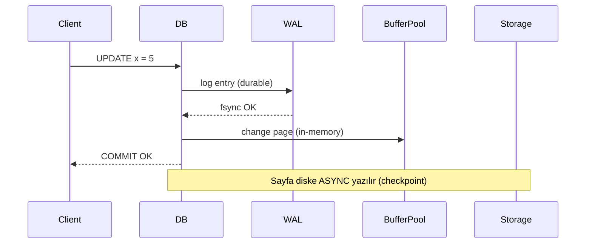
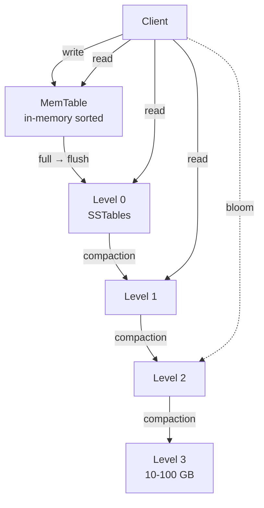

# 💾 Storage Engine'lerin İç Yapısı

> **"Veritabanı, başka bir program tarafından yapılması zor olan tek bir şeyi iyi yapar: kalıcılık."** — Pat Helland

Bu doküman storage engine'lerin **nasıl çalıştığını** anlatır. B-Tree vs LSM, WAL, MVCC, snapshot, indexing, vacuum/compaction. Hedef: senior+ ve performans/storage seçimleri yapan staff IC.

---

## 📑 İçindekiler

1. [Storage Hiyerarşisi & Temel Kavramlar](#1-storage-hiyerarşisi--temel-kavramlar)
2. [WAL — Write-Ahead Log](#2-wal--write-ahead-log)
3. [B-Tree Family](#3-b-tree-family)
4. [LSM-Tree](#4-lsm-tree)
5. [B-Tree vs LSM: Trade-off](#5-b-tree-vs-lsm-trade-off)
6. [MVCC — Multi-Version Concurrency Control](#6-mvcc--multi-version-concurrency-control)
7. [Snapshot, Checkpoint ve Recovery](#7-snapshot-checkpoint-ve-recovery)
8. [Indexing Stratejileri](#8-indexing-stratejileri)
9. [Page Cache, Buffer Pool, Direct I/O](#9-page-cache-buffer-pool-direct-io)
10. [Compression ve Encoding](#10-compression-ve-encoding)
11. [Üretim Tuzakları](#11-üretim-tuzakları)

---

## 1. Storage Hiyerarşisi & Temel Kavramlar

### Hiyerarşi (latency açısından)

| Katman | Latency | Bandwidth |
|---|---|---|
| CPU register | <1 ns | TB/s |
| L1 cache | 1 ns | ~1 TB/s |
| L2 cache | 4 ns | ~500 GB/s |
| L3 cache | 12 ns | ~250 GB/s |
| DRAM | 100 ns | 30-50 GB/s |
| Local NVMe SSD | 10-100 μs | 3-7 GB/s |
| Local SATA SSD | 100-500 μs | 0.5 GB/s |
| Network attached (EBS gp3) | 1-5 ms | 1 GB/s |
| HDD seek | 5-15 ms | 0.2 GB/s |
| S3 (warm) | 30-100 ms | (parallel) |
| Tape | dakikalar | — |

> Storage engine tasarımı **bu uçurumu** yönetir: hot working set RAM'de, soğuk veri disk'te.

### Sıralı vs Random I/O

- **Sıralı**: Disk arm hareket etmez (HDD), SSD prefetch ider. **10-100x daha hızlı**.
- **Random**: Her okuma yeni adres → seek + cache miss.
- **Sonuç**: Storage engine'lerin temel hilesi **sıralı I/O'ya çevirmek**.

### Page / Block

- Tipik page boyutu: 4KB (Postgres 8KB, MySQL InnoDB 16KB).
- I/O **tüm page** olarak yapılır.
- Tek bir byte okumak = 1 page okumak.
- **Write amplification:** 1 byte yazmak → 1 page yazmak.

---

## 2. WAL — Write-Ahead Log

### Temel kural

> **Önce log'a yaz, sonra veriyi değiştir.** Crash olursa log'dan replay edilir.



### Niye işe yarar?

- Random page write'lar **batch'lenebilir** (checkpoint'te).
- Log **sıralı** yazılır (hızlı).
- Crash → WAL'den son committed transaction'a kadar replay.

### Group commit / Batched fsync

Tek tek `fsync` çağırmak çok pahalı (~ms). **Group commit**:
- Birden fazla transaction commit'ini buffer'la.
- Tek `fsync` ile durable yap.
- N tx'in latency'si tek tx'e benzer ama **throughput N**.

### `fsync` yalanları

- 🚨 Bazı SSD'ler `fsync` dönse de buffer'da tutar. Power loss → veri kaybı.
- 🚨 ZFS / btrfs / ext4 farklı garantiler.
- 🚨 Postgres `fsync=off` veri kaybı riski yaratır (ama dev'de hızlı).
- ✅ **Enterprise SSD**: power-loss capacitor (PLP).

### Postgres WAL Konfigürasyonu

```
synchronous_commit = on    # default, durable
wal_level = replica        # streaming replication için
max_wal_size = 4GB         # checkpoint sıklığı
checkpoint_timeout = 15min
```

`synchronous_commit = off` → 200ms'lik veri kaybı riski karşılığında 2-5x throughput.

---

## 3. B-Tree Family

### B+ Tree yapısı

```
        [50 | 100]              ← internal node
       /     |     \
   [10|30] [70|80] [120|150]    ← leaf nodes (linked)
```

- Her node bir disk page'i.
- Leaf'ler birbirine linked → range scan hızlı.
- Yükseklik logaritmik (10⁹ kayıt → ~4 seviye).

### Read path

```
Root → ... → Leaf → key bulunur
```

3-4 page read (cache hit ise RAM hızında).

### Write path

```
1. Leaf'e ulaş
2. WAL entry yaz (fsync)
3. Page'i buffer pool'da değiştir
4. Page kapasitesi aşıldıysa SPLIT (merkez key'i parent'a)
5. Async olarak dirty page disk'e yazılır (checkpoint)
```

### Page split / merge

- **Split**: Yarısı yeni page'e, ortanca key parent'a.
- **Merge**: Komşu page %50'nin altındaysa birleşir.
- Split/merge **cascading** olabilir → root'a kadar.

### Concurrency: B-link tree

- Lehman & Yao 1981.
- Her node "right sibling" pointer tutar.
- Split sırasında reader'lar kilit beklemeden geçer.

### Innovations

- **Fractal Tree** (TokuDB): Buffered B-tree, write amplification düşürür.
- **Bw-Tree** (Microsoft Hekaton): Latch-free, delta record'lar.
- **Copy-on-write B-tree** (LMDB, Btrfs): Değişen page kopyalanır → snapshot ucuz.

### Üretimde

| DB | Engine |
|---|---|
| Postgres | B+ tree (heap + index) |
| MySQL InnoDB | Clustered B+ tree (PK = data) |
| SQL Server | Clustered + non-clustered B+ tree |
| LMDB | Copy-on-write B+ tree |
| MongoDB WiredTiger | B-tree (default) veya LSM |

---

## 4. LSM-Tree

> O'Neil et al. 1996 — *The Log-Structured Merge-Tree*

### Temel fikir

> Random write'ları **tüm yazmaları sıralı** hale çevir. Sıralamayı periyodik **merge** ile koru.

### Bileşenler



### Write path

```
1. WAL'e yaz (durable)
2. MemTable (sorted, RAM, e.g. skip list) → insert
3. MemTable threshold'u (e.g. 64MB) aşınca:
   - Immutable yap
   - Yeni MemTable başlat
   - Flush: SSTable olarak diske yaz (sıralı yazma!)
```

### Read path

```
1. MemTable check
2. L0 SSTable'lar (en yeniden eskiye)
3. L1, L2, ... (key range bilgisi ile)
4. Bloom filter: "bu key bu SSTable'da yok" hızlı negatif cevap
```

### SSTable (Sorted String Table)

- Disk üzerinde sıralı key-value blokları.
- Footer'da index + bloom filter.
- **Immutable** — tek bir kez yazılır, asla değiştirilmez.

### Compaction

> Aynı key'in birden fazla version'unu tek tutmak için periyodik **merge**.

İki strateji:

#### Size-tiered (Cassandra default)

- Aynı boyuttaki SSTable'lar birleşir.
- Write amp: ~10x. Space amp: ~2x.
- Yazma yoğun yüke uygun.

#### Leveled (RocksDB, LevelDB default)

- Her seviye 10x büyük.
- L_n+1 her zaman L_n'in 10 katı.
- Read amp: düşük (her level'da en fazla 1 SSTable kontrol).
- Write amp: ~25x. Space amp: ~1.1x.

### Tombstones

DELETE → "tombstone" entry yaz. Compaction'da gerçekten sil.
**Sorun:** Tombstone'lar çok birikirse read performansı düşer (Cassandra'nın klasik tuzağı).

### Bloom filter

> "Bu key bu SSTable'da **kesinlikle yok**" der. False positive var, false negative yok.

Tipik: 10 bit/key → %1 false positive. ~10-100x okuma hızlanması.

### Üretimde

| DB | LSM Engine |
|---|---|
| Cassandra, ScyllaDB | Size-tiered (default) / Leveled |
| RocksDB (Facebook) | Leveled (defaults) |
| LevelDB | Leveled |
| HBase | Leveled |
| InfluxDB (TSI) | LSM variant |
| TiKV, CockroachDB | RocksDB / Pebble (Go RocksDB) |
| MongoDB WiredTiger | LSM (opsiyonel) |

---

## 5. B-Tree vs LSM: Trade-off

| Eksen | B-Tree | LSM-Tree |
|---|---|---|
| **Read latency** | Düşük (1 path, ~3-4 page) | Yüksek (multiple SSTables) |
| **Write latency** | Orta (random write) | Düşük (sıralı, batched) |
| **Write amplification** | 2-3x (page+WAL) | 10-30x (compaction) |
| **Space amplification** | 1-2x | Leveled 1.1x, Tiered 2x |
| **Range scan** | Çok hızlı (linked leaves) | Hızlı (sorted SSTables) |
| **Update-heavy** | İyi | Daha iyi |
| **Read-modify-write** | Native | Tombstone overhead |
| **Compression** | Sınırlı (page-level) | Çok iyi (block-level) |
| **Implementation** | Karmaşık (B-link, locking) | Daha basit (immutable SSTables) |

### Pratik öneri

| Yük | Tercih |
|---|---|
| OLTP, read-heavy | B-Tree (Postgres, MySQL) |
| Write-heavy time-series, log | LSM (Cassandra, RocksDB) |
| Embedded KV | LSM (RocksDB, LevelDB) |
| Snapshot & branch | Copy-on-write B-tree (LMDB) |
| Mixed analytical + OLTP | Hybrid (CockroachDB, TiDB) |

---

## 6. MVCC — Multi-Version Concurrency Control

### Problem

Reader vs Writer locking → kötü concurrency. Reader long query writer'ı blokluyor.

### MVCC çözümü

> Yazma yeni **version** oluşturur. Eski reader'lar eski version'u görmeye devam eder. **Lock yok** (readers don't block writers).

```
Row v1 (xmin=100)  ← committed
Row v2 (xmin=150, xmax=null)  ← latest

Tx T (snapshot=120) okuduğunda:
  v1 visible (100 < 120 < 150)
  v2 invisible (xmin=150 > 120)
```

### Postgres'te

- Her row'da `xmin` (insert tx), `xmax` (delete/update tx).
- Visibility check: snapshot'a göre row görünür mü?
- UPDATE = INSERT new + mark old (xmax).
- DELETE = mark xmax.

### MySQL InnoDB'de

- Undo log'da eski version'lar.
- Row başına `DB_TRX_ID`, `DB_ROLL_PTR`.
- Eski version'a undo chain ile ulaşılır.

### CockroachDB / Spanner

- HLC timestamp tabanlı MVCC.
- Her key'in `(key, ts) → value` formatında storage'ı.
- Snapshot read = "ts'den önceki en son version".

### Vacuum / Garbage Collection

> Eski version'lar **silinmeli**. Postgres `VACUUM`, InnoDB `purge thread`.

**Sorun:** Long-running transaction (saatlerce açık) tüm vacuum'u bloklar. **Tablo şişer (bloat)**.

> **Üretim alarmı:** Postgres'te `pg_stat_activity` "idle in transaction" 5dk+ → kill et veya alert.

### Phantom read & Snapshot Isolation

Snapshot Isolation = MVCC'nin standart sonucu. Ama **Serializable değil** (write skew anomaly).

```
T1: SELECT count(*) FROM oncall WHERE on_duty=true → 2
T2: SELECT count(*) FROM oncall WHERE on_duty=true → 2
T1: UPDATE me SET on_duty=false (count'a göre 1 hala var)
T2: UPDATE other SET on_duty=false (count'a göre 1 hala var)
COMMIT both → 0 on duty! Anomaly.
```

**Çözüm:** SSI (Postgres Serializable) veya explicit locking (`SELECT ... FOR UPDATE`).

---

## 7. Snapshot, Checkpoint ve Recovery

### Checkpoint

Buffer pool'daki dirty page'leri **toplu** disk'e yazma. WAL'de bir noktadan öncesini garantiye alır → eski WAL silinebilir.

**Trade-off:**
- Sık checkpoint → recovery hızlı, I/O yüklü.
- Seyrek → I/O patlamalı, recovery uzun.

Postgres: `checkpoint_timeout = 15min`, `max_wal_size = 4GB`.

### Snapshot

Belirli bir an'daki tutarlı veri görünümü.
- **Logical**: SQL-level (`pg_dump`, MySQL `mysqldump`).
- **Physical**: File-level (`pg_basebackup`, LVM snapshot, EBS snapshot).
- **MVCC snapshot**: Read-only transaction = ucuz snapshot.

### PITR — Point-in-Time Recovery

```
Base backup + WAL archive → istediğin saniyeye geri dön.
```

Postgres: `archive_mode = on`, `archive_command = ...`.
**Test edilmedikçe yoktur.**

### Recovery zamanı

```
Recovery time ≈ (last_checkpoint → crash) WAL size / replay throughput
```

Sık checkpoint = küçük WAL = hızlı recovery.

### Crash-safe atomicity (durable file write)

Atomic file replace pattern:
```bash
write tmpfile
fsync tmpfile
rename(tmpfile, realfile)   # atomic on POSIX
fsync(directory)            # ÖNEMLİ! Aksi halde rename uçabilir.
```

> Çoğu uygulama directory fsync'i unutur. Power loss → eski + yeni file ikisi birden kaybolur.

---

## 8. Indexing Stratejileri

### B-Tree Index

- Default. Equality + range.
- Sıralı sorgular hızlı.
- Cardinality düşükse (boolean) gereksiz.

### Hash Index

- Sadece equality.
- Postgres'te memory-efficient değil (genellikle GIN/B-tree daha iyi).
- MySQL Memory engine, Redis hash.

### Bitmap Index

- Düşük cardinality (cinsiyet, statü).
- Birden fazla bitmap AND/OR ile birleşir.
- Update'i pahalı → DW/OLAP için.

### Inverted Index

- Full-text search.
- Postgres GIN, Lucene/Elasticsearch, Tantivy.

### Spatial / R-Tree

- Geografik (PostGIS).
- "x mile içindeki noktalar".

### Composite Index

```sql
CREATE INDEX ON orders (user_id, created_at DESC);
```

**Soldan eşleşme** kuralı:
- ✅ `WHERE user_id = ?` — kullanır
- ✅ `WHERE user_id = ? AND created_at > ?` — kullanır
- ❌ `WHERE created_at > ?` — kullanmaz

### Covering Index

```sql
CREATE INDEX ON orders (user_id) INCLUDE (status, total);
```

Index'ten doğrudan dönüş, table heap'e gitmez. **Çok hızlı.**

### Partial Index

```sql
CREATE INDEX ON orders (user_id) WHERE status = 'open';
```

Sadece "open" satırlar indekslenir. Boyut küçük, çok seçici sorgular.

### Index Anti-Pattern'leri

- 🚫 **Her kolona index** — write penalty katlanır.
- 🚫 **Düşük cardinality kolonda B-tree** (boolean) — anlamsız.
- 🚫 **`LIKE '%foo'`** — leading wildcard B-tree kullanmaz, GIN/trigram gerekir.
- 🚫 **Function call**: `WHERE LOWER(email) = ...` — function index gerekir.
- 🚫 **Unused indexes** — `pg_stat_user_indexes` kontrol edip sil.

---

## 9. Page Cache, Buffer Pool, Direct I/O

### İki katmanlı caching

```
Application memory ←→ DB Buffer Pool ←→ OS Page Cache ←→ Disk
```

**Çoğu DB** OS page cache'e ek olarak kendi buffer pool'unu tutar:
- Postgres `shared_buffers` (genelde RAM'in %25'i).
- MySQL InnoDB `innodb_buffer_pool_size` (RAM'in %50-75'i).

**Niye iki katman?** DB workload-aware (LRU+LFU karışımı, prefetch tuning).

### Direct I/O

`O_DIRECT` flag → OS page cache'i bypass et.
- ✅ Database kendi cache'ini yönetiyorsa double-buffering yok.
- ❌ Read-ahead'siz, küçük random read pahalı.

MySQL InnoDB `innodb_flush_method = O_DIRECT` üretim default.

### `mmap` storage

- LMDB, MongoDB (legacy MMAPv1) kullanır.
- OS sayfa hatası ile lazy load.
- ✅ Basit. ❌ Kontrol az, fsync güvenilirliği farklı.

> **Andy Pavlo'nun ünlü makalesi:** *"Are You Sure You Want to Use MMAP in Your Database Management System?"* (2022) — cevap: **hayır**.

---

## 10. Compression ve Encoding

### Block-level compression

LSM SSTable'ları block (4-64KB) compression. Tipik:
- **Snappy / LZ4**: Hızlı, orta sıkıştırma. Default.
- **Zstd**: Modern, daha iyi oran + akılcı hız.
- **gzip**: Yavaş, eski.

### Columnar compression

Aynı tip değer yan yana → çok iyi sıkışır. Parquet, ClickHouse, ORC.

| Encoding | Kullanım |
|---|---|
| **Run-length** | Aynı değer ardışık |
| **Dictionary** | Az unique değer |
| **Delta** | Artan ID, timestamp |
| **Bit-packing** | Sığ tipler (1-2 bit) |
| **Frame-of-reference** | Yakın değerler |

### Trade-off

- ✅ **Disk size 5-10x küçük** → I/O ücuz.
- ❌ **CPU yükü** — decompression latency.
- ✅ **Network transfer** — replication ucuz.

---

## 11. Üretim Tuzakları

### 1. Bloat / fragmentation

- Postgres MVCC update bloat — `VACUUM FULL` veya `pg_repack`.
- MySQL InnoDB tablespace fragmentation — `OPTIMIZE TABLE`.

### 2. Long transaction

- Postgres: `idle in transaction` vacuum'u bloklar.
- Çözüm: Statement timeout + transaction timeout.

### 3. Connection storm

- Connection başına 5-10MB memory.
- 5K connection → 25-50GB.
- **Çözüm:** PgBouncer / RDS Proxy / connection pooler.

### 4. WAL disk dolması

- Replication slot ileri gitmiyor → WAL silinmiyor → disk dolar → DB durur.
- Alert: `pg_replication_slots` lag.

### 5. Disk full → DB write durur

- Reserved space + monitoring.
- WAL ayrı volume'da olabilir (recovery hızı için).

### 6. Backup'ın test edilmemesi

- "Backup var" demek "restore çalışıyor" demek değil.
- GitLab 2017 (postmortem-arsivi #2): 5 backup mekanizması da çalışmıyordu.

### 7. Replication lag

- Async replication'da seconds-minutes-hours olabilir.
- Read-after-write consistency: read replica'dan okuma sorun yaratır.
- Çözüm: leader read, sync replica, veya causal consistency token.

### 8. Schema migration kilidi

- `ALTER TABLE` Postgres'te exclusive lock alır → tüm sorgular bekler.
- Kısa süre OK; saatler süren index build → outage.
- **Çözüm:** `CREATE INDEX CONCURRENTLY`, `pt-online-schema-change`, `gh-ost`, online schema change.

### 9. `SELECT ... FOR UPDATE` deadlock

- Sıralama tutarlı değilse cyclic dependency.
- Çözüm: Tüm transaction'lar key'leri **aynı sırada** kilitlemeli.

### 10. tx isolation yanılgısı

- "Read Committed" default'tur ve **lost update** mümkündür.
- "Serializable" güvenli ama performans cezası var.
- SSI tipinde retry budget gerekir.

---

## 🎯 Staff+ Storage Kontrol Listesi

### Veritabanı seçimi / migration öncesi

- [ ] Workload karakteri belirlendi mi? (Read-heavy → B-Tree/InnoDB, write-heavy → LSM/RocksDB)
- [ ] MVCC overhead kabul edilebilir mi? (Long-running tx → vacuum pressure)
- [ ] Replication modeli seçildi mi? (Sync → durability, async → performance, semi-sync → denge)
- [ ] Backup + restore drill yapıldı mı? RTO/RPO ölçülmüş mü?
- [ ] Connection pool sizing: max connection = (core_count × 2) + disk_spindle kuralı kontrol edildi mi?

### Schema / migration review

- [ ] `ALTER TABLE` kilitleme etkisi değerlendirildi mi? (`CONCURRENTLY`, `gh-ost` gerekli mi?)
- [ ] Index stratejisi: covering index, partial index, composite index sırası doğru mu?
- [ ] Compression trade-off'u: CPU overhead vs storage tasarrufu değerlendirildi mi?
- [ ] Partition stratejisi büyüyen tablolar için planlandı mı? (Range vs hash vs list)

### Operasyonel

- [ ] WAL disk'i ayrı mı? (Write-ahead log I/O yoğunluğu data disk'ini etkilemesin)
- [ ] Vacuum / compaction zamanlaması off-peak mi?
- [ ] Checkpoint interval SLO ile uyumlu mu? (Recovery time vs I/O burst)
- [ ] Page cache hit ratio izleniyor mu? (%99+ hedef)
- [ ] Transaction isolation level bilinçli olarak seçilmiş mi? (Default read-committed ≠ güvenli)

---

## 📚 İleri Okuma

### Birincil

- O'Neil et al. 1996 — *The Log-Structured Merge-Tree*
- Bayer & McCreight 1972 — *Organization and Maintenance of Large Ordered Indexes* (B-Tree)
- Lehman & Yao 1981 — *Efficient Locking for Concurrent Operations on B-Trees*
- Mohan et al. 1992 — *ARIES: A Transaction Recovery Method*

### Kitaplar

- *Database Internals* — Alex Petrov (mükemmel)
- *Designing Data-Intensive Applications* — Kleppmann (3-4. bölümler)
- *Transaction Processing: Concepts and Techniques* — Gray & Reuter (klasik)
- *Readings in Database Systems* — Stonebraker & Hellerstein ("Red Book")

### Bloglar / Pratik

- Andy Pavlo — CMU 15-721, 15-445 dersleri (YouTube)
- Marc Brooker — *Cache Me If You Can*
- HighScalability — case studies
- Brendan Gregg — sistem-level perf (USE method)

> [⬅️ Pratik klasörü](README.md) · [📚 Sözlük](../glossary/terim-sozlugu.md) · [🔬 Kaynakça](../kaynakca.md)
