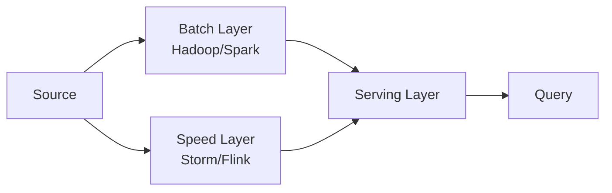
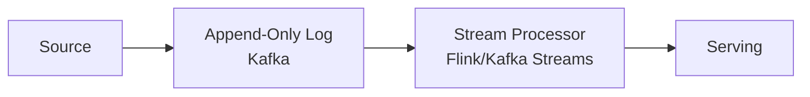

# 📊 Veri Mühendisliği

> **"Veri sistemleri için 'doğru' diye bir şey yoktur. Trade-off'lar, bağlamlar ve bilinçli ödünler vardır."**

Bu doküman OLTP'den OLAP'a, batch'ten stream'e, CDC'den data lake/lakehouse'a kadar veri sisteminin **çekirdeğini** kapsar.

---

## 📑 İçindekiler

1. [OLTP vs OLAP vs HTAP](#1-oltp-vs-olap-vs-htap)
2. [Data Warehouse, Data Lake, Lakehouse](#2-data-warehouse-data-lake-lakehouse)
3. [ETL vs ELT](#3-etl-vs-elt)
4. [Lambda vs Kappa Architecture](#4-lambda-vs-kappa-architecture)
5. [Change Data Capture (CDC)](#5-change-data-capture-cdc)
6. [Stream Processing](#6-stream-processing)
7. [Schema Evolution](#7-schema-evolution)
8. [Data Modeling: Star, Snowflake, Data Vault](#8-data-modeling-star-snowflake-data-vault)
9. [Data Quality & Lineage](#9-data-quality--lineage)
10. [Data Mesh vs Data Fabric](#10-data-mesh-vs-data-fabric)
11. [Anti-Pattern'ler](#11-anti-patternler)

---

## 1. OLTP vs OLAP vs HTAP

| | OLTP | OLAP | HTAP |
|---|---|---|---|
| Workload | Transactional | Analytical | Both |
| Query | Point lookup, simple | Aggregate, complex | Mixed |
| Volume per query | Tek satır - birkaç bin | Milyon - milyar satır | Bağlama göre |
| Concurrency | Yüksek (10K+) | Düşük (10-100) | Karışık |
| Storage | Row-oriented | Columnar | Hibrit |
| Examples | Postgres, MySQL, MongoDB | Snowflake, BigQuery, Redshift | TiDB, SingleStore, CockroachDB |

### Niye Columnar OLAP'ta kazanır?

```
SELECT AVG(price) FROM sales WHERE country='TR';

Row store: Tüm satırı oku, AVG için sadece price'a bak → I/O wasted.
Column store: Sadece country + price kolonlarını oku → 10-100x daha az I/O.
                Aynı tip → muhteşem compression (5-20x).
                SIMD ile vectorized AVG.
```

### Niye Row OLTP'te kazanır?

```
INSERT INTO sales (...) VALUES (...);
UPDATE sales SET status='shipped' WHERE id=...;

Row store: Tek I/O ile satır.
Column store: Her kolona ayrı write → write amp.
```

---

## 2. Data Warehouse, Data Lake, Lakehouse

### Data Warehouse (klasik)

> Schema-on-write. Yapılandırılmış. SQL.

- **Cloud DW**: Snowflake, BigQuery, Redshift, Synapse.
- **On-prem**: Teradata, Vertica, Exadata.
- **Open-source**: ClickHouse, Druid, StarRocks.

### Data Lake

> Schema-on-read. Raw veri (Parquet, ORC, Avro, JSON, CSV) object storage'da.

- **Storage**: S3, GCS, ADLS.
- **Query engine**: Athena, Trino, Presto, Spark.
- **Format**: Parquet (columnar) veya Avro (row, streaming için).

### Lakehouse (modern)

> Data lake + ACID + schema enforcement + transactions.

- **Apache Iceberg** (Netflix, Apple).
- **Delta Lake** (Databricks).
- **Apache Hudi** (Uber).

**Özellikler:**
- ACID transactions on object storage.
- Time travel (snapshot per write).
- Schema evolution.
- Hidden partitioning.
- Z-ordering / data skipping.

### Karşılaştırma

| | Warehouse | Lake | Lakehouse |
|---|---|---|---|
| **Schema** | Strict | Yok | Strict |
| **ACID** | Var | Yok | Var |
| **Cost** | Yüksek (storage + compute coupled) | Düşük (raw S3) | Düşük (raw + meta) |
| **Streaming** | Sınırlı | Var | Var |
| **ML/AI** | Sınırlı | İyi | İyi |

> 2023+ trend: **Lakehouse** baskın. Snowflake bile Iceberg desteğini öne çıkarıyor (2024).

---

## 3. ETL vs ELT

### ETL (klasik)

```
Source → Extract → Transform → Load → DW
```

- Transform önce; DW'a temiz veri girer.
- Tools: Informatica, Talend, Airflow + Python.
- ❌ Tasarım önden, schema değişmek zor.

### ELT (modern)

```
Source → Extract → Load → DW → Transform (in-DW)
```

- Raw veri DW'a yazılır.
- Transform DW içinde SQL ile (dbt).
- ✅ DW compute güçlü; işlem orada ucuz.
- ✅ Tarihsel raw data → reprocessing kolay.

### dbt (Data Build Tool)

> SQL-based transformation framework. Modüler model'ler, test, docs, lineage.

```sql
-- models/marts/finance/monthly_revenue.sql
{{ config(materialized='incremental') }}

SELECT
  DATE_TRUNC('month', order_date) AS month,
  SUM(total) AS revenue
FROM {{ ref('orders') }}

  WHERE order_date > (SELECT MAX(month) FROM {{ this }})

GROUP BY 1
```

### Reverse ETL

> DW → Operational system (Salesforce, HubSpot, Iterable).
> Census, Hightouch, Polytomic.

---

## 4. Lambda vs Kappa Architecture

### Lambda (Marz 2011)



- **Batch**: Doğru ama yavaş (saatlik).
- **Speed**: Hızlı ama yaklaşık.
- **Serving**: İkisini birleştir.

❌ İki kod tabanı, iki sistem, sync problemi.

### Kappa (Kreps 2014)



> "Sadece stream layer." Reprocessing → log'u baştan oku.

✅ Tek kod tabanı. ✅ Log uzun saklanırsa batch'e ihtiyaç yok.
❌ Çok büyük historical reprocess pahalı.

### Modern hibrit

> Lakehouse + streaming → Lambda/Kappa ayrımı bulanıklaşır. Iceberg streaming write + batch read aynı tabloda.

---

## 5. Change Data Capture (CDC)

> OLTP DB'deki **her değişikliği** event olarak yayınla.

### Yöntemler

| Yöntem | Açıklama | Tool |
|---|---|---|
| **Log-based** | DB binlog/WAL oku | Debezium, Maxwell, Fivetran |
| **Trigger-based** | DB trigger → audit table | Custom |
| **Query-based** | Polling `WHERE updated_at > ?` | Airbyte (incremental) |

### Log-based niye baskın?

- ✅ DB performansına etki minimal.
- ✅ Tüm DML yakalanır (DELETE dahil).
- ✅ Schema change yakalanır (DDL).
- ✅ Replication slot ile durability.

### Debezium (popüler, open-source)

```
Postgres logical replication slot → Debezium connector → Kafka topic
   "db.public.orders" topic'inde her INSERT/UPDATE/DELETE event'i
```

### Outbox Pattern (CDC ile birlikte)

> Application transaction'da outbox tablosuna yazar. CDC outbox'tan okur, downstream'e yayınlar. Dual-write tutarsızlığı çözülür. (Bkz: [dagitik-sistemler-derinlemesine.md](dagitik-sistemler-derinlemesine.md) #10)

### CDC use cases

- Microservice event-driven entegrasyon.
- Search index sync (Elasticsearch).
- Analytics warehouse sync (Snowflake).
- Cache invalidation.
- Audit log.

### Tuzaklar

- 🚨 **Replication slot ileri gitmiyor** → WAL birikir → DB disk dolar.
- 🚨 **Schema change** consumer'lara önce iletilmeli (forward compat).
- 🚨 **Initial snapshot** büyük tabloda saatler sürer.

---

## 6. Stream Processing

### Yöntemler

| Tool | Model | Use case |
|---|---|---|
| **Apache Kafka Streams** | Library, in-app | Lightweight transform |
| **Apache Flink** | Cluster, low-latency | Complex stateful |
| **Apache Spark Structured Streaming** | Micro-batch | Batch+stream unified |
| **Apache Beam** | Abstraction (runs on Flink/Spark/Dataflow) | Portable |
| **ksqlDB** | SQL on Kafka | Simple |
| **Materialize / RisingWave** | Streaming SQL DB | Analytics |

### Time semantics

| | Anlam |
|---|---|
| **Event time** | Olayın gerçek zamanı (sensor, user click) |
| **Processing time** | Stream processor'un gördüğü zaman |
| **Ingestion time** | Sisteme giriş zamanı |

> Doğru: **Event time**. Late events için **watermark + allowed lateness**.

### Windowing

- **Tumbling**: 5dk pencerelere böl.
- **Hopping**: 5dk pencere, her 1dk slide.
- **Session**: Aktivite gap'i ile (e.g. 30dk inaktivite → window kapanır).

### Stateful processing

```java
// Kafka Streams: KTable
stream
  .groupByKey()
  .count()  // stateful: count per key, persist in RocksDB
  .toStream()
  .to("output");
```

State store: local RocksDB + changelog topic backup.

### Exactly-once

- Kafka Streams + transactions: end-to-end exactly-once **Kafka↔Kafka**.
- External sink (DB) → idempotent writer pattern (e.g. upsert with key).

### Checkpoint / Savepoint (Flink)

- Periodic checkpoint → recovery point.
- Savepoint → manual, version upgrade.

---

## 7. Schema Evolution

### Compatibility türleri

| Tip | Yeni schema |
|---|---|
| **Backward** | Eski reader yeni veriyi okuyabilir |
| **Forward** | Yeni reader eski veriyi okuyabilir |
| **Full** | İkisi |
| **None** | Hiçbiri (kötü) |

### Avro örneği

```json
// v1
{ "name": "User",
  "fields": [
    { "name": "id", "type": "int" },
    { "name": "email", "type": "string" }
  ]
}

// v2 — Backward + Forward compatible
{ "name": "User",
  "fields": [
    { "name": "id", "type": "int" },
    { "name": "email", "type": "string" },
    { "name": "phone", "type": ["null", "string"], "default": null }
  ]
}
```

**Kurallar (Avro full compat):**
- ✅ Yeni field default'lı.
- ❌ Field silmek (forward bozar).
- ❌ Tip değiştirmek.
- ❌ Required field eklemek.

### Schema Registry

- Confluent Schema Registry, Apicurio.
- Producer schema register; consumer schema fetch.
- Compatibility check publish öncesi.

### Protobuf

- Field number ile identity (isim değil).
- Field number'ı **asla yeniden kullanma**.
- `reserved` keyword silinen field için.

```protobuf
message User {
  int64 id = 1;
  string email = 2;
  reserved 3, 4;          // eski field'lar
  reserved "old_name";    // eski isim
  string phone = 5;
}
```

### JSON Schema / OpenAPI

- Avro/Protobuf yok, ama validation var.
- AsyncAPI for event-driven specs.

---

## 8. Data Modeling: Star, Snowflake, Data Vault

### Star Schema (Kimball)

```
        ┌──────────┐
        │ Dim_Date │
        └─────┬────┘
              │
┌──────────┐  │  ┌────────────┐
│ Dim_User ├──┴──┤ Fact_Sales │
└──────────┘     │            │
        ┌────────┤            │
        │        └────┬───────┘
   ┌────┴─────┐       │
   │ Dim_Geo  │   ┌───┴──────┐
   └──────────┘   │Dim_Product│
                  └───────────┘
```

- Fact: ölçüler (sales, click).
- Dimension: kategori (date, user, product).
- Denormalized → join az, query hızlı.

### Snowflake Schema

- Dimension'lar normalize (sub-dim'ler).
- Storage az, ama join çok.
- Modern columnar DB'de fark az → **Star tercih edilir**.

### Data Vault

- **Hub**: Business key.
- **Link**: Hub'lar arası ilişki.
- **Satellite**: Descriptive attribute + history.

> Append-only, audit-friendly. Banking, insurance.

### One Big Table (OBT)

> "Tüm fact + dim'leri tek wide table'a denormalize et."
> Modern columnar (BigQuery, Snowflake) → 1000+ kolon ucuz.
> dbt + Snowflake projeleri çoğunlukla OBT.

---

## 9. Data Quality & Lineage

### Veri kalitesi boyutları

| Boyut | Soru |
|---|---|
| **Accuracy** | Doğru mu? |
| **Completeness** | Eksik mi? |
| **Consistency** | Sistemler arası tutarlı mı? |
| **Timeliness** | Güncel mi? |
| **Validity** | Format uygun mu? |
| **Uniqueness** | Duplikasyon var mı? |

### Test-driven data

```sql
-- dbt test
SELECT order_id
FROM {{ ref('orders') }}
GROUP BY 1
HAVING COUNT(*) > 1
-- 0 satır dönmesi gerekir
```

dbt expectations, Great Expectations, Soda, Monte Carlo.

### Data Contract

> Producer ↔ consumer arası **schema + SLA + semantic** sözleşme.

```yaml
dataset: orders
owner: payments-team
schema:
  - name: order_id
    type: string
    nullable: false
slas:
  freshness: 1h
  completeness: 99.9%
```

Tools: dbt-contracts, Soda, Datafold, Acryl DataHub.

### Lineage

> Veri nereden geldi, nereye gidiyor?

- **Column-level lineage**: Hangi kolon hangi başka kolondan türetildi?
- Tools: DataHub (LinkedIn), OpenLineage, Marquez, Atlan, Collibra.

---

## 10. Data Mesh vs Data Fabric

### Data Mesh (Zhamak Dehghani 2019)

> Domain-oriented decentralized data ownership. **Data as a product.**

4 ilke:
1. **Domain ownership** — domain ekipleri kendi data'sının sahibi.
2. **Data as a product** — discoverable, addressable, trustworthy, secure.
3. **Self-serve platform** — central platform, decentralized usage.
4. **Federated computational governance** — kurallar global, uygulama lokal.

### Data Fabric

> Centralized metadata, ML-driven, otomatik integration. Vendor-driven (Talend, IBM, Microsoft).

### Hangisi?

- **Mesh**: Org büyük (1000+ mühendis), domain ekipleri olgun.
- **Fabric**: Centralized data team güçlü.
- **Çoğu org**: Hibrit, mesh ilham — saf uygulamak zor.

---

## 11. Anti-Pattern'ler

### 1. Snapshot tabloyu sürekli full refresh

> 1B satırlı tabloyu her gece yeniden yazmak. Disk yoğun, replication overhead, downtime riski.

**Çözüm:** Incremental + CDC + Iceberg snapshot.

### 2. JSON blob içinde her şey

```sql
CREATE TABLE events (id UUID, payload JSONB);
-- Her query JSON parse, indekslenmemiş, schema yok.
```

**Çözüm:** Yapılandırılmış kolonlar + iyi tanımlı schema. JSONB sadece truly variable kısımda.

### 3. Cron'la "yedekleme"

`0 0 * * * pg_dump > /tmp/backup.sql`
**Sorunlar:**
- Test edilmiyor.
- Yerel disk → host ölünce backup gider.
- Gizleyici (encryption yok).
- Eski file silinmiyor.

**Çözüm:** Managed backup (RDS), object storage (S3), tested restore.

### 4. "Data Lake → Data Swamp"

Her kullanıcı her şeyi raw S3'e atar, kimse silmez, schema yok, kim hangi data'nın sahibi belirsiz.

**Çözüm:** Data catalog (DataHub, Atlas), ownership, lifecycle policy.

### 5. Reverse-ETL yerine doğrudan API call

App'ten Salesforce'a doğrudan POST → fragile, no audit, no batching.

**Çözüm:** DW'dan reverse-ETL (Hightouch, Census).

### 6. Hadoop'a yatırım (2024'te)

> Hadoop ekosistemi (HDFS, MapReduce, YARN) deklare edilmiş "deprecated" değilse de **operasyonel olarak** ölmüştür. Yeni yatırım = teknik borç.

**Modern**: Object storage (S3) + Spark/Trino + Iceberg.

### 7. "Tüm veri her yere kopyalanır"

Kafka → DW → Lake → cache → search → ... 7 kopya.
**Çözüm:** Lakehouse single source of truth, query engine üzerine.

### 8. PII without classification

> GDPR ihlali. PII tag'i yoksa erişim kontrolü, retention, masking yapılamaz.

**Çözüm:** Column classification (PII, sensitive, public). Auto-discovery (Macie, Privacera).

---

## 🎯 Staff+ Veri Mimarisi Yaklaşımı

### Karar checklist'i

- [ ] Workload OLTP / OLAP / hibrit?
- [ ] Latency SLA (anlık? saatlik? günlük?)?
- [ ] Volume büyüyor mu? Lineer / exponential?
- [ ] Schema evolution gereği nasıl?
- [ ] Reprocessing senaryosu (batch / stream)?
- [ ] Data ownership net mi (mesh seviyesi)?
- [ ] Compliance (PII, PCI) ihtiyacı?
- [ ] Cost optimization sınırı?
- [ ] Vendor lock-in toleransı?

### Yatırım önceliği (small startup → enterprise)

```
1. OLTP DB doğru seçim (Postgres çoğu için).
2. Application analytics → Postgres read replica.
3. CDC + ELT (Fivetran/Airbyte → Snowflake/BigQuery).
4. dbt ile transform.
5. Data catalog (DataHub).
6. Streaming (Kafka + Flink) sadece **gerçekten** real-time gerekirse.
7. ML platform en sonda.
```

> En sık hata: data team ML'den başlar. Foundation (CDC, DW, dbt) eksikken ML değer üretmez.

---

## 📚 İleri Okuma

- *Designing Data-Intensive Applications* — Kleppmann (DDIA, 10. bölüm)
- *Fundamentals of Data Engineering* — Joe Reis & Matt Housley
- *The Data Warehouse Toolkit* — Kimball (klasik)
- *Streaming Systems* — Akidau, Chernyak, Lax (Beam)
- *Data Mesh* — Zhamak Dehghani
- Confluent / Kafka Summit videoları
- dbt Learn (free)
- *Designing Cloud Data Platforms* — Pathirana

> [⬅️ Pratik klasörü](README.md) · [📚 Sözlük](../glossary/terim-sozlugu.md) · [🔬 Kaynakça](../kaynakca.md)
