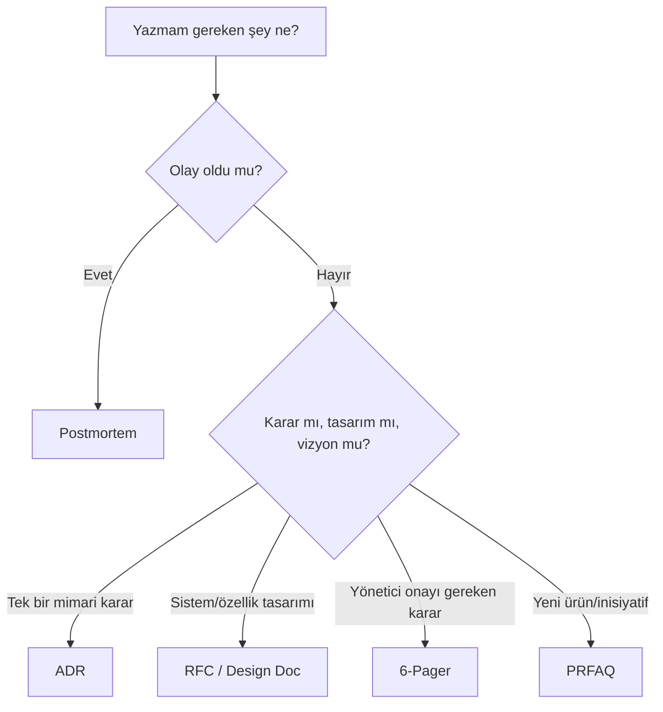

# 📐 Templates — Şablon Kütüphanesi

Staff+ seviye yazma kültürünün temel taşları. Her şablon, **alanında en kabul gören formatın** Türkçeye uyarlanmış halidir.

| Şablon | Kullanım | Hedef uzunluk | Kaynak |
|---|---|---|---|
| [ADR (Architecture Decision Record)](adr-sablon.md) | Mimari karar — *neden bu, neden o değil* | 1-2 sayfa | Michael Nygard 2011 |
| [RFC / Design Doc](rfc-design-doc-sablon.md) | İnşa öncesi tasarım | 4-8 sayfa | Google + IETF |
| [6-Pager Memo](6-pager-sablon.md) | Yönetici karar memo'su | 6 sayfa | Amazon |
| [PRFAQ](prfaq-sablon.md) | Yeni ürün/girişim vizyonu — *working backwards* | 1 sayfa PR + FAQ | Amazon |
| [Postmortem](postmortem-sablon.md) | Olay sonrası analiz | 2-4 sayfa | Google SRE + Etsy |

## Hangisini Ne Zaman Kullanmalı?

## Workflow

1. **Taslak** → kişisel branch / draft.
2. **İç gözden geçirme** → 1-2 yakın çalışan, dilbilgisi + mantık + sayı.
3. **Geniş gözden geçirme** → ilgili reviewer'lara dağıt, en az 48 saat süre.
4. **Toplantı** (sadece gerekirse) → asenkron yorumlar tıkandığında.
5. **Karar** → `Status` alanı güncellenir, ana branch'e merge.
6. **İmplementasyon takibi** → her ADR/RFC'nin `Doğrulama` bölümü 30/90 gün sonra geri okunur.
