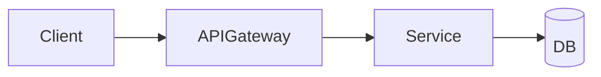

# 📄 RFC / Design Doc — Şablon

> **Amaç:** Bir özelliği veya sistemi **inşa etmeden önce** ekibin gözden geçirebileceği, eleştirebileceği, kabul/red edebileceği yapılandırılmış bir doküman üretmek.
> **Hedef uzunluk:** 4-8 sayfa. Daha kısaysa ADR olabilir; daha uzunsa parçala.
> **Kültür:** Google design doc + IETF RFC + Amazon working-backwards karması.

---

## RFC-NNNN: [Başlık]

| Alan | Değer |
|---|---|
| **Yazar(lar)** | İsim @handle |
| **Durum** | Taslak / Gözden geçirme / Kabul / Reddedildi / Implementasyon / Tamamlandı |
| **Oluşturulma** | YYYY-MM-DD |
| **Hedef uygulama tarihi** | YYYY-Q? |
| **Gözden geçirenler** | Tech lead, alan uzmanı, security, SRE, … |
| **İlgili ADR'lar** | ADR-001, ADR-007 |
| **Slack / forum** | #channel-name |

---

## 1. TL;DR

3-5 cümle. Doküman daha okunmadan, *karar veren bir kişi* ne yaptığını, neden yaptığını, ne kazanacağını ve neyi feda edeceğini görmeli.

## 2. Sorun (Problem Statement)

**Veriyle** başla. Anekdotla değil.
- Mevcut durum, sayılarla.
- Bu durumun yarattığı somut etki (gelir, kullanıcı, takım hızı, risk).
- Neden **şimdi** çözüyoruz, neden **6 ay önce değildi**, neden **6 ay sonra olmaz**.

## 3. Hedefler ve Hedef-Olmayanlar

- **Hedefler (Goals):** Bu doküman tamamlandığında doğru olması gereken cümleler.
- **Hedef değil (Non-goals):** Çözüm kapsamı dışı bırakılan, ama akla geleceği için yazılması gereken her şey. *Bu bölüm en az hedefler kadar uzun olmalı.*

## 4. Önerilen Çözüm

### 4.1 Yüksek Düzey

Bir mimari diyagram (mermaid). En fazla 7±2 kutu. Daha fazlaysa zoom-in alt diyagramları yap.

### 4.2 Veri Modeli

- Tablolar / kolleksiyonlar / topic'ler.
- **Schema evolution** stratejisi (Avro / Protobuf / SQL migration).
- **Veri sahipliği** (kim üretir, kim tüketir).

### 4.3 API'lar / Sözleşmeler

- Endpoint imzaları, gRPC/Protobuf veya OpenAPI.
- **Idempotency**, **pagination**, **error model** (RFC 7807 / RFC 9457).
- **Versioning** stratejisi.

### 4.4 Akışlar

Mutluluk yolu, hata yolu, retry yolu, geri alma yolu. Sequence diyagramlarıyla.

### 4.5 Operasyonel Plan

- Dağıtım sırası (ekspans/kontrakt, feature flag, canary).
- Migrasyon stratejisi (eski + yeni paralel ne kadar yaşar).
- Rollback prosedürü (ne kadar sürer, hangi durumlarda tetiklenir).

## 5. Alternatifler

En az **3 alternatif**, her biri için artılar/eksiler/neden seçilmedi. "Hiç yapmama" alternatifi de dahil.

| Seçenek | Maliyet | Süre | Risk | Reversibility |
|---|---|---|---|---|
| Önerilen | … | … | … | … |
| Alt-A | … | … | … | … |
| Alt-B | … | … | … | … |
| Hiçbir şey yapma | … | … | … | … |

## 6. Etki Analizi

### 6.1 Performans
- Beklenen p50 / p99 / p99.9.
- Throughput hedefi.
- Kapasite hesabı (Little's Law: `L = λW`).
- Yük testi planı.

### 6.2 Maliyet
- Build maliyeti (mühendis-haftası).
- Run maliyeti (aylık $).
- Egress, depolama, lisans dahil.
- 1 yıllık TCO.

### 6.3 Güvenlik
- Threat model (STRIDE özeti).
- Yeni saldırı yüzeyleri.
- Auth / authz değişiklikleri.
- Secret yönetimi.
- PII varsa tokenization / encryption planı.

### 6.4 Gizlilik & Uyumluluk
- GDPR / KVKK etkisi.
- Veri saklama (retention) politikası.
- Right-to-be-forgotten implementasyonu.

### 6.5 Operasyonel Yük
- Yeni dashboard'lar, alert'ler.
- SLI/SLO değişiklikleri.
- On-call runbook'u.
- Üzerinden geçecek tüm ekipler için "ne öğrenmeleri gerekecek" listesi.

### 6.6 Bağımlılıklar
- İçsel: hangi takım/servis.
- Dışsal: hangi vendor/SaaS, fatura, lisans.

## 7. Açık Sorular

Bilerek cevapsız bırakılan sorular. *Henüz karar verilmedi*. Her birinin kararsalama tarihi ve sahibi olmalı.

## 8. Risk Kaydı

| Risk | Olasılık | Etki | Hafifletme |
|---|---|---|---|
| … | düşük/orta/yüksek | düşük/orta/yüksek | … |

## 9. Yol Haritası

| Faz | Tarih | Çıktı | Tersine çevrilebilir mi? |
|---|---|---|---|
| F0: Spike / POC | … | … | Evet |
| F1: Dark launch | … | … | Evet |
| F2: %1 canary | … | … | Evet |
| F3: %100 | … | … | Sınırlı |
| F4: Eski sistemi kapat | … | … | Hayır |

## 10. Başarı Kriterleri

Doküman 6 ay sonra okunduğunda **objektif** olarak başarı/başarısızlık ölçülebilmeli.

| Metrik | Mevcut | Hedef | Ölçüm aracı |
|---|---|---|---|
| p99 latency | … | … | … |
| Error rate | … | … | … |
| Aylık maliyet | … | … | … |

## 11. İlgili Belgeler

- ADR-NNNN
- Bağlı RFC'ler
- Kaynakça atıfları
- Önceki postmortem'ler (varsa)

---

## ✏️ Yazım İpuçları

1. **Aktif ses** kullan. "Yapılır" değil "yaparız".
2. **Sayı ver.** "Hızlı" yerine "p99 ≤ 80 ms".
3. **Karşı görüşü kendin yaz.** En sert eleştiriyi sen kendi RFC'ne yap. (*"Why this is a bad idea"* bölümü.)
4. **Daha az kelime, daha çok diyagram + tablo.** Reviewer 30 dakika ayırırsa, ilk 10 dakikada özünü bilmeli.
5. **Reversibility'yi her bölümde** kafanda tut. *"Bu kararı 3 ay sonra geri almam gerekirse maliyeti nedir?"*

## ✅ Kabul Öncesi Kontrol Listesi

- [ ] TL;DR'i 3 cümleye sığdırdım.
- [ ] Hedef ≠ Hedef değil ayrımı net.
- [ ] En az 3 alternatif (biri "hiçbir şey yapma").
- [ ] Sayısal performans/maliyet hedefleri var.
- [ ] Threat model var.
- [ ] Rollback planı var.
- [ ] Açık soruların sahipleri ve tarihleri var.
- [ ] Başarı kriterleri ölçülebilir.
- [ ] *"Bu neden kötü bir fikir olabilir"* bölümü dolu.
